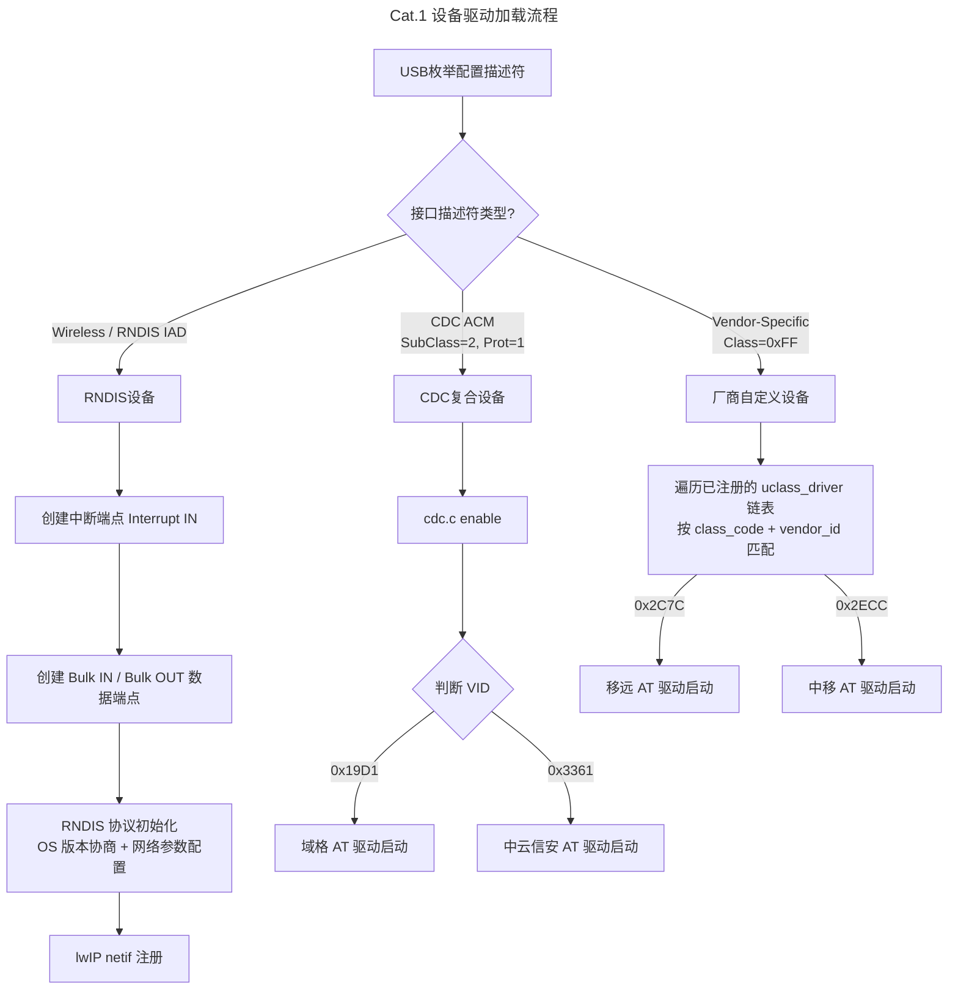

# Cat.1 模组接入指南

Cat.1 模组通常支持 RNDIS / ECM 两种 USB 虚拟网卡驱动方式，本 SDK 默认使用 RNDIS 接口协议。

## 1. USB 配置描述符

Cat.1 模组的 USB 配置描述符一般由 **RNDIS 网卡** + **AT 串口** 组合而成：

- **RNDIS 设备**：属于复合设备（IAD 关联接口），通过接口描述符中的 `bInterfaceSubClass` / `bInterfaceProtocol` 确定数据通信的 TX/RX 端点（Bulk）以及中断端点（Interrupt）。
- **AT 串口设备**：通常有 2~3 组接口，分别用于 AT 命令控制、调试日志等用途。根据厂商不同，AT 串口分为两种类型：

| 类型 | 典型厂商 | 接口特征 |
|------|----------|----------|
| **厂商自定义设备**（Vendor-Specific） | 移远（Quectel）、中移（China Mobile） | `bDeviceClass` = 0xFF，需要注册对应 VID 的 Vendor 驱动 |
| **CDC 复合设备**（CDC ACM） | 域格（Yuge）、中云信安（ZXInfo） | `bInterfaceSubClass` = 0x02, `bInterfaceProtocol` = 0x01，使用 CDC 类驱动 |

> **快速判断方法**：将 Cat.1 模组插入 Windows 电脑，如果设备管理器中能直接枚举出多个串口（无需安装额外驱动），通常是 CDC 复合设备；如果需要安装厂商提供的专用驱动才能显示串口，通常是厂商自定义设备。

也可以通过 USB 抓包工具或 SDK 的 log 输出查看完整的描述符信息。SDK 在枚举过程中会打印接口的 `bInterfaceSubClass` 和 `bInterfaceProtocol`，辅助确认设备类型。

## 2. AT 命令

各模组的初始化流程中，部分 AT 命令是通用的（如 AT 握手、SIM 卡查询、网络注册查询），但配网控制命令各厂商有各自的定义。**部分模组需要手动配网**（移远、中移），**部分模组在 PS 域注册成功后会自动联网**，无需额外配网命令（域格、中云信安）。

所有 AT 命令以 `\r\n`（回车换行）表示结束。

### 2.1 通用初始化命令

| 指令 | 含义 | 备注 |
|------|------|------|
| `AT` | 确认 AT 串口通信正常 | 返回 `OK` 表示 AT 通道就绪，可继续后续命令 |
| `AT+CPIN?` | 查询 SIM 卡状态 | 一般模组无需 PIN 码，返回 `+CPIN: READY` |
| `AT+CREG?` | 查询 CS 域网络注册状态 | 插卡正常且不欠费时，会很快注册成功，返回 `+CREG: 0,1` |
| `AT+CEREG?` | 查询 EPS 域网络注册状态 | 返回 `+CEREG: 0,1` 表示 PS 域已注册 |

### 2.2 移远（Quectel）配网控制命令

| 指令 | 含义 | 备注 |
|------|------|------|
| `AT+QCFG="usbnet"` | 查询当前 USB 网卡接口协议 | 返回 `+QCFG: "usbnet",<mode>`，1 = ECM，3 = RNDIS |
| `AT+QCFG="usbnet",3` | 切换为 RNDIS 模式 | 切换后需重启模组生效（`AT+QPOWD` 软复位） |
| `AT+QICSGP=1,1,"UNINET","","",1` | 配置 PDP 上下文参数 | 配置场景 1，APN 为 UNINET（中国联通）；实测插其他运营商 SIM 卡也可正常使用 |
| `AT+QIACT=1` | 激活 PDP 场景 | 激活后可通过 `AT+QIACT?` 查询获取公网 IP |
| `AT+QNETDEVCTL=1,1,1` | 接通 USB 网卡 | 将移动网络与 USB 虚拟网卡桥接 |
| `AT+QIDEACT=1` | 反激活 PDP 场景 | PDP 激活失败时回退，反激活后重新尝试 |
| `AT+QPOWD` | 模组软关机 | 收到 `POWERED DOWN` 后复位 MCU |

### 2.3 中移（China Mobile）配网控制命令

| 指令 | 含义 | 备注 |
|------|------|------|
| `AT+MDIALUPCFG="mode",0` | 配置拨号方式为 RNDIS | 部分模组可能默认工作在其他模式，需切换 |
| `AT+MDIALUP=1,1` | 拨号上网 | 拨号成功返回 `+MDIALUP: 1,1,<IP>`，可获取公网 IP |
| `AT+CGDCONT?` | 查询 PDP 上下文 | 返回 `+CGDCONT: 1,...` 表示 PDP 场景已配置 |
| `AT+MDIALUP?` | 查询拨号状态 | 成功后定时轮询确认连接保持 |

### 2.4 域格（Yuge）/ 中云信安（ZXInfo）配网控制命令

这两家厂商的模组在 PS 域注册成功（`+CEREG: 0,1`）后会自动拨号联网，无需额外配网命令。但部分场景可能需要手动配置：

| 指令 | 含义 | 备注 |
|------|------|------|
| `AT+QICSGP=1,1,"UNINET","","",1` | 配置 PDP 上下文 | 同移远方案，配置 APN |
| `AT+QIACT=1` | 激活 PDP 场景 | 激活后可查询 IP |
| `AT+QIACT?` | 查询 PDP 激活状态和 IP | 返回 `+QIACT: 1,1,1,<IP>` |
| `AT+QNETDEVCTL=1,1,1` | 接通 USB 网卡 | 桥接移动网络与 USB 虚拟网卡 |
| `AT+QCFG="band",0x0,<mask>` | 设置频段优先级 | 可排除 B40/B41 以避免与 2.4G WiFi 同频干扰 |
| `AT+QIDEACT=1` | 反激活 PDP | 激活失败时回退重试 |

## 3. 驱动框架与移植

### 3.1 驱动文件结构

本 SDK 的 Cat.1 模组驱动位于 `rttusb/usbhost/class/` 目录下：

| 驱动文件 | 对应厂商 | 设备类型 | VID / PID | 典型型号 |
|----------|----------|----------|-----------|----------|
| `quectel.c` | 移远（Quectel） | Vendor-Specific | `0x2C7C` / `0x0903` | EC801E-CN |
| `chinamobile.c` | 中移（China Mobile） | Vendor-Specific | `0x2ECC` / `0x3012` | ML307R |
| `yuge.c` | 域格（Yuge） | CDC ACM | `0x19D1` / `0x1003` | YM310 X09 |
| `zxinfo.c` | 中云信安（ZXInfo） | CDC ACM | `0x3361` / `0x7B6E` | ZX800 |
| `wireless.c` | 通用 RNDIS | Wireless Class | — | RNDIS 数据通道 |
| `cdc.c` | CDC 公共层 | CDC / COMM Class | — | CDC 枚举 → 分发到厂商 AT 驱动 |

### 3.2 驱动注册方式

**厂商自定义设备（quectel.c / chinamobile.c）**：

在 `usbhost_core.c` 的 `rt_usb_host_init` 函数中调用对应的驱动注册函数：

```c
// 注册 Vendor-Specific 驱动，USB 核心通过 class_code + vendor_id 匹配
rt_usbh_class_driver_register(rt_usbh_class_driver_quectel());      // 移远
rt_usbh_class_driver_register(rt_usbh_class_driver_chinamobile());  // 中移
```

这些驱动的 `class_code` 设置为 `USB_CLASS_VEND_SPECIFIC`（0xFF），同时指定 `vendor_id`，USB 核心在枚举到 VID 匹配的设备时触发对应的 `enable` 回调。

**CDC 复合设备（yuge.c / zxinfo.c）**：

这两个驱动注册为 `USB_CLASS_CDC` 类型，但其 `enable` 实际由 `cdc.c` 的 `rt_usbh_cdc_enable` 函数间接调用（通过 VID 判断后分发）：

```c
// cdc.c 的 enable 流程中：
// if (vendor == YUGE) → rt_usbh_yuge_at_run(intf);
// if (vendor == ZXINFO) → rt_usbh_zxinfo_at_run(intf);
```

因此移植 CDC 类型模组时，无需在 USB 核心层额外注册，只需确保对应的 `RT_USBH_VENDOR_YUGE` / `RT_USBH_VENDOR_ZXINFO` 宏已开启并在 `cdc.c` 中 `#include` 对应的头文件。

**通用 RNDIS 驱动（wireless.c）**：

Wireless 驱动负责 RNDIS 网卡的数据面初始化，注册为 `USB_CLASS_WIRELESS`。它匹配 `bInterfaceSubClass=1, bInterfaceProtocol=3`（标准 RNDIS IAD），同时兼容了中云信安模组的 IAD 描述符不一致问题（`bInterfaceSubClass=2, bInterfaceProtocol=255`）。

### 3.3 AT 串口识别

AT 串口通常有多组（2~3 个接口），不同厂商的布局不同，需要在 `enable` 函数中通过 **接口号**（`bInterfaceNumber`）和 **字符串描述符**（`iInterface`）来定位正确的命令控制串口：

| 厂商 | 命令 AT 串口的接口号 | 识别方式 |
|------|---------------------|----------|
| 移远（Quectel） | 接口 3 | Vendor-Specific 接口，通过 `bInterfaceNumber == 3` 过滤 |
| 中移（China Mobile） | 接口 2 | Vendor-Specific 接口，通过 `bInterfaceNumber == 2` 过滤 |
| 域格（Yuge） | 接口 2（CDC IAD 第 2 组） | CDC ACM 接口，`bInterfaceSubClass=2, bInterfaceProtocol=1`，通过 `bInterfaceNumber == 2` 过滤 |
| 中云信安（ZXInfo） | 接口 4（CDC IAD 第 2 组） | CDC ACM 接口，`bInterfaceSubClass=2, bInterfaceProtocol=1`，通过 `bInterfaceNumber == 4` 过滤 |

同时，`enable` 函数中会通过 `rt_usbh_get_string_descriptor` 读取接口字符串描述符并打印，辅助开发阶段确认选对了 AT 串口。

### 3.4 端点配置与 CDC Line Coding

AT 串口驱动初始化时为 Bulk IN / Bulk OUT 端点分配 Pipe，并通过 CDC 类请求（`GET_LINE_CODING` / `SET_LINE_CODING`）获取或设置串口参数（波特率、数据位、停止位、校验位）。对于厂商自定义设备，同样使用 `rt_usbh_cdc_get_line_coding` 来读取虚拟串口的线路参数并打印。

### 3.5 快速移植步骤

1. 确认 Cat.1 模组的 VID / PID 和 AT 串口设备类型（Vendor-Specific 或 CDC ACM）。
2. 选择对应的现有驱动模板文件（`quectel.c` / `chinamobile.c` / `yuge.c` / `zxinfo.c`）复制并重命名。
3. 修改新驱动中的 `USB_VENDOR_ID` 和 `USB_PRODUCT_ID` 宏定义。
4. 调整 AT 串口的接口号过滤条件及相关的 AT 命令。
5. 根据设备类型，在 `usbhost_core.c` 中注册（Vendor-Specific）或参照 `cdc.c` 的方式在 CDC enable 中分发调用（CDC ACM）。

## 4. 驱动加载流程



**AT 命令初始化**以状态机形式实现：顺序发送命令，确认接收到目标应答后推进到下一状态；当前状态响应不正确时重试，超过最大重试次数后回到初始状态重新开始。

- 移远 / 中移：最大重试 3 次后回退到 UNKNOW 状态
- 域格 / 中云信安：最大重试 10 次后回退到 UNKNOW 状态

### 4.1 各厂商状态机流程

#### 移远（Quectel）状态机

```
UNKNOW → CHECK_AT_STATUS → CHECK_SIM_STATUS → CHECK_CS_STATUS
    → CHECK_PS_STATUS → CHECK_USBNET_STATUS
        ├── ECM (mode=1) → CONFIG_USBNET_STATUS (切换RNDIS) → POWERDOWN (重启)
        └── RNDIS (mode=3) → CONFIG_PDP_CONTEXT → ACTIVE_PDP_CONTEXT
            → CHECK_IP_STATUS → CONNECT_USB_ADAPTER → INITIALIZED
    ACTIVE_PDP_CONTEXT 失败超过3次 → DEACTIVE_PDP_CONTEXT → 回到 CHECK_SIM_STATUS
```

> 移远模组的 `CHECK_USBNET_STATUS` 状态先查询当前 USB 网卡模式，如果是 ECM 则下发 `AT+QCFG="usbnet",3` 切换为 RNDIS，然后软关机重启 MCU 使配置生效。

#### 中移（China Mobile）状态机

```
UNKNOW → CHECK_AT_STATUS → CHECK_SIM_STATUS → CHECK_PS_STATUS
    → CHECK_PDP_CONTEXT → CHECK_IP_STATUS (拨号) → CHECK_BAND
    → INITIALIZED (定时查询网络信息)
```

> 中移模组初始化后定时查询运营商、频段、信号强度（RSRP/RSSI/SINR/RSRQ）和频点信息（`AT+MUESTATS`），并通过 `eutra_channel_freq_mapping` 函数计算 FDD/TDD 上下行频率。

#### 域格（Yuge）/ 中云信安（ZXInfo）状态机

```
UNKNOW → CHECK_AT_STATUS → CHECK_SIM_STATUS → CHECK_CS_STATUS
    → CHECK_PS_STATUS → INITIALIZED (自动联网，定时查询信号)
```

> 域格和中云信安模组在 PS 域注册成功后自动联网，无需手动配网。初始化后定时查询运营商、信号强度（CSQ）、误码率（BER）及频段信息，其中域格/中云信安会检测 B40/B41 与 WiFi 2.4G 是否同频冲突，若冲突则通过系统事件触发 WiFi 信道切换。

### 4.2 RNDIS 数据通道初始化

RNDIS 数据通道（`wireless.c`）在 AT 初始化之前或并行完成初始化：

1. 解析 IAD 接口描述符定位 Communication 接口（含 Interrupt 端点）和 Data 接口（含 Bulk IN/OUT 端点）。
2. 分配 RNDIS 消息缓冲区（128 B）、数据接收缓冲区（2048 B）和发送拼接缓冲区（2048 B）。
3. 为中断端点和 Bulk 端点分别分配 Pipe。
4. 调用 `rt_usbh_rndis_run` 启动 RNDIS 协议栈：发送 `REMOTE_NDIS_INITIALIZE_MSG` 协商版本 → 发送 `REMOTE_NDIS_QUERY_MSG` 获取 MTU 等参数 → 发送 `REMOTE_NDIS_SET_MSG` 配置包过滤器 → 完成初始化，网络数据通路就绪。

## 5. 网络信息查询

初始化完成后，各厂商驱动会定时查询网络状态信息：

| 查询项目 | 移远 | 中移 | 域格 | 中云信安 |
|----------|------|------|------|----------|
| 运营商 | — | `AT+COPS?` | `AT+COPS?` | `AT+COPS?` |
| 信号强度 (RSSI) | — | `AT+MUESTATS="radio"` | `AT+CSQ` | `AT+CSQ` |
| RSRP | — | `AT+MUESTATS="radio"` | — | — |
| SINR | — | `AT+MUESTATS="radio"` | — | — |
| 频段/频点 | — | `AT+MUESTATS="sband"` | `AT+CCED=0,1` | `AT+QNWINFO` |
| 误码率 (BER) | — | — | `AT+CSQ` | `AT+CSQ` |

## 6. 关键宏开关

| 宏定义 | 控制对象 | 说明 |
|--------|----------|------|
| `RT_USBH_VENDOR_QUECTEL` | `quectel.c` | 启用移远模组驱动 |
| `RT_USBH_VENDOR_CHINAMOBILE` | `chinamobile.c` | 启用中移模组驱动 |
| `RT_USBH_VENDOR_YUGE` | `yuge.c` + `cdc.c` | 启用域格模组驱动 |
| `RT_USBH_VENDOR_ZXINFO` | `zxinfo.c` + `cdc.c` | 启用中云信安模组驱动 |
| `RT_USBH_WIRELESS` | `wireless.c` | 启用通用 RNDIS 无线网卡驱动 |
| `RT_USBH_CDC` | `cdc.c` | 启用 CDC 类驱动（CDC ACM 设备的基础层） |
| `STATIC_RNDIS_NETDEV` | `wireless.c` | 使用静态分配的 RNDIS 结构体（通过 dev_get 获取） |

## 7. 系统网卡注册

Cat.1 模组完成联网后，其 RNDIS 虚拟网卡（`l0`）需要注册到 lwIP 协议栈，并与 WiFi 网卡（`w0`）协调默认路由。本 SDK 提供两种网卡接入形态：

| 接入形态 | 典型应用场景 | 实现方式 |
|----------|-------------|----------|
| **桥接模式** | MiFi 类设备（4G → WiFi 共享） | 使用 SDK 轻量桥接模块，LTE 数据直接转发到 WiFi 侧，无需切换默认网卡 |
| **独立切换模式** | 双上网通道设备（4G / WiFi 各自独立） | 通过 lwIP `lwip_netif_set_default2` 动态切换默认网卡，socket 通信自动走当前活跃网卡 |

### 7.1 桥接模式

桥接模式下，LTE 数据面和 WiFi 数据面通过桥接模块互联，LTE 网卡不直接暴露给上层应用。使用时需要在初始化桥接模块时提前传入静态分配的 RNDIS 设备结构体，并在工程配置中定义：

```c
#define STATIC_RNDIS_NETDEV   // 使用静态分配的 RNDIS netif
```

`wireless.c` 中通过 `HG_LTE_RNDIS_DEVID` 设备 ID 获取预分配的 `struct usb_rndis`，不再动态申请。Cat.1 模组接入成功后，RNDIS 数据通路直接与桥接模块对接，上层无需关心网卡切换。注意：`events.c` 中的网卡切换逻辑在定义了 `STATIC_RNDIS_NETDEV` 后**不会被编译**，因为桥接模式下不存在 `l0` 与 `w0` 路由竞争的问题。

### 7.2 独立切换模式

独立切换模式下，`l0` 和 `w0` 各自获得独立 IP 地址，系统通过事件驱动机制在两张网卡之间自动切换默认路由。

#### 7.2.1 事件触发

各厂商 AT 驱动在状态机进入 `INITIALIZED` 状态（模组联网成功）时，统一发出系统事件：

```c
// quectel.c / chinamobile.c / yuge.c / zxinfo.c
SYSEVT_NEW_LTE_EVT(SYSEVT_LTE_CONNECTED, 0);
```

该事件由 `events.c` 中的 `sys_event_hdl_lte` 函数统一处理。**编译条件**为 `RT_USBH_WIRELESS_RNDIS` 已启用且 `STATIC_RNDIS_NETDEV` 未定义：

```c
// events.c
#if defined(RT_USBH_WIRELESS_RNDIS) && !defined(STATIC_RNDIS_NETDEV)
```

#### 7.2.2 切换逻辑

**WiFi 优先级高于 LTE**：当 WiFi 连接成功时自动关闭 LTE 网卡并切换到 WiFi；WiFi 断开时自动回退到 LTE。处理流程如下：

| 事件 | 动作 | 说明 |
|------|------|------|
| `SYSEVT_LTE_CONNECTED` | 若 WiFi 未连接 → 设 `l0` 为默认网卡 + 对 `l0` 启动 DHCP Client | LTE 首次就绪，抢占默认路由 |
| `SYSEVT_WIFI_CONNECTTED` | 关闭 `l0`（down）+ 设 `w0` 为默认网卡 | WiFi 连接，LTE 退避 |
| `SYSEVT_WIFI_DISCONNECT` | 启用 `l0`（up）+ 设 `l0` 为默认网卡 | WiFi 断开，回退到 LTE |

对应 `events.c` 核心源码：

```c
void sys_event_hdl_lte(uint32 event_id, uint32 data, uint32 priv)
{
    switch (event_id) {
        case SYS_EVENT(SYS_EVENT_LTE, SYSEVT_LTE_CONNECTED):
            if (sys_status.wifi_connected == 0) {
                lwip_netif_set_default2("l0");   // LTE 接管默认路由
                lwip_netif_set_dhcp2("l0", 1);   // 启动 DHCP，从模组获取 IP
            }
            break;
        case SYS_EVENT(SYS_EVENT_WIFI, SYSEVT_WIFI_CONNECTTED):
            lwip_netif_updown2("l0", 0);          // 关闭 LTE 网卡
            lwip_netif_set_default2("w0");        // WiFi 接管默认路由
            break;
        case SYS_EVENT(SYS_EVENT_WIFI, SYSEVT_WIFI_DISCONNECT):
            lwip_netif_updown2("l0", 1);          // 重新启用 LTE 网卡
            lwip_netif_set_default2("l0");        // LTE 恢复默认路由
            break;
    }
}
```

#### 7.2.3 DHCP 地址获取

Cat.1 模组的 RNDIS 接口内置了 DHCP Server，系统对 `l0` 启动 DHCP Client 后自动获取 IP 地址。DHCP 完成后触发 `SYSEVT_LWIP_DHCPC_DONE` 事件，由 `sys_event_hdl_dhcp` 将分配的 IP、子网掩码、网关、DNS 等记录到 `sys_status.dhcpc_result` 结构体中，供上层应用查询当前网络状态。

### 7.3 关键接口汇总

| 网卡名 | 类型 | 用途 |
|--------|------|------|
| `l0` | RNDIS 虚拟网卡 | Cat.1 模组 USB 数据通路 |
| `w0` | WiFi 网卡 | WiFi STA / AP 数据通路 |

| 操作函数 | 含义 |
|----------|------|
| `lwip_netif_set_default2("l0")` | 将 `l0` 设为系统默认网卡（出站流量走 `l0`） |
| `lwip_netif_set_dhcp2("l0", 1)` | 对 `l0` 启动 DHCP Client，从模组获取 IP |
| `lwip_netif_updown2("l0", 0)` | 关闭 `l0` 网卡（Administratively Down） |
| `lwip_netif_updown2("l0", 1)` | 启用 `l0` 网卡（Administratively Up） |

| 相关事件 | 含义 |
|----------|------|
| `SYSEVT_LTE_CONNECTED` | Cat.1 模组联网成功，触发网卡切换 |
| `SYSEVT_WIFI_CONNECTTED` | WiFi 连接成功，LTE 退避 |
| `SYSEVT_WIFI_DISCONNECT` | WiFi 断开，回退到 LTE |
| `SYSEVT_LWIP_DHCPC_DONE` | DHCP 完成，IP/掩码/网关/DNS 已就绪 |
