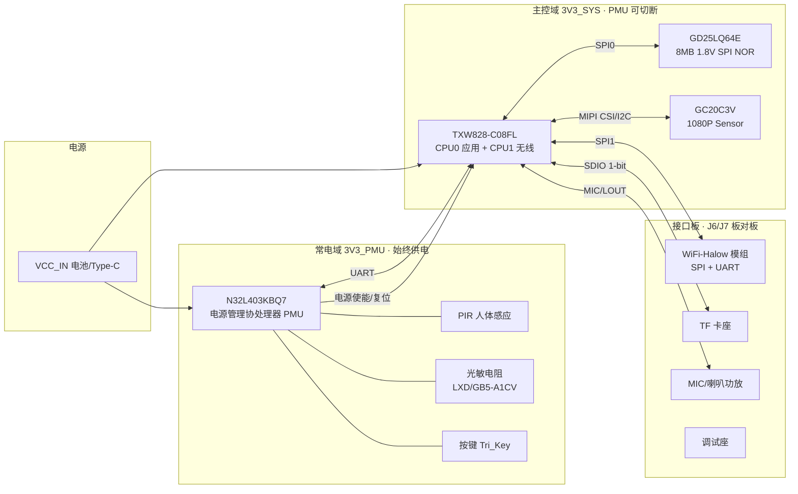

# NE102 硬件系统 IO 与连接关系说明

> 来源：`custom/doc/ne102_schematic.pdf`（ACM155-001-V1.0，2026-08-13/18，V1.0）
> 主控：TXW828-C08FL（QFN68）｜电源协处理器：N32L403KBQ7（QFN32，页内丝印 NS32L40X）｜Sensor：GC20C3V
> 本文由原理图文本层提取整理（2026-09-29），引脚级结论已做交叉校验；**最终以受控版原理图和 BOM 为准**。

## 1. 系统架构总览

关键设计：**N32L403 独立于主控常电运行**，掌握全部电源使能（1.2V 核心、主控 3V3、模组电、IR-CUT、补光灯），PIR/按键等低速率事件由它监测并唤醒/复位主控；TXW828 负责相机、Wi-Fi-Halow 图传和业务。

## 2. 电源树

| 电源域 | 产生方式 | 使能控制 | 去向 |
|--------|----------|----------|------|
| VCC_IN | 电池（J5 4P）＋ Type-C（J4，VBUS 经 FB6 汇入） | — | 全部电源输入 |
| 3V3 | U6 MP1462GD-Z buck（≈3.35V/2A，效率90%） | **`PMU_DC_EN`**（U6 EN） | 3V3_RF/3V3_IO/3V3_VCC/3V3_AUDIO（磁珠分域）；再经 `PMU_PWR_3V3` 控制的开关导通为 **SYS_3V3** 主控域电源 |
| 1V2_VDD | U7 MP1601 LDO-buck（3V3→1.2V） | **`PMU_DC_EN`**（U7 EN，与 3V3 主轨同源使能） | TXW828 核心 |
| 3V3_PMU | U4 SG1301B33M LDO（Iq=2μA，常电） | —（常开） | N32L403、PIR、光敏、按键、调试座 |
| 2V8_CSI | TXW828 内部 LDO_CAM（2.5–3.25V 可调，默认 2.8V），**从 PA13 引脚输出** | `CAM_EN`（PB6，时序总控） | Sensor AVDD |
| 1V8_CSI | TXW828 内部 LDO（VCAM2），**从 PC8 引脚输出** | 随上电 | Sensor VDDIO |
| 1V2_CSI | 板上 MP1601（U8/U9，3V3/1V8→1.2V） | `1V2_EN` | Sensor DVDD |
| 1V8_FLASH | **TXW828 内部 LDO 输出** | — | GD25LQ64E（1.8V 低压型 NOR） |
| 5V_IR | U11 SG1301B50M LDO（VCC_IN→5V） | `IR_PWR_EN` | IR-CUT 驱动 U12 |
| VIN_LED | U13 MP2410AGJ buck | — | 1W 白光补光灯（LED 调光见 §5.9） |
| TF 卡电 | `SDIO_PWR_EN`（PB7）控制开关 | PB7 | 接口板 TF 卡座 |

### 2.1 TXW828 电源域明细与上电时序（数据手册 V1.8 表 1-7-1-1 + 第 3 章，2026-09-29 整理）

**外部供电域**（NE102 全部源自 SYS_3V3 / 1V2_VDD）：

| 域 | 引脚 | 电压 | 供电对象 | NE102 来源 |
|----|------|------|----------|-----------|
| VCC | 55 | 3.3V（3.0–3.6） | 数字 IO：PA0–7、PA9/10、PA13、PA15、PC6/7（USB）、PD0–7、PD12/13 | SYS_3V3 |
| VCC1 | 56 | 3.3V | 数字 IO：PB6–15、PC0–1 | SYS_3V3 |
| VCC_SD | 内部域 | 3.3/1.8V 内部可选，默认 3.3V | 数字 IO：PC8–13 | 随 VCC |
| VCC_FLS | 36 | 内部可选 VCC/VCC18，**默认关闭** | 数字 IO：PB0–5（SPI NOR） | 输出为 1V8_FLASH → GD25LQ64E |
| VDD | 62 | **外部 DCDC 1.15V**（@192MHz；WiFi 保活休眠时 1.05V） | 数字核心 | 1V2_VDD（U7，PMU_DC_EN） |
| VCCA | 58 | 3.3V | 模拟模块、VDDLDO 输入（VCCD） | SYS_3V3（3V3_AUDIO 域） |
| VCCRF | 2 | 3.3V | 射频 | SYS_3V3（3V3_RF 域） |
| VCCPA | 1 | 3.3V | 射频 PA | SYS_3V3（3V3_RF 域） |

**片内 LDO 输出域**（输入取自 VCCA/VCC，默认关闭，由 boot ROM/固件按需使能，外部只需备好 3.3V）：

| 域 | 引脚 | 电压/负载 | 用途与限制 |
|----|------|-----------|-----------|
| VCAM | 57 | 2.5–3.25V 或 3.3V，100mA | 相机 AVDD（NE102：2V8_CSI） |
| VCAM2 | 28 | 1.0–2.55V，100mA | 相机 IO（NE102：1V8_CSI） |
| VCC18 | 29 | 1.8V，100mA | **仅内部 PSRAM；不允许驱动外部负载，不支持外部 1.8V Flash**（手册 V1.6 明确） |
| VDD15O | 65 | 1.5V，源自 VCCA | 供 VDD15L（66）/VDD15R（67）射频 |
| VCMAU | 19 | 参考 | 仅去耦，禁止带负载 |

**上电时序结论**：

- 数据手册**没有规定 3.3V 与 1.2V 之间的强制上下电顺序**（全文无时序章节；官网《硬件设计指南》页面过大未能抓取，公网亦无公开时序资料）。
- 可推导的硬约束：① 复位释放电平为 0.6×VCCIO（nRST 为 MCLR 型），**复位线电平只在 VCCIO 建立后才有意义**，即 3.3V 和 1.2V 必须在复位释放前稳定；② 片内 LDO 全部从 VCCA/VCC 取电，3.3V 是一切内部 LDO 的前提；③ 内部 LDO 的使能时序由 boot ROM/固件完成，板上无需控制。
- NE102 的时序链因此是充分的：`PMU_DC_EN` 同建 3V3/1V2 轨 → `PMU_PWR_3V3` 导通 SYS_3V3（全部 3.3V 域经磁珠同源上电）→ nRST 浮空、由片内上拉释放 → boot ROM 接管内部 LDO 使能。1V2 会比 SYS_3V3 早数 ms（核心先于 IO），手册无禁止。

**待硬件确认**：
1. ~~W25Q64JV 电压范围疑点~~ **已解决（2026-09-29）**：实际 BOM 为 **GD25LQ64EWIGR**（GD 1.8V 低压系列，64Mbit=8MB），与 1V8_FLASH 轨（VCC_FLS/pin36 输出）匹配，设计自洽。原理图 PDF 文本误标为 W25Q64JV。注意手册 V1.6 "VCC18LDO 不支持外部 1.8V Flash" 针对的是 pin29（内部 PSRAM 专用轨）；本板 flash 电取自 pin36 VCC_FLS，为独立可选输出。
2. 核心先于 IO 数 ms 上电是否满足泰芯推荐——手册无禁止，建议向 FAE 确认一句。
3. VCC_FLS 的 1.8V/3.3V 选择机制：学习板（3.3V flash W25Q128JVSIQ）与本板（1.8V flash）同芯片均直接 boot，推断由 B0/B1 strap（原理图标注含 1.8V/3.3V 与 SF/SD 字样、100K 下拉）+ boot ROM 自管，软件无需配置；若遇 flash 启动异常再向 FAE 确认 strap 语义。

### 2.2 芯片输出电源的软件使能核对（2026-09-29，对照学习板资料包）

学习板资料包（`custom/doc/TXW82x_DEV_BORAD_v1.2/`，核心板 QFN80 同芯片家族）核对结论：

| 芯片输出轨 | NE102 网络 | 软件使能点 | NE102 状态 |
|------------|-----------|-----------|-----------|
| VCAM LDO（pin57，2.5–3.25V） | 2V8_CSI（sensor AVDD） | demo `app_power_init()`：`pmu_vcam_ldo_en(VCAM_EN, VCAM_VOL=2V80)`，`VCAM_EN=1` 已在 720P config | ✅ 已使能 |
| **VCAM2 LDO（pin28，1.0–2.55V）** | **1V8_CSI（sensor IOVDD + 相机 I2C/RST/PDN 上拉轨，实测原理图 p8）** | `pmu_vcam2_ldo_en(VCAM2_EN, VCAM2_VOL=1V80)`；**`VCAM2_EN` 系统默认 0（关）** | ✅ 已补：720P config 增加 `VCAM2_EN=1`（学习板不需要——其相机模组 IOVDD 取自 VCAM） |
| VCC_SD 域选择（PC8–13 IO 电压） | 相机 I2C/RST/PDN/MCLK 所在域 | `pmu_vccsd_power_set(1, VCCSD_33)`；`VCCSD_33` 默认 0=**1.8V** | ✅ 默认即 1.8V，与 1V8_CSI 上拉匹配（AI/LCD demo 因触摸要 3.3V 才显式改 1） |
| VCC_FLS（pin36） | 1V8_FLASH（GD25LQ64E） | 无 SDK 代码管理 | ✅ boot strap + ROM 自管（见待确认 3） |
| VCC18（pin29） | 内部 PSRAM | 系统 PSRAM 初始化自管 | ✅ 无需配置 |

## 3. TXW828-C08FL（U1）IO 分配总表

### 3.1 时钟与复位

| 引脚 | 网络 | 连接 |
|------|------|------|
| PA7/PA10（RTC_I，pin60） | RTC_XI | Y2 32.768kHz 晶振 |
| PA6/PA9（RTC_O，pin59） | RTC_XO | Y2 32.768kHz 晶振 |
| XI/XO_40M | — | Y1 40MHz 主晶振（射频必选） |
| pin4（NRST） | — | **板上 RC 复位电路**（非 PMU 控制；PMU_RST_SYS 实际接 PB14 GPIO，见 §3.7） |

### 3.2 存储与扩展总线

| 功能 | 引脚 | 网络 | 连接 |
|------|------|------|------|
| SPI0 CS | PB4（pin31） | SPI0_CS | GD25LQ64E（U2，8MB 1.8V NOR，1V8_FLASH 域） |
| SPI0 CLK | PB1/BOOT1（pin34） | SPI0_CLK | 同上（**PB0/PB1 兼作启动 strap**） |
| SPI0 D0 | PB0/BOOT0（pin35） | SPI0_D0 | 同上 |
| SPI0 D1 | PB5（pin30） | SPI0_D1 | 同上 |
| SPI0 D2/WP | PB3（pin32） | SPI0_D2/WP | 同上 |
| SPI0 D3/HOLD | PB2（pin33） | SPI0_D3/HOLD | 同上 |
| SDIO CLK | PB9（pin12） | SDIO_CLK | TF 卡（**1-bit 模式**，卡座在接口板，经 J6/J7 引出） |
| SDIO CMD | PB8（pin13） | SDIO_CMD | TF 卡 |
| SDIO D0 | PB10（pin11） | SDIO_D0 | TF 卡 |
| SDIO CD | PB11（pin10） | SDIO_CD | TF 卡检测 |
| TF 电源 | PB7（pin14） | SDIO_PWR_EN | TF 卡供电开关 |

### 3.3 相机（GC20C3V，MIPI CSI-0，1-lane）

| 功能 | 引脚 | 网络 |
|------|------|------|
| MIPI CKP/CKN | PA4（pin51）/PA5（pin52） | MIPI_CKP / MIPI_CKN |
| MIPI D0P/D0N | PA2（pin49）/PA3（pin50） | MIPI_D0P / MIPI_D0N |
| MCLK | PC9（pin27） | CSI_MCLK |
| I2C SCL/SDA | PC11（pin25）/PC10（pin26） | CSI_SCL / CSI_SDA |
| RESET | PC12（pin24） | CSI_RST |
| PWDN | PC13（pin23） | CSI_PWDN |
| 相机电源总控 | PB6（pin15） | CAM_EN（页8/9/10 共用） |
| 2.8V 输出 | **PA13（pin57）** | 2V8_CSI（内部 LDO 输出脚，非 GPIO） |
| 1.8V 输出 | **PC8（pin28）** | 1V8_CSI（内部 LDO 输出脚，非 GPIO） |

### 3.4 UART 与 USB

| 功能 | 引脚 | 网络 | 连接 |
|------|------|------|------|
| UART → PMU（TX） | PB12（pin9） | PMU_TX | N32L403 `PMU_RX` |
| **主日志 UART0** | **PD12（TX，pin38）/ PD13（RX，pin37）** | UART0_TX/RX | **2026-09-30 改**：设备引出的串口座；原生 TX1/RX1 焊盘方向（config.cfg 任意 iomap） |
| CPU1 日志 UART1_TX | PC6（pin53 焊盘） | UART1_TX | CPU1（无线核）日志输出，921600（RX 需固定复用 M1_28 未配） |
| UART ← PMU（RX） | PB13（pin8） | PMU_RX | N32L403 `PMU_TX` |
| UART1 | **PD12（TX1，pin38）/ PD13（RX1，pin37）** | UART1_TX/RX（与 USBF_DM/TX1、USBF_DP/RX1 **同引脚复用**） | J6/J7 → 接口板（WiFi-Halow 模组 AT/数据通道）；**与 USB Device 互斥**，引脚复用二选一 |
| USB Device D+/D− | PD13（pin37）/PD12（pin38） | USBF_DP/RX1、USBF_DM/TX1 | Type-C（J4，页7）：供电/烧录/调试 |
| USB Host | PC6（pin53）/PC7（pin54） | USB_DP/TX0、USB_DM/RX0 | J7 → 接口板（2026-09-30 起 PC6 改作 CPU1 日志 UART1_TX） |

### 3.5 WiFi-Halow 模组（SPI1 + 控制，经 J6/J7 到接口板）

| 功能 | 引脚 | 网络 |
|------|------|------|
| SPI1 CS | PD0（pin46） | SPI1_CS |
| SPI1 CLK | PD3（pin43） | SPI1_CLK |
| SPI1 MOSI | PD1（pin45） | SPI1_MOSI |
| SPI1 MISO | PD2（pin44） | SPI1_MISO |
| SPI1 中断 | PD4（pin42） | SPI1_INT |
| 模组 Busy | PD5（pin41） | Halow_BusyH |
| 模组 Wake | PD6（pin40） | Halow_WakeH |
| 模组复位 | PD7（pin39） | Halow_RST_N |
| 模组供电控制 | PA0（pin47） | Module_PWR（与 PMU_Module_EN 配合，经 Q6 驱动） |

### 3.6 音频（经 J7 到接口板）

| 功能 | 引脚 | 网络 |
|------|------|------|
| MIC 差分输入 | pin16/pin17 | MIC_P / MIC_N |
| 线路差分输出 | pin21/pin20 | LOUT_P / LOUT_N |
| 音频模拟电源 | pin18 | 3V3_AUDIO（VCCA_U_3V3） |
| 音频共模输出 | pin19 | VCMAU（**只能去耦，禁止作电源**） |

### 3.7 控制、指示与 ADC

| 功能 | 引脚 | 网络 | 说明 |
|------|------|------|------|
| PMU 复位通道 | PB14（pin7） | PMU_RST_SYS | PMU → 主控 **GPIO 级复位通道**（固件约定，非硬件 NRST）；**TXW828 真正的 NRST（pin4）由板上 RC 复位电路管理**（2026-09-30 硬件确认：烧录工具 4 线制不接复位线亦正常） |
| 补光灯调光 | PA1（pin48） | SYS_PWM → LED_PWM | 页10（PMU 侧另有 PMU_PWM→LEDW_PWM） |
| IR-CUT 切换 | PB15（pin6） | SYS_IRCUT → IRCUT_SW | 页10；**双源控制**：主控 PB15 或 PMU PA11（PMU_IRCUT），与补光灯双源模式相同 |
| 电池电压检测 | PA15（pin61） | BAT_ADC12 | 页9 分压采样（`BAT_DET_ON` 控制分压使能省电） |
| 状态 LED | PC0（pin4） | LED_NET/SYS | LED1（蓝色）网络/系统指示 |
| 预留 ADC | PC1（pin3） | SYS_ADC6 | 引至 J6（注意 Vref 上限 3.0V） |
| 调试/烧录 | PA9（DAT）/PA10（CLK） | PA9_TMS / PA10_TCK | **数据手册确认：PA9=调试 DAT/烧录 DAT，PA10=调试 CLK/烧录 CLK**（二线制；内置 100KΩ 上拉，另有 VREFPIR_N1/N2、低功耗 PWM2/PWM3 复用）。接 **J1 烧录座**并引出测试点 TP1(PA9)/TP2(PA10)；原理图网络名 TMS/TCK 系沿用学习板 JTAG 叫法，实义为 DAT/CLK |
| 2.7V 偏置输出 | pin15 | 2V7_BIAS | 内部偏置，引至 J7/TP4 |

## 4. N32L403KBQ7（U3）电源管理协处理器

**角色**：常电域"看门人"。主控休眠/断电期间由 3V3_PMU 供电独立运行；负责电源时序、低速率传感（PIR/光敏/按键）、IR-CUT/补光灯，以及通过 UART/复位线唤醒或重启主控。其固件为**独立工程**（N32L403，Keil/IAR 生态），与主控固件分开开发、通过串口协议协作。

**供电与时钟**：U4 SG1301B33M（VCC_IN→3.3V/300mA，Iq=2μA）→ 3V3_PMU；Y3 32.768kHz（PD14/PD15）；复位 PMU_nRST（R/C + 调试引出）。

**引脚分配全表**（QFN32，已按原理图页6逐一核对）：

| 引脚 | 端口/复用 | 网络 | 方向 | 连接与作用 |
|------|-----------|------|------|------------|
| 1 | VDD | 3V3_PMU | — | 常电域供电 |
| 2 | PD14/XI | RTX_XI | ← | Y3 32.768kHz 晶振 |
| 3 | PD15/XO | RTX_XO | ← | Y3 32.768kHz 晶振 |
| 4 | NRST | PMU_nRST | ← | 复位（R/C + 调试引出） |
| 5 | VDDA | 3V3_PMU | — | 模拟供电 |
| 6 | PA0/AON | PMU_CFG_KEY | ← | 按键 Tri_Key（AON 唤醒域） |
| 7 | PA1 | PMU_IR_EN | → | 页10 IR/补光支路使能（CAM_EN 联动） |
| 8 | PA2 | PMU_ADC | ← | 页9 光敏 PR_ADC（Vref 上限 3.0V） |
| 9 | PA3 | PMU_PIR_CFG | → | 页9 PIR 模块配置/使能 |
| 10 | PA4 | PMU_DC_EN | → | 页7 DC-DC 使能：U6（3V3 主轨）与 U7（1.2V）的 EN，**同开 3V3 与 1.2V 两个电源域** |
| 11 | PA5 | PMU_PWR_3V3 | → | 页5 开关：**拉高将 3V3 导通至 SYS_3V3 主控域** |
| 12 | PA6 | PMU_SDA | ↔ | 页9 I2C 引至接口板 |
| 13 | PA7 | PMU_SCL | ↔ | 页9 I2C 引至接口板 |
| 14 | PB0 | PMU_Module_EN | → | 页9 模组电源（Q6/PWR_CTRL）：WiFi-Halow 供电 |
| 15 | PB1 | PMU_RST_SYS | → | TXW828 PB14：复位主控（唤醒手段之一） |
| 16 | VSS | GND | — | |
| 17 | VDD | 3V3_PMU | — | |
| 18 | PA8/AON | PMU_PIR_TRI | ← | 页9 PIR_IN：PIR 触发输入（AON 唤醒源） |
| 19 | PA9/USART1_TX | Debug_TX | → | 调试串口（J2/J3，T2/T3 测试点）：PMU 发送 |
| 20 | PA10/USART1_RX | Debug_RX | ← | 调试串口：PMU 接收 |
| 21 | PA11/USB_DM | PMU_IRCUT | → | 页9 IRCUT_SW：IR-CUT 切换（与主控 PB15 双源） |
| 22 | PA12/USB_DP | — | — | ✗ 未连（USB 未使用） |
| 23 | PA13/JTMS | PMU_TMS | — | SWD 调试（T8，页9 引出） |
| 24 | PA14/JTCK | PMU_JTCK | — | SWD 调试（T7，页9 引出） |
| 25 | PA15/JTDI | PMU_JTDI | — | JTAG（T6） |
| 26 | PB3/JTDO | PMU_JTDO | — | JTAG（T5） |
| 27 | PB4/NJRST | PMU_JRST | — | JTAG 复位（T4） |
| 28 | PB5 | PMU_PWM | → | 页10 LEDW_PWM：白光补光调光（主控休眠时仍可调光） |
| 29 | PB6 | PMU_TX | → | TXW828 PB13：命令/状态串口（R21 上拉） |
| 30 | PB7 | PMU_RX | ← | TXW828 PB12：命令/状态串口（R22 上拉） |
| 31 | BOOT0 | PMU_BOOT0 | — | 页9：烧录/启动选择 |
| 32/33 | VSS/PAD | GND | — | |

板级器件：K1（TS-1112E×2）、K2（TS-1807R）按键，J2/J3（1×2P 调试座），R21/R22 10K 上拉。

## 5. 各模块连接关系

1. **相机 GC20C3V**（页8）：MIPI CSI-0 **1-lane**（D0+CK），I2C 地址 `0x6C`（8-bit 写，即 7-bit 0x36），I2C_ID 电阻可选。电源 AVDD28=2V8_CSI、VDDIO18=1V8_CSI、DVDD12=1V2_CSI，受 CAM_EN 时序控制。SDK 已带驱动 `sdk/lib/bus/iic/sensor/sensor_gc20C3_mipi.c`（`DEV_SENSOR_GC20C3`，1920×1080@24fps RAW10），但初始化表为 MIPI **2-lane**，需按 1-lane 配置 CSI/驱动。
2. **SPI NOR GD25LQ64E**（页5，U2，实际 BOM 为 GD25LQ64EWIGR；原理图文本误标 W25Q64JV）：GD 1.8V 低压系列，64Mbit=8MB，SPI0 四线，1V8_FLASH 域（与 VCC_FLS 输出自洽）；PB0/PB1 为启动 strap（100kΩ 下拉）。
3. **TF 卡**（接口板）：SDIO 1-bit（CLK/CMD/D0/CD）+ SDIO_PWR_EN 独立供电控制；热插拔走 SDK `sdh_loop` 轮询。
4. **WiFi-Halow 模组**（接口板，经 J6/J7）：SPI1 从机 + INT/Busy/Wake/RST 握手 + Module_PWR/PMU_Module_EN 供电 + UART1 AT 通道。**802.11ah 协议栈/模组驱动不在本 SDK 内**，需模组厂配套或自研（SPI 厂商私有协议）。
5. **Type-C**（页7，J4 16P）：VBUS 经 FB6 入 VCC_IN；USBF_DP/DM（PD13/PD12）为 USB Device（烧录/调试）。**注意 PD12/PD13 与 UART1 复用**：若软件把该组引脚配成 UART1 连模组，则 USB 设备口不可用。
6. **音频**（经 J7）：MIC 差分入、LOUT 差出至接口板功放；软件对应 `app_audio_init()`，PA 时序注意爆音。
7. **PIR**（页9）：输出 PIR_IN→PMU（唤醒源）；PMU_PIR_CFG 配置；也可经 J6 给主控侧参考。
8. **光敏 LXD/GB5-A1CV**（页9，U10）：PR_ADC→PMU_ADC，日夜/补光联动。
9. **IR-CUT 与补光**（页10）：U12 AP1511B 双线圈驱动（IRCUT_SW/PMU_IRCUT 控制，IR_PWR_EN 供电，200mA max）；白光 LED（1W）由 LED_PWM（主控 SYS_PWM/PA1）与 LEDW_PWM（PMU_PWM）两路调光。
10. **电池**（页9，J5）：BAT_ADC12 分压至 PA15，分压使能 `BAT_DET_ON`（Q5），PMU 侧同源检测；`BAT_PWR_ON=1` 有效。
11. **按键**：Tri_Key 三键（K1×2 + K2），PMU_CFG_KEY（AON 唤醒域）+ PMU_BOOT0 等。
12. **状态灯**：LED1（蓝，PC0，LED_NET/SYS）。

## 6. 低功耗架构要点（结合 `TXW82x 低功耗开发指南`）

- **两级低功耗**：① 主控 SDK 休眠（模式1/3/5，见低功耗指南）；② PMU 级断电——PMU_DC_EN 切 3V3/1.2V 轨、PMU_PWR_3V3 断 SYS_3V3，主控全断，仅 3V3_PMU 常电（μA 级）。
- **唤醒链**：PIR/按键 → N32L403 →（按策略）拉 PMU_RST_SYS 复位主控或先 UART 通知再复位；RTC 定时由主控 RTC（Y2 32k）或 PMU（Y3 32k）承担。
- **外设电源可独立关断**：TF（SDIO_PWR_EN）、模组（Module_PWR/PMU_Module_EN）、相机（CAM_EN）、IR-CUT（IR_PWR_EN）——休眠前逐一关闭，并按低功耗指南用 `dsleep_set_user_gio*()` 保持必要电平。
- **注意**：PA13/PC8 是相机 LDO 输出脚，不可作 GPIO；PA0/PB0/PB1 有 strap 复用（Module_PWR/BOOT），休眠保持与上电时序需一起核对。

## 7. 与 SDK 默认配置的差异（bring-up 必读）

| 项 | SDK 默认/学习板 | NE102 实际 | 动作 |
|----|-----------------|-----------|------|
| SDIO 引脚 | PA6/7/8/11/12/13 | PB7–PB11 | ✅ 已完成：NE102 config.cfg（CLK=PB9/CMD=PB8/DAT0=PB10，1-bit 只用三个脚） |
| SD 总线宽度 | 4-bit 可选 | **1-bit**（无 D1–D3） | ✅ config.cfg 只配 DAT0，DAT1–3 不配置即 1-bit |
| Sensor | GC1084 等 | GC20C3V（1-lane） | ✅ 已完成：demo 配置切 `DEV_SENSOR_GC20C3`（驱动自带 1-lane 1080p25 模式，demo 按 1 lane 调用） |
| UART0 | PA11/PA12 | PC6/PC7（USB 口复用） | ✅ 已完成：config.cfg PIN_UART0_TX=PC_6/RX=PC_7 |
| 电源开关 | 学习板由 demo 电池方案管理 | CAM_EN(PB6) 门外置 sensor 1.2V、TF_PWR(PB7) 卡供电 | ✅ 已完成：`custom/app/app_lowpwr_camera.c` `app_board_power_init()` 在 main() 开头拉高（参数化，0xFF 跳过）；极性高有效待上板确认 |
| 烧录/调试口 | PA10=TMS、PA9=TCK（学习板 JTAG 命名） | **数据手册确认 PA9=DAT、PA10=CLK**（二线烧录/调试），原理图网络名沿用 TMS/TCK 叫法 | 烧录器按 DAT=PA9 / CLK=PA10 接线（J1） |
| 启动介质 | SF（NOR） | SF（**GD25LQ64E**，8MB 1.8V），PB0/PB1 strap | 保持一致 |
| 产品方案 | CUSTOMER_ID 5/9 | 当前按 ID 5（720P IPC）适配跑通；后续转自研方案 | 走 skill §4 新产品方案流程 |

## 8. 硬件确认记录（2026-09-29 已核实）

1. **主控域上电链（2026-09-29 修订）**：`PMU_DC_EN`（PMU PA4）拉高**同时使能 3V3 主轨（U6）与 1.2V 核心轨（U7）**；随后 `PMU_PWR_3V3`（PMU PA5）拉高把 3V3 导通至 SYS_3V3 主控电源域。**上电顺序必须 DC_EN 在前**（先建轨、后切换），断电顺序相反。
2. **UART1 与 USB Device 复用**：同一组引脚 TXW828 PD12（=USBF_DM/TX1=UART1_TX）、PD13（=USBF_DP/RX1=UART1_RX），两种功能互斥。
3. **1V8_FLASH**：由 TXW828 芯片内部 LDO 输出，供 GD25LQ64E（1.8V 低压型 NOR）。
4. **N32L403 引脚分配**：全表已核对（见 §4），含 PMU_IRCUT=PA11、PMU_PIR_TRI=PA8/AON、调试串口=PA9/PA10、IR-CUT 与补光灯同为双源控制。
5. **页5 J1**（A1251AWR-04-F1CA-R，带屏蔽）：接烧录器（二线制：**CLK=PA10、DAT=PA9**，见数据手册"调试 CLK/烧录 CLK、调试 DAT/烧录 DAT"）。

## 9. TXW828 烧录方式（NE102）

### 9.1 前提：主控域必须已上电（PMU 依赖）

NE102 的主控电源链是 `VCC_IN → PMU(N32L403) → SYS_3V3/1V2 → TXW828`，**PMU 固件运行后才会给主控上电**。因此：

- **首次 bring-up 顺序：先烧 PMU**（J-Link SWD，PA13/PA14 → T7/T8 测试点，`custom/pmu/jlink/flash.bat`），PMU 运行后主控域自动上电，才可烧 TXW；
- PMU 未跑/被断电时，主控域无电，任何 TXW 烧录方式都连不上（排查"工具找不到芯片"先查此处）。

### 9.2 方式一：TXLink-Lite 二线离线烧录（量产标准，推荐）

- **接口 J1**（A1251AWR-04-F1CA-R）：VRET 参考电压接 3V3、**PA9=烧录 DAT、PA10=烧录 CLK**、GND；另引出 TP1(PA9)/TP2(PA10) 测试点。
- 引脚定义以数据手册 V1.4 表 1-7-1-2 为准（二线制）。
- ⚠️ 原理图 J1 处的 TXLink 标注为 "HDA→PA10、HCK→PA9"，与数据手册（PA9=DAT/PA10=CLK）**相反**，且与同一处的 C-LINK 标注（TCK→PA10/TMS→PA9）矛盾——**以手册为准接线；若烧录器连接失败，先对调 DAT/CLK 两根线再试**（无损坏风险）。
- J1 未引出 CHIP_EN（TXLink 标准接口的预留信号之一）：空片时 ROM 上电即进入烧录握手；**重烧已编程芯片**建议先接好烧录器再让主控域重新上电（复位 PMU 或整板重新上电），确保 ROM 在上电窗口进入握手。此为常规实践推断，首次上板验证。
- 供电：NE102 由电池/VCC_IN 供电，功耗不受烧录器 3V3 能力限制；VRET 仅作参考电平。

### 9.3 方式二：USB 烧录（Type-C J4）

- USBF_DP/DM = PD13/PD12 → Type-C（J4）；要求设备进入 USB Boot（空片或由工具引导）。
- 需 PC 端**官方下载工具**（量产发布资料，SDK 内不含；泰芯官网/FAE 获取）。
- PD12/PD13 与 UART1 复用，但烧录阶段与业务无冲突。

### 9.4 方式三：CKLink + CDK（开发调试 + 烧录）

- 连接：CKLink 的 TCK→PA10、TMS→PA9（J1 或 TP1/TP2），参考电压 VRET 接 3V3。
- CDK 烧录：`project/txw82xApp/CSKYFlashProgramerConsole.bat <CDK路径> <配置>`（注意仓库内 `CSKYFlashProgramerCfg/` 为空，需在 CDK Flash Programmer 中针对 GD25LQ64E 配置后保存）。
- GDB 方式：`project/txw82xApp/utilities/gdb.init` + `gdb_flash_24Mhz.init`（含关看门狗、切时钟等预置命令，仅限本芯片）。
- 适合开发期反复调试，量产不用。

### 9.5 烧录产物与常见坑

- 烧录文件：`project/txw82xApp/APP.bin`（`./build.sh txw` 或 `txw-app` 后位于 `archive/latest/APP.bin`）——必须是 Core→App 完整构建产物，勿用预置的旧 `txw82xcore.bin` 拼装。
- 烧录成功但不起动：核对镜像地址（`makecode.ini` CodeAddrOffset）、Flash 参数；SPI 配置定稿为 **SDK 默认 EB 四线 + SPI_CLK=1c + SPI_SIZE=800000**（EB 对 GD25LQ64E 兼容且保住运行时四线取指，详见 §10 ReadCmd 定案）。
- **官方《TXW 烧录方法及烧录异常排查方法》要点（2026-09-30 已全文提取）**：① TXLink-Lite 82x 接线 VREF-3.3V / HDA-PA10 / HCK-PA9 / GND，"板子不需要上电只接 4 根线即可"；② 排查清单第一条即"供电正常 + **晶振起振（空片上电即起振）**"；③ **固件不得复用 PA9/PA10，否则第二次烧不进**（NE102 未复用，安全；补救法=上电前短接 flash 1/2 脚使 ROM 读不到固件落入下载模式，或用 TXLink-Lite 强制烧）。

### 9.6 如何进入 boot/下载模式

ROM 内置 BootInterface（数据手册 §1.2）：下载通道为 **USB2.0 Device + UART（二线 PA9/PA10）**；启动介质由 strap 选择（**PB0/PB1 = BOOT0/BOOT1**，兼作 SPI0 D0/CLK，组合表见 §10 第 6 条）。学习板的进下载电路：核心板把 PB0/PB1 经 1K 引成 MODE_DATA/MODE_CLK 到底板，底板 KEY_BOOT 按键 + 板载调试 MCU（R4/R66 22Ω 串阻）可在烧录时驱动这两根选择模式——即 MODE_* 是 **strap 线（PB0/PB1）**而非 PA9/PA10；PA9/PA10 只承担烧录通信（DAT/CLK）。

按场景：

| 场景 | 进 boot 方式 |
|------|--------------|
| **空片/固件无效** | 上电即自动进入 ROM 下载等待，TXLink/USB 直接可连（首次烧录已验证） |
| **重烧已编程芯片（TXLink）** | 先连好 TXLink → 让主控域**重新上电**（复位 PMU/整板断电再上）→ ROM 在上电窗口与烧录器握手进入下载 |
| **重烧（USB）** | 空片时插 Type-C 上电即枚举；已编程芯片通常需配合上述"重新上电"或先擦/短接 flash |
| **应急（暴力法，SDK 文档不推荐）** | 短接 flash 的 CLK/CS 使 ROM 读不到有效固件 → 落入下载模式；仅在受控返修时使用 |

NE102 注意：
- J1 无 KEY_BOOT/CHIP_EN 引脚（学习板有 KEY_BOOT），重烧只能靠"重新上电握手"或短接 flash；
- 主控域重新上电 = 复位 PMU（按 PMU_nRST 测试点）或整板重新上电——PMU 固件会按 DC_EN→PWR_3V3 时序重新给主控上电，形成上电窗口；
- 后续可在 PMU 固件中实现"按住按键 → PMU 拉住主控复位并等待烧录器"的进下载逻辑（见 pmu TODO）。

## 9.7 摄像头 bring-up 记录（2026-09-30 下午，sensor 已识别）

- **硬件事实（以 GC20C3_Brief 数据手册+硬件确认为准）**：I2C_ID 引脚 10K 下拉 → I2C_ID_SEL=0 → 地址 **0x62/0x63**（7-bit 0x31）；**PWDNB 低有效**（高=正常模式）；XSHUTDOWN(RESET) 低=硬待机；三路电源（AVDD2.8/IOVDD1.8/DVDD1.2）**任意上电顺序均可**；XCLK 需在首次 I2C 前运行（SDK 已满足）。
- **探测 0xFF 无应答的排查与定案**：地址/PDN/时序全排除后，用 GPIO 软件 I2C（bit-bang，诊断代码已删）读 reg 0x03f1 得 0xc3（sensor 活）；分层测试证明 iomap/控制器/驱动全好、7-bit 0x31 直读命中——**唯一差异是时机**（开机 ~600ms 队列首探失败，~1.6s 直读成功）。
- **修复（两步，含根因终版修正）**：
  - ① `sensorAutoCheck()` 加重试（5ms×100，实测 **retry 1 命中**）。根因终版（日志时间戳定案）：`sensor_power_on()` 固定延时 72ms（PDN 2 + RESET 预等待 50 + 脉冲 20）结束后**立即**首探，而 GC20C3 复位释放后需 ~6ms 引导才响应 I2C——首探 0xff 是一笔 ~1ms 就完成的快速失败事务，**不是**控制器超时或一次性故障（早前"第一笔事务必超时 ~75ms"的推测已推翻：75ms 实为固定延时本身）。
  - ② 快启优化（2026-10-08）：`sensor_power_on()` CSI0 复位延时 50/20ms → 2/2ms（板级 LDO 在 main() `app_board_power_init()` 已提前稳定，预等待冗余）。实测 sensor 就绪 **616→546ms（-70ms，2 次 boot 一致）**，retry 循环兜底复位引导期；init table/ISP/[Sensor Timing] 全链路同步提前 ~70ms。
  - 配套：`app_iic.c` 队列引脚序列加 IEEN（双向焊盘输入使能，与 SD 驱动 DAT0 同款处理）。
  - 快启抓拍后续杠杆：探测入口在 ~533ms，前面排着系统/Wi-Fi 初始化——把相机链路在 demo 启动序列中前移才是数量级优化点。
- **分层诊断法（复用）**：①GPIO bit-bang I2C 读 ID（排除全部控制器/复用层）→ ②iomap 回读（GPIO_GET_OUTMAP/INMAP 验证映射落上）→ ③i2c_open+ioctl(SET_DEVICE_ADDR, **7-bit**)+i2c_read 直驱 → 与队列路径逐层对比。
- **✅ 已解决（视频出图，2026-09-30 晚）**：无帧真凶 = **av_sram 池耗尽**（1080p 管线吃满 100KB，编码器 `malloc fail size=8192 remain=0`）→ 修复：切换 1080p demo（其原生 `CONFIG_AVHEAP_SIZE=150K`，100K+50K）后解决。实测出图（当时 720p demo 下的 640×360 子流；后切换 1080p demo，见下）。帧到达诊断：在 `vpp_frame_done`（vpp_dev.c 开源）加计数器——注意探测必须跑独立任务（阻塞 MAIN 工作队列 >5s 触发监视器 dump）。
- **✅ 性能已修复（2026-10-08 XIP 运行时降速定案）**：镜像头 SPI_CLK(0x1c) 被 ROM 经 fw_info(0x2006be00+0x18) 传给运行时 `ll_xip_clock_init(0)` → 运行时 XIP 仅 ~26MHz（取指带宽实测 1-3MB/s），全固件爬行（1080p 编 4.7fps，"CPU 100%"实为等取指）。**修复 = `app_board_power_init()`（main 第一句，启动 [3ms] 即生效）调用 `ll_xip_clock_init(60)`**（boot 头保持 0x1c，烧录/启动不受影响；60MHz 由 `ll_qspi_clock_auto_adjust` 自动调延迟，实测稳定；最初放在 app_lowpwr_camera_init/usr_app_init——排在 sys_wifi_init 与整个 demo init 之后，启动主体仍跑 28MHz，上移后全链路再快 ~31ms）。战果：主码流 1080p **17.9fps@2.6Mbps**、子码流 720p **17.8fps**、CPU 57%、零丢帧。PSRAM 带宽（43W/72R MB/s）为次级瓶颈，FAE 可跟进。
- 次级遗留：fps 表只有 {25,15} 无 30 档；TF 卡未插已用 `NE102_SD_EN=0` 屏蔽（ipc_1080p_demo.c）。

## 10. 首板点亮记录（冷启动失败已定案修复，2026-09-30）

现象：烧录报成功，但 LED（PC0）不亮、串口无输出。排查结论见下方定案。

**日志口速查（源码核实 2026-09-30）**：`device_init()`（device.c:563，pre_main 阶段）同时打开 `uart0=921600 //for CPU0` 与 `uart1=921600 //for CPU1`——**双核日志走不同串口**；`hgprintf_uart()` 写 `console_handle`（由 uart_open 赋值，闭源库）；引脚均由 config.cfg 参数经任意 iomap 映射（UART1_RX 除外，固定复用 M1_28）：

| 核 | 串口 | 波特率 | NE102 引脚 | 备注 |
|----|------|--------|-----------|------|
| CPU0（应用 + AT 控制台） | UART0 | 921600 | TX=**PD13**(pin37) / RX=**PD12**(pin38) | **2026-09-30 二次改**：TX/RX 对调以匹配适配器接线（任意 iomap，无方向限制）；设备串口座即此两脚 |
| CPU1（无线核） | UART1 | 921600 | TX=**PC6**(pin53 焊盘) | 从 PD12 挪来（让位 UART0）；RX 需固定复用 M1_28 未配 |
| PMU（N32L403） | USART1 | 115200 | PA9/PA10 → T2/T3 测试点 | 每秒 uptime |

**console 引脚机制与镜像二进制验证（2026-09-30）**：芯片**没有硬件默认的 UART0 引脚**——编译期宏兜底值为 255（不输出），实际引脚 100% 由参数表决定：`config.cfg` → 构建时 makecode（`TxParamPatchEn=1`）把参数写入 APP.bin 内 `iocfg_psram`（.rodata@0x100f690c，结构 {u16 size; u16 pin_max; u8 pin[196]}，按 pin_param.h 枚举序）→ 启动时 `device_init()`/`uart_open` → `uart_pin_func()` 读 `MACRO_PIN(PIN_UART0_TX)` → `gpio_iomap_output` 任意映射到目标脚（学习板 PA11/PA12 也是它 config.cfg 配的，同理）。已从 `archive/latest/APP.bin` 二进制直接读参数表逐项核对：UART0_TX=38(PC_6)、UART0_RX=39(PC_7)、UART1_TX=60(PD_12)、CAM_EN=22(PB_6)、TF_PWR=23(PB_7)、SD/MIPI 各脚全部正确——**镜像内 console 确在 PC6/PC7，"串口配置错"假设排除**；无输出指向固件未启动（电源/flash/strap，见下）或物理接线/适配器问题。（复现验证时注意：pin_param.h 头部注释含字面量 `MACRO_PIN_DEFINE(XXXX)`，统计枚举须先剥注释行，否则索引偏 1 全部对不上。）

### 定案（2026-09-30，CKLink 在线诊断全程闭环）

**根因：ROM 冷启动路径按镜像头字段配置的 SPI 时钟（`SPI_CLK_MHZ=0x3c` 档）对本板 flash 过快。**
**唯一必要修复（已二分定案）：`project/txw82xApp/makecode.ini` 的 `SPI_CLK_MHZ` `3c → 1c`。** DriverStrength（2）/SampleDelay（55AA）保持 SDK 出厂默认即可。二分记录：3c+强驱动+零采样延迟=不启动；1c+全默认=正常启动。修复后冷启动稳定（LED 2Hz 心跳时序正确=系统全速，启动半速仅影响 ROM 引导阶段）。

**flash 启动速率定案（2026-10-08 打点实测，"1c 会不会拖慢启动"问题关闭）**：header SPI_CLK 实际只覆盖 **reset→main 入口**（ROM 8KB 拷贝 + SystemInit + pre_main）——1c 下实测仅 **~2ms**，提档收益 ≤2ms 无意义，**1c 永久保留，2c/38/3c 不再测试**。启动主体 [3→664ms] 窗口中取指受限部分仅 ~31ms（其余为 RF 校准/音频/电源等硬件固有等待），已通过把 XIP 60MHz 修正从 `app_lowpwr_camera_init()`（usr_app_init，排在 sys_wifi_init/sys_app_init 之后）**上移到 `app_board_power_init()`（main 第一句，[3ms] 生效）**回收：sensor 就绪 548→513ms、[Sensor Timing] 975→944ms，全链路 -31ms。快启抓拍下一刀应砍 [3-664ms] 窗口的固有等待本身（PIR 唤醒场景跳过 Wi-Fi/BLE 初始化、直取相机路径）。另：烧录器 CKLink 接入运行中系统的瞬间会触发一次 `cpu loading` + Core1 寄存器转储打印（2 次复现于连接时刻），属调试器挂起伪象，非自发崩溃。

**运行时 XIP 时钟上限实测（2026-10-08，"能不能更快"问题关闭）**：`ll_xip_clock_init` 动态提档实验——**120MHz = 永久 `system restart fault` 重启循环**（1 次存活都没有）；**100MHz = 临界**（每次上电随机 1-2 次 `[wdt]`/`[soft_reset]` 故障后某次启动存活，之后稳定，但产品级不可接受）；**60MHz = 定稿**（每次启动零故障）。GD25LQ64E fC 规格 133MHz，上限卡在 SoC/板级信号边际而非 flash。且 >60MHz **零收益**：启动链路已是硬件等待主导（sensor 命中 496ms@60 vs 495ms@100）；编码 17.9fps 时 CPU 57%，瓶颈在 sensor 帧率配置与 PSRAM 带宽而非取指。结论写在 `app_lowpwr_camera.c` 注释里（`NE102_XIP_RUNTIME_CLK_MHZ`），勿盲目上调。

**机理**：GD25LQ64E@1.8V + 本板走线下 0x3c 档时序边际不足——轻则 XIP"病态爬行"（实测 PC 每秒推进 1~2 字节），重则总线挂死连调试域一起拖死（CKLink 不可停核=最早"全非法值"现象）。下载路径（烧录）走慢钟不受影响，故表现为"烧得上跑不起"。学习板 W25Q128@3.3V 同参数无恙。

**ReadCmd 定案（2026-10-08 二次修正，推翻早前"EB 对 GD 不适用"的判断）**：SDK 默认 `ReadCmd=EB` 四线 + QE 序列**对 GD25LQ64E 完全适用且应保留**——①EB 时序结构与 W25Q128JV 完全一致（地址 6clk + M 2clk + 4 dummy = ReadCmdDummy=6）；②QE 同为 S9 非易失位（两家默认都是 0），SDK `Squence1=01H 双字节写 SR1+SR2` 恰好就是 GD 设置 QE 的**唯一正确方式**（GD 标准模式无 31H 单写 SR2 命令，`Squence4=31H` 被 GD 忽略、无害）；③GD25LQ64E 规格：非 03 命令 133MHz、03 命令 80MHz、Quad 532Mbps（1.65-2.0V），flash 本体能力充裕。实测（EB+1c+DriverStrength=0）正常启动，且**运行时 XIP 获得四线取指**：同样 1c+运行时 60MHz 下，启动链路比 03 单线再快 ~20ms（sensor 命中 513→496ms、[Sensor Timing] 944→924ms）。早前改成 `ReadCmd=03`+`SpecSquenceEn=0` 的保守化不必要且损失四线带宽，已还原为 SDK 默认。**上限定界**：EB+2c(44MHz) 烧录后不启动（DriverStrength=0/3 均同）——远低于 GD 133MHz 规格，属 SoC 引导阶段固定采样点（`SampleDelay`，无自动训练）在本板 1.8V 走线下的边际问题；因 header 时钟只影响 ~2ms 的 ROM 阶段（见下条），**不值得继续调参，1c 定稿**。若未来确需提速：可从运行时 `ll_qspi_clock_auto_adjust`（闭源库）训练出的寄存器值反推 header `SampleDelay`。

**排查中确证无误的项**（后续跳过）：strap 电路（原理图 p5 模式表：PB[1:0]=10 → FLASH@1.8V，R14=10K 唯一已贴拉 PB1；CS 上拉 R12 正确）、flash 内容（CKLink 全片回读与镜像逐字节一致）、晶振（HOSC_MNT@0x40020080 监测器实测起振）、电源轨（3.3/1.2/1.8V）、PSRAM 参数表（与 42229 参考逐字节一致）、CPU1 镜像加载（SRAM 0x10001000 逐字节核对）、固件可执行性（手动建窗引导法全程跑通至应用层）。

**"烧录成功但不启动"复用诊断法**（工具见 `custom/tools/`）：
1. CKLink 全片读回比对（`cklink_read_flash.bat`）排除烧录完整性；
2. `rsp_read_regs.py`（GDB-RSP，握手先发 `+`，stop 包寄存器小端）停核看 PC/寄存器；
3. 手动引导：关 WDT（0x400C1004/14=0xdddd；PMU 安全写=偏移→0x400180B8、数据→+B4、钥匙 0xC053781B→+BC）→ QSPI(0x40000000) 写 `REMAP_ADD(0x24)=0xc00`+`CONFIG|=BIT(16)` 建 XIP 重映射窗口 → PC 置镜像入口放跑——固件能跑即软件清白，问题在 ROM 引导参数；
4. 已知坑：调试模块退化时回陈旧 PC（单步/读数交叉验证）；GPIO 被 ACE 门控（`system_set_ace_peris()`），JTAG 态写不进 GPIO，LED 只能由固件驱动；JTAG `reset`/`R0`/MCLR 均不能真正复位核心，看真实上电现场必须断电；`SINGLE_CORE` 宏（cdkproj Define）可跳过 CPU1 等待做单核最小验证。

**遗留**：如需全速启动，携二分证据问 FAE 索要 GD25LQ64E@1.8V 推荐启动时序。

