# TXSDK_USB开发指南

> 文档版本：V1.0  
> 修订日期：2026-09-18  
> SDK 基线：`TXW82x_FPV-v2.7.1.7-45228`  
> 目标读者：USB 协议栈、驱动和应用软件开发工程师

## 1. 适用范围

本指南面向 USB 协议栈、驱动和应用软件开发工程师，说明当前 SDK 中 USB Host、Device 和 USB 2.0 OTG 检测模块的初始化入口、对象生命周期、Class 注册链和数据路径。

为便于判断各 Class 在 SDK 中的接入方式，文中使用以下状态：

| 状态 | 含义 |
|---|---|
| 核心注册 | 初始化函数中存在不受 Class 宏控制的注册调用 |
| 宏控注册 | 初始化函数中存在受对应宏保护的注册调用 |
| 间接接入 | 没有独立注册调用，由另一个已注册 Class 的回调进入 |
| 实现存在、通用入口未接入 | 源文件中有实现，但当前通用初始化函数没有注册调用 |

“实现存在”不等于“已进入当前工程的编译和注册链”。本指南聚焦 SDK 软件接口和实现流程，不包含板级电气设计、外设兼容性、传输性能和目标产品运行结果。

### 1.1 主要术语

| 术语 | 在本文中的含义 |
|---|---|
| EP0 | Device 默认控制端点，或 Host 访问设备默认控制端点所使用的 pipe |
| pipe | Host 侧由 HCD 分配、关联到设备实例的端点传输对象 |
| `uinstance` | Host 侧 USB 设备实例 |
| `ufunction` | Device 配置中的一个功能对象 |
| IAD | Interface Association Descriptor；Host 核心据此把接口数组交给 Class enable |
| BOT | MSC 源码实现的 Bulk-Only Transport 传输路径 |
| altsetting | Device 接口的备用设置；核心在 `USB_REQ_SET_INTERFACE` 中切换并重启对应端点 |

## 2. 软件结构与统一初始化

### 2.1 目录职责

| 路径 | 当前代码职责 |
|---|---|
| `sdk/demo/app_common.h` | USB 模式位和 `app_usb_init()` 声明 |
| `sdk/demo/app_common.c` | 模式校验、重复注册过滤和各控制器注册入口 |
| `sdk/lib/bus/rttusb/bsp` | USB 1.1/2.0 HCD、DCD、Class 注册和 OTG 检测适配 |
| `sdk/lib/bus/rttusb/include` | Host、Device 和通用 USB 类型与接口声明 |
| `sdk/lib/bus/rttusb/usbhost/core` | Host 初始化、枚举、类匹配、HUB 和 pipe 生命周期 |
| `sdk/lib/bus/rttusb/usbhost/class` | Host Class 实现 |
| `sdk/lib/bus/rttusb/usbdevice/core` | Device 对象构造、Setup 分发、配置和 I/O 请求 |
| `sdk/lib/bus/rttusb/usbdevice/class` | Device Class 实现 |

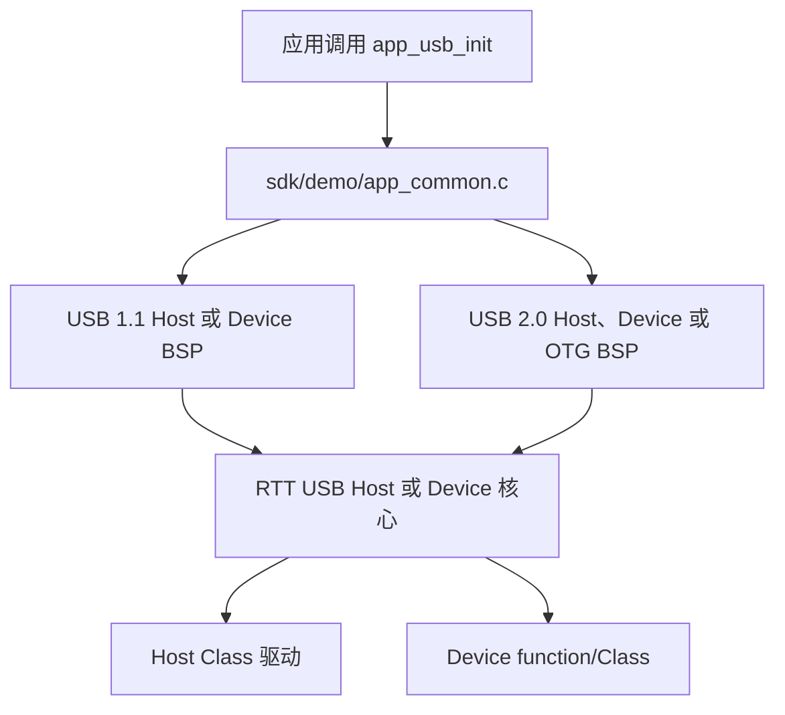

### 2.2 模式位和校验

`sdk/demo/app_common.h` 定义以下运行时模式位：

| 模式位 | 位值 | `app_usb_init()` 中的入口 |
|---|---|---|
| `USB11_DEVICE_MODE` | `BIT(0)` = 0x01 | `hg_usb11d_class_driver_register()`、`hg_usb11d_register()` |
| `USB11_HOST_MODE` | `BIT(1)` = 0x02 | `hg_usb11h_register()` |
| `USB20_DEVICE_MODE` | `BIT(2)` = 0x04 | `hg_usbd_class_driver_register()`、`hg_usbd_register()` |
| `USB20_HOST_MODE` | `BIT(3)` = 0x08 | `hg_usbh_register()` |
| `USB20_OTG_MODE` | `BIT(4)` = 0x10 | `hg_usb_connect_detect_init()` |

`app_usb_init(uint8_t usb_mode)` 的源码行为如下：

- 参数为 0 或含未知位时返回 `RET_ERR`。
- 同一次调用中，USB 1.1 Host 与 Device 互斥。
- 同一次调用中，USB 2.0 Host、Device 与 OTG 三者互斥。
- 静态变量 `app_usb_register_flag` 过滤已经注册过的模式位。
- Device 第一次初始化前调用 `rt_usbd_core_device_list_init()`；USB 2.0 OTG 分支首次初始化同样会执行该调用，Device 与 OTG 共用同一个静态标记保证只执行一次。
- 该函数没有跨多次调用检查同一控制器先后选择不同角色的逻辑。

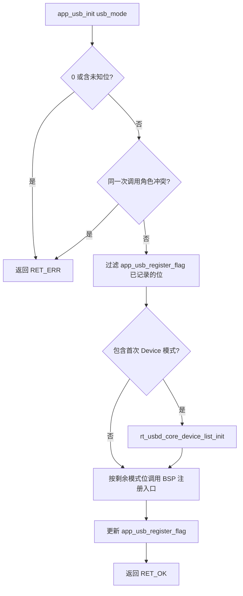

### 2.3 调用示例

下面的调用形式可由 `sdk/demo/app_common.h` 和 `sdk/demo/app_common.c` 直接对应：

```c
#include "app_common.h"

int32_t ret = app_usb_init(USB20_HOST_MODE);
if (ret != RET_OK) {
    return ret;
}
```

运行时模式只决定进入哪个 BSP 注册入口；Class 是否具有注册分支还取决于相应 `RT_USBH_*` 或 `RT_USB_DEVICE_*` 宏。

### 2.4 USB DMA 缓冲区约束

> **核心规则：USB DMA 只能配置“位于 SRAM 地址空间、且 4 字节对齐”的缓冲区地址，两个条件缺一不可。** 任何把缓冲区地址交给 USB 控制器的路径都必须先满足该规则。

| 约束 | 要求 | 判定方法 |
|---|---|---|
| SRAM 地址空间 | 地址必须落在 SRAM 区间 `[0x20000000, 0x28000000)`；PSRAM 区间 `[0x28000000, 0x30000000)` 的地址不可直传 | `IS_SRAM_ADDR(addr)` 为真且 `IS_PSRAM_ADDR(addr)` 为假（宏定义于 `chip/txw82x/txw82x.h`） |
| 4 字节对齐 | 地址低 2 位必须为 0；指针偏移后的实际传参地址同样必须保持对齐 | `((uintptr_t)addr & 0x3U) == 0U` |

对齐约束只针对地址，不要求传输长度是 4 的倍数。受该规则约束的传输入口包括 `rt_usb_hcd_pipe_xfer()`、`rt_usbd_io_request()`、`hgusb20_ep_rx_kick()`/`hgusb20_ep_tx_kick()`、`USB_HOST_KICK_EP_DMA`，以及各 Class 接口间接启动的端点传输。

地址核心规则之外，RX 方向还需满足以下长度要求；PSRAM 中转要求则同时适用于收发两个方向：

- **RX DMA 长度按端点最大包长取整**：配置 RX DMA 长度（`hgusb20_ep_rx_kick()` 的 `len`、`rt_usb_hcd_pipe_xfer()` 的 RX `nbytes`、`USB_HOST_KICK_EP_DMA` 的 `dma_len`）时，应取为该端点 `wMaxPacketSize` 的整数倍；一次传输可覆盖多个包，实际接收长度以 `USB_HOST_GET_RX_DMA_LEN`（底层 `hgusb20_ep_get_dma_rx_len()`）读回为准。
- **RX 尾部预留**：RX 缓冲区分配容量 = 预期接收长度 + `USB_RX_BUFF_RESERVE_SIZE`（`usb_common.h` 中当前为 4）。USB SIE 在部分接收长度下会向尾部越界多写：USB 2.0 在接收长度除 4 余 1 时多写 2 字节、余 2 时多写 1 字节；USB 1.1 在余 2 时多写 1 字节。
- **PSRAM 数据经 SRAM 中转**：发送方向先把数据复制到 SRAM 缓冲区再启动 DMA；接收方向先由 DMA 写入 SRAM，再复制到 PSRAM 长期保存。

### 2.5 Class 接入矩阵

标准 USB Host Class：

| Class | 控制宏 | 当前通用初始化接入 | 主要业务 pipe |
|---|---|---|---|
| HUB | 无 Class 宏分支 | 核心注册 | Interrupt/控制路径由 HUB 实现管理 |
| MSC | `RT_USBH_MSTORAGE` | 宏控注册 | Bulk IN/OUT |
| CDC ACM | `RT_USBH_CDC` | 宏控注册 | 可选 Interrupt/Bulk；控制请求走 EP0 |
| HID | `RT_USBH_HID` | 宏控注册 | Interrupt IN |
| UVC | `RT_USBH_UVC` | 宏控注册 | 动态 ISO IN |
| UAC | `RT_USBH_UAC` | 宏控注册 | 动态 ISO IN/OUT |
| Wireless/RNDIS | `RT_USBH_WIRELESS`、`RT_USBH_WIRELESS_RNDIS` | 宏控注册 | Interrupt IN + Bulk IN/OUT |
| ADK | `RT_USBH_ADK` | 实现存在、通用入口未接入 | 源码含 Bulk IN/OUT |

厂商定制模组（`RT_USBH_VENDOR_*`，按 Vendor Specific Class + VID 匹配，层级独立于上表标准 Class）：

| Class | 控制宏 | 当前通用初始化接入 | 主要业务 pipe |
|---|---|---|---|
| Quectel | `RT_USBH_VENDOR_QUECTEL` | 独立宏控注册 | Bulk IN/OUT |
| China Mobile | `RT_USBH_VENDOR_CHINAMOBILE` | 独立宏控注册 | Bulk IN/OUT |
| Yuge | `RT_USBH_VENDOR_YUGE` | 经 CDC 间接接入（需同开 `RT_USBH_CDC`） | Bulk IN/OUT |
| ZXInfo | `RT_USBH_VENDOR_ZXINFO` | 经 CDC 间接接入（需同开 `RT_USBH_CDC`） | Bulk IN/OUT |

Device Class：

| Class | 控制宏 | BSP 注册链 | 非 EP0 端点 | TX/RX 端点数 |
|---|---|---|---|---|
| CDC-VCOM | `RT_USB_DEVICE_CDC` | USB 1.1/2.0 均有 | Interrupt IN + Bulk IN/OUT | 2 / 1 |
| MSC | `RT_USB_DEVICE_MSTORAGE` | USB 1.1/2.0 均有 | Bulk IN/OUT | 1 / 1 |
| UVC | `RT_USB_DEVICE_VIDEO` | USB 1.1/2.0 均有 | ISO IN | 1 / 0 |
| UVC（仅 MJPEG） | `RT_USB_DEVICE_VIDEO_MJPEG` | 仅 USB 2.0 BSP | ISO IN | 1 / 0 |
| UVC（仅 H.264） | `RT_USB_DEVICE_VIDEO_H264` | 仅 USB 2.0 BSP | ISO IN | 1 / 0 |
| UAC Mic | `RT_USB_DEVICE_AUDIO_MIC` | USB 1.1/2.0 均有 | ISO IN | 1 / 0 |
| UAC Speaker | `RT_USB_DEVICE_AUDIO_SPEAKER` | USB 1.1/2.0 均有 | ISO OUT | 0 / 1 |
| HID | `RT_USB_DEVICE_HID` | USB 1.1/2.0 均有 | Interrupt IN/OUT | 1 / 1 |
| RNDIS | `RT_USB_DEVICE_RNDIS` | USB 1.1/2.0 均有 | Interrupt IN + Bulk IN/OUT | 2 / 1 |
| ECM | `RT_USB_DEVICE_ECM` | 两个通用 BSP 均未调用注册 | Interrupt IN + Bulk IN/OUT | 2 / 1 |
| WINUSB | `RT_USB_DEVICE_WINUSB` | USB 1.1/2.0 均有 | Bulk IN/OUT | 1 / 1 |

表中 TX/RX 端点数按单个 Class 实例统计：TX 为 IN 端点（设备向 Host 发送），RX 为 OUT 端点（Host 向设备发送），EP0 不计。复合设备同时启用多个 Class 时端点数叠加，可用端点规模见 2.6 节。

#### project_config.h Class 使能示例

宏可添加在 `project_config.h`或编译选项中。Host 与 Device 的使能示例如下，按需打开即可，注释掉的条目表示当前未启用：

```c
/* ===== USB Host：标准 Class ===== */
#define RT_USBH_MSTORAGE              //U 盘（MSC）
// #define RT_USBH_CDC                //CDC ACM
 #define RT_USBH_UVC                  //UVC 摄像头
// #define RT_USBH_UAC                //UAC 音频
// #define RT_USBH_HID                //HID（鼠标/键盘需同时打开对应 protocol）
// #define RT_USBH_HID_MOUSE
// #define RT_USBH_HID_KEYBOARD
// #define RT_USBH_WIRELESS            //Wireless/RNDIS
// #define RT_USBH_WIRELESS_RNDIS     //RNDIS 实现，需与 RT_USBH_WIRELESS 同开
// #define RT_USBH_ADK                 //ADK（当前通用初始化链未自动接入）

/* ===== USB Host：厂商定制模组（VENDOR 层，独立于标准 Class）===== */
// #define RT_USBH_VENDOR_QUECTEL      //Quectel Cat.1 AT
// #define RT_USBH_VENDOR_CHINAMOBILE  //China Mobile Cat.1 AT
// #define RT_USBH_VENDOR_YUGE         //Yuge Cat.1 AT，经 CDC 转入，需同开 RT_USBH_CDC
// #define RT_USBH_VENDOR_ZXINFO       //ZXInfo Cat.1 AT，经 CDC 转入，需同开 RT_USBH_CDC
```

```c
/* ===== USB Device：打开需要的 Device Class ===== */
#define RT_USING_USB_DEVICE           //Device 核心总开关（门控 usbdevice.c）
// #define RT_USB_DEVICE_COMPOSITE    //复合设备；启用 RT_USB_DEVICE_VIDEO 时会自动补定义
 #define RT_USB_DEVICE_VIDEO          //UVC
// #define RT_USB_DEVICE_CDC          //CDC-VCOM 虚拟串口
// #define RT_USB_DEVICE_MSTORAGE     //MSC
// #define RT_USB_DEVICE_AUDIO_MIC    //UAC 麦克风
// #define RT_USB_DEVICE_AUDIO_SPEAKER //UAC 扬声器
// #define RT_USB_DEVICE_HID          //HID
// #define RT_USB_DEVICE_RNDIS        //RNDIS 网卡
// #define RT_USB_DEVICE_ECM          //ECM 网卡（通用 BSP 未注册，需自行接入注册链）
// #define RT_USB_DEVICE_WINUSB       //WINUSB
```

- 这些宏只决定编译与注册分支；Host/Device 角色仍由 `app_usb_init()` 的运行时模式位（2.2 节）决定，配置宏与传入的模式位需保持一致。

### 2.6 芯片可用端点资源

| 芯片 / 控制器 | 端点规模 | HUB 下接多设备 | 支持 RTTUSB 的 SDK 版本 |
|---|---|---|---|
| TXW81X USB 2.0 | EP0 + 3 TX + 3 RX | 不支持 | 2.5.3 / 2.5.4 及后续版本 |
| TXW82X USB 2.0 | EP0 + 6 TX + 6 RX | 支持 | 2.7.0 / 2.7.1 及后续版本 |
| TXW82X USB 1.1 | EP0 + 3 TX + 3 RX | 不支持 | 2.7.0 / 2.7.1 及后续版本 |

- TX/RX 口径与 2.5 节一致：TX 为 IN 端点（设备向 Host 发送），RX 为 OUT 端点（Host 向设备发送）；EP0 固定用于默认控制传输，不计入业务端点。
- 结合 2.5 节的 TX/RX 端点数评估方案：例如“UVC（1 TX）+ UAC Speaker（1 RX）+ MSC（1 TX + 1 RX）”共占 2 TX + 2 RX，TXW81X 的 3 TX + 3 RX 即可容纳；“CDC-VCOM（2 TX + 1 RX）+ RNDIS（2 TX + 1 RX）”需 4 TX + 2 RX，超出 3 TX 上限，只能配置在 TXW82X USB 2.0 上。
- 不支持 HUB 下接多设备的控制器，Host 模式下只应连接单个 USB 设备；多设备同时接入需使用 TXW82X USB 2.0 控制器。
- **版本提醒**：RTTUSB 协议栈自 TXW81X 2.5.3/2.5.4、TXW82X 2.7.0/2.7.1 起提供支持，后续版本同样支持；更早的 SDK 版本不含该 USB 协议栈，移植或升级前先确认目标版本在上表范围内。本文基于 TXW82X 2.7.1（`TXW82x_FPV-v2.7.1.7`）基线编写。

### 2.7 关键源码索引

| 主题 | 路径 |
|---|---|
| 统一模式入口 | `sdk/demo/app_common.c`、`sdk/demo/app_common.h` |
| Host 初始化 | `sdk/lib/bus/rttusb/usbhost/core/usbhost.c` |
| Host 枚举与释放 | `sdk/lib/bus/rttusb/usbhost/core/usbhost_core.c` |
| Host Class 匹配 | `sdk/lib/bus/rttusb/usbhost/core/driver.c` |
| Host HUB | `sdk/lib/bus/rttusb/usbhost/core/hub.c` |
| Host Class | `sdk/lib/bus/rttusb/usbhost/class` |
| Device 对象与 Class 链 | `sdk/lib/bus/rttusb/usbdevice/core/usbdevice.c` |
| Device Setup 与 I/O | `sdk/lib/bus/rttusb/usbdevice/core/usbdevice_core.c` |
| Device Class | `sdk/lib/bus/rttusb/usbdevice/class` |
| USB 2.0 Device BSP | `sdk/lib/bus/rttusb/bsp/drv_usbd.c` |
| USB 1.1 Device BSP | `sdk/lib/bus/rttusb/bsp/drv_usb11d.c` |
| OTG 检测 | `sdk/lib/bus/rttusb/bsp/usb_detect.c` |
| Host UVC 组帧 | `sdk/lib/video/uvc/rtt_uvc_host.c` |
| UVC/音频 MSI 应用层 | `sdk/app/video_app/video_app_usb_msi.c`、`sdk/app/audio_usb_msi` |
| USB DMA ioctl 命令 | `sdk/include/hal/usb_device.h` |

## 3. USB Host 核心

### 3.1 Class 注册

`sdk/lib/bus/rttusb/usbhost/core/usbhost.c` 的 `rt_usb_host_init()` 最先调用 `rt_usbh_hub_init()` 建立根 HUB、消息队列和 hub 线程，随后 `rt_usbh_class_driver_init()` 初始化 Class 表，再按宏依次注册 MSC、HID（含 Mouse/Keyboard protocol）、CDC、UVC、UAC、Wireless、Quectel 和 China Mobile，最后无条件注册 HUB 并调用 `rt_device_init(uhc)`。Yuge、ZXInfo 和 ADK 不在该函数的独立注册分支中。

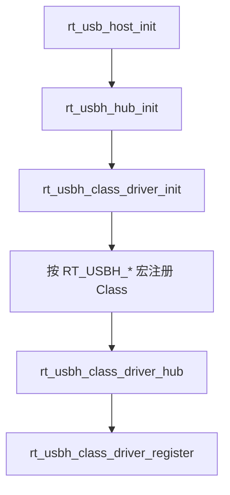

### 3.2 枚举、匹配和释放

`sdk/lib/bus/rttusb/usbhost/core/usbhost_core.c` 中 `rt_usbh_attatch_instance()` 的顺序是：

1. 为地址 0 的 EP0 分配 pipe（初始按 8 字节最大包长）。
2. 读取设备描述符头（8 字节）。
3. 复位端口、清连接变化并设置设备地址。
4. 按取得的最大包长重新分配 EP0 pipe。
5. 读取完整设备描述符和配置描述符（先读 18 字节配置头，再读完整配置描述符）。
6. 调用 `rt_usbh_set_configure(device, 1)`。
7. 有 IAD 时按 Function Class 查找驱动，并把 `struct uhintf **` 传给 enable；没有 IAD 时按 Interface Class 查找驱动，并传单个接口指针。

`rt_usbh_detach_instance()` 逐接口调用 Class disable，然后释放接口、配置描述符、EP0 pipe，并遍历实例 pipe 链释放其余 pipe，最后清空 `uinstance`。函数名中的 `attatch` 是源码现有拼写。

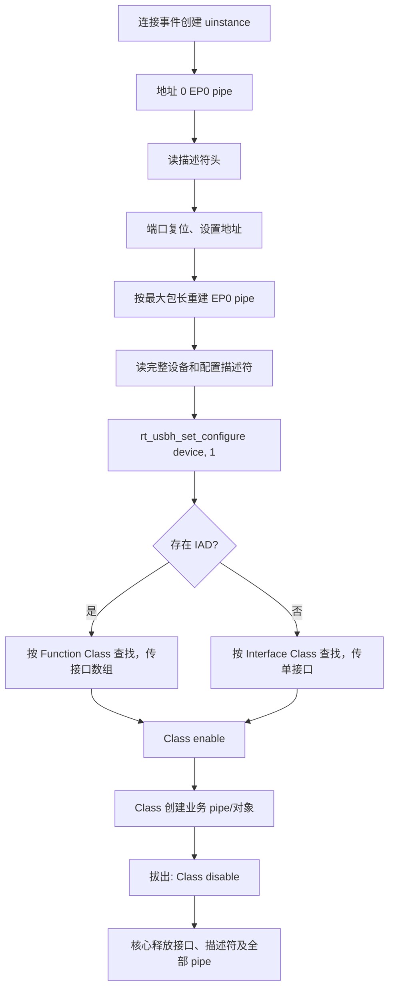

### 3.3 匹配和返回值边界

`sdk/lib/bus/rttusb/usbhost/core/driver.c` 有两项需要在扩展 Class 时直接遵循：

- `rt_usbh_class_driver_find()` 实际比较 `class_code`；当 Class 为 `USB_CLASS_VEND_SPECIFIC` 时还比较 VID。传入的 `subclass_code` 当前没有用于比较。
- `rt_usbh_class_driver_enable()` 和 `rt_usbh_class_driver_disable()` 调用 Class 回调后固定返回 `RT_EOK`，没有向上返回回调的错误码。

因此，Class 内部的匹配失败和初始化失败不能仅依赖这两个包装函数的返回值向枚举主线传播。

## 4. USB Host Class 开发说明

### 4.1 USB 集线器（HUB）

**相关源码：** `sdk/lib/bus/rttusb/usbhost/core/hub.c`、`sdk/lib/bus/rttusb/usbhost/core/usbhost.c`。

#### 关键宏

HUB 没有独立的功能启用宏。`rt_usb_host_init()` 固定调用 `rt_usbh_class_driver_hub()` 注册 HUB 驱动；使用通用 Host 初始化入口时无需、也不能通过单独的 HUB 宏取消该注册。

- `rt_usbh_class_driver_hub()` 设置 `class_code = USB_CLASS_HUB`，enable/disable 分别为 `rt_usbh_hub_enable()` 和 `rt_usbh_hub_disable()`。
- HUB 驱动在 `rt_usb_host_init()` 中无条件注册。
- 根端口事件入口为 `rt_usbh_root_hub_connect_handler()` 和 `rt_usbh_root_hub_disconnect_handler()`。
- HUB 代码处理端口状态、复位、子设备 attach 和 detach。

#### EP0 控制接口

| SDK 接口 | USB 请求 | 功能 |
|---|---|---|
| `rt_usbh_hub_get_descriptor()` | `GET_DESCRIPTOR(HUB)`，IN / Class / Device | 读取 HUB 描述符，包括端口数量和供电特性等信息。 |
| `rt_usbh_hub_get_status()` | `GET_STATUS`，IN / Class / Device | 读取 4 字节 HUB 状态和状态变化位。 |
| `rt_usbh_hub_get_port_status()` | `GET_STATUS`，IN / Class / Other | 读取指定下行端口的状态和变化位；根 HUB 分支调用 `root_hub_ctrl(RH_GET_PORT_STATUS)`。 |
| `rt_usbh_hub_clear_port_feature()` | `CLEAR_FEATURE`，OUT / Class / Other | 清除端口特性或变化位；根 HUB 分支使用 `RH_CLEAR_PORT_FEATURE`。 |
| `rt_usbh_hub_set_port_feature()` | `SET_FEATURE`，OUT / Class / Other | 设置端口特性，例如端口复位；根 HUB 分支使用 `RH_SET_PORT_FEATURE`。 |
| `rt_usbh_hub_reset_port()` | 组合控制流程 | 设置 `PORT_RESET`，轮询端口状态，最后清除 `C_PORT_RESET`，用于在枚举子设备前完成端口复位。 |

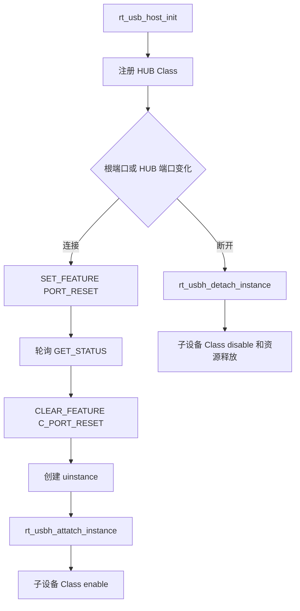

### 4.2 USB 大容量存储类（MSC）

**相关源码：** `sdk/lib/bus/rttusb/usbhost/class/mass.c`、`sdk/lib/bus/rttusb/usbhost/class/udisk.c`、`sdk/lib/fs/fatfs/diskio.c`、`sdk/lib/fs/vfs/vfs.h`、`sdk/lib/fs/vfs/vfs_fatfs.c`。

#### 关键宏

| 宏 | 当前值 | 作用与使用说明 |
|---|---:|---|
| `RT_USBH_MSTORAGE` | 由工程配置决定 | 定义后，`rt_usb_host_init()` 注册 MSC Host 驱动，并编译 Mass Storage 与 U 盘接入路径。 |
| `UDISK_MAX_COUNT` | `2` | 限制 `udisk.c` 可同时管理的 U 盘数量，也决定当前可分配的 `/usb0`、`/usb1` 挂载编号。增加该值会同步增加静态设备表容量。 |
| `UDISK_SRAM_XFER_SIZE` | `4096` | PSRAM 业务缓冲中转时单个 SRAM 分段缓冲的长度；读写路径按 `UDISK_SRAM_XFER_SIZE + USB_RX_BUFF_RESERVE_SIZE` 分配中转缓冲，并按该长度对应的扇区数分段搬运。 |

- 编译宏为 `RT_USBH_MSTORAGE`；驱动注册函数为 `rt_usbh_class_driver_storage()`。
- `rt_usbh_storage_enable()` 分配 `struct ustor` 和 CSW 缓冲，扫描 Bulk IN/OUT 端点并分配 pipe，然后调用 `rt_udisk_run()`。
- BOT/SCSI 路径经 Bulk-Only Transport 的 CBW、数据阶段和 CSW 完成 INQUIRY、TEST UNIT READY、READ CAPACITY、READ10/WRITE10 等命令，不属于 EP0 请求。介质探测各步骤失败最多重试 10 次；READ CAPACITY 超限时改用回退容量 2880 扇区 × 512 字节继续挂载。
- disable 调用 `rt_udisk_stop()`，等待 `stor->ref` 归零，再释放缓冲和对象；实例 pipe 仍由 Host 核心 detach 统一回收。

#### EP0 控制接口

| SDK 接口 | USB 请求 | 功能 |
|---|---|---|
| `rt_usbh_storage_get_max_lun()` | `USBREQ_GET_MAX_LUN`，IN / Class / Interface | 读取设备支持的最大 LUN 编号，供后续逻辑单元访问使用。 |
| `rt_usbh_storage_reset()` | `USBREQ_MASS_STORAGE_RESET`，OUT / Class / Interface | 复位 MSC Bulk-Only Transport 状态，用于初始化或错误恢复。 |

#### FatFS/VFS 挂载与卸载

`rt_udisk_run()` 完成介质探测后创建 `ustor_data` 和 `udisk_device`，以 `DEV_USB + udisk_id` 注册 FatFS 驱动，再调用 `vfs_mount()`。`UDISK_MAX_COUNT` 为 2，挂载目标由 `"/usb%d"` 生成，因此当前实现可使用 `/usb0`、`/usb1`；FatFS 源设备名由 `"%d:"` 生成。

`vfs.h` 要求在其他 VFS API 之前调用 `vfs_init()`，`vfs_fatfs.h` 要求在 `vfs_init()` 之后、首次 `vfs_mount()` 之前调用 `vfs_fatfs_register()`。通用入口 `app_sd_init()` 只调用了 `vfs_fatfs_register()`，且当前 SDK 中没有其他 `vfs_init()` 调用点。应用启动时应先调用一次 `vfs_init()` 再注册 FatFS；已注册或挂载后不要重复调用，该函数会清空文件系统表和挂载表。

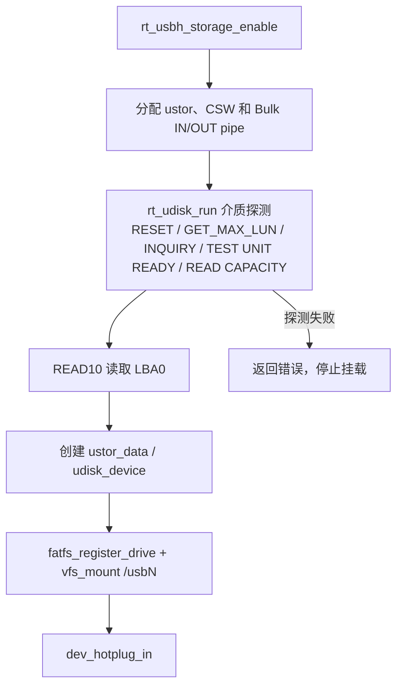

拔出设备时，`rt_udisk_stop()` 先把 `disk->intf` 置空，再调用 `vfs_umount("/usbN")`，随后执行 `dev_hotplug_out()` 并释放中转缓冲、磁盘编号和对象。应用在热拔出后不得继续使用原文件描述符。


#### VFS 文件读写

应用应在挂载完成后使用 VFS 路径访问文件。常用接口为 `vfs_open()`、`vfs_read()`、`vfs_write()`、`vfs_lseek()`、`vfs_tell()`、`vfs_size()`、`vfs_sync()` 和 `vfs_close()`；目录遍历使用 `vfs_opendir()`、`vfs_readdir()`、`vfs_closedir()`。打开标志由 `VFS_O_RDONLY`、`VFS_O_WRONLY`、`VFS_O_RDWR`、`VFS_O_CREAT`、`VFS_O_APPEND`、`VFS_O_TRUNC` 组合，定位基准为 `VFS_SEEK_SET`、`VFS_SEEK_CUR`、`VFS_SEEK_END`。

写入并同步文件：

```c
#include "vfs.h"

struct vfs_file_desc *fd;
const char data[] = "usb storage write test\n";
vfs_ssize_t written;

fd = vfs_open("/usb0/test.txt",
              VFS_O_WRONLY | VFS_O_CREAT | VFS_O_TRUNC, 0);
if (fd != NULL) {
    written = vfs_write(fd, data, sizeof(data) - 1);
    if (written == (vfs_ssize_t)(sizeof(data) - 1)) {
        vfs_sync(fd);
    }
    vfs_close(fd);
}
```

循环读取文件：

```c
#include "vfs.h"

struct vfs_file_desc *fd;
unsigned char buffer[512];
vfs_ssize_t read_len;

fd = vfs_open("/usb0/test.txt", VFS_O_RDONLY, 0);
if (fd != NULL) {
    while ((read_len = vfs_read(fd, buffer, sizeof(buffer))) > 0) {
        /* 在此处理 buffer[0..read_len-1]。 */
    }
    vfs_close(fd);
}
```

文件读写的底层调用链为 VFS → FatFS → `diskio.c` 中注册的 `struct fatfs_diskio` → `rt_udisk_read()`/`rt_udisk_write()` → `rt_usbh_storage_read10()`/`rt_usbh_storage_write10()`。当业务缓冲位于 PSRAM 时，当前实现使用 4 KiB SRAM 缓冲分段中转。

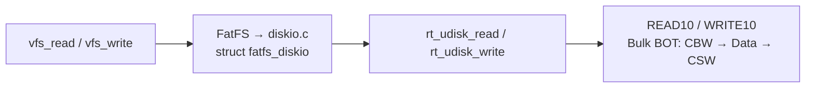

### 4.3 USB 通信设备类抽象控制模型（CDC ACM）

**相关源码：** `sdk/lib/bus/rttusb/usbhost/class/cdc.c`、`sdk/lib/bus/rttusb/usbhost/class/cdc.h`。

#### 关键宏

| 宏 | 当前状态 | 作用与使用说明 |
|---|---:|---|
| `RT_USBH_CDC` | 由工程配置决定 | 定义后注册 CDC Host 驱动，启用通信接口与关联数据接口的枚举及控制请求处理。 |
| `RT_USBH_CDC_THREAD` | 由工程配置决定 | 定义后创建 CDC 工作线程、事件对象与业务 pipe；未定义时保留 CDC EP0 控制路径，但不建立该线程数据路径。 |

- 编译宏为 `RT_USBH_CDC`，可选线程路径受 `RT_USBH_CDC_THREAD` 控制；注册 Class 为 `USB_CLASS_COMM`。
- IAD 枚举路径把接口指针数组传给 `rt_usbh_cdc_enable()`。
- EP0 控制接口包括 `rt_usbh_cdc_send_command()`、`rt_usbh_cdc_get_response()`、line coding 读写和 control line state 设置。
- 线程路径分配 `ucdc_data`、event 和线程，并扫描业务 pipe。
- 当 VID 命中时，CDC enable/disable 分别调用 Yuge 或 ZXInfo 的 AT run/stop 钩子；二者不是 `rt_usb_host_init()` 中的独立注册项。

#### EP0 控制接口

| SDK 接口 | CDC ACM 请求 | 功能 |
|---|---|---|
| `rt_usbh_cdc_send_command()` | `SEND_ENCAPSULATED_COMMAND` | 向通信接口发送封装命令。 |
| `rt_usbh_cdc_get_response()` | `GET_ENCAPSULATED_RESPONSE` | 从通信接口读取封装响应。 |
| `rt_usbh_cdc_get_line_coding()` | `GET_LINE_CODING` | 读取 7 字节线路编码，包括波特率、停止位、校验位和数据位。 |
| `rt_usbh_cdc_set_line_coding()` | `SET_LINE_CODING` | 写入 7 字节线路编码。 |
| `rt_usbh_cdc_set_control_line_state()` | `SET_CONTROL_LINE_STATE` | 发送控制线状态请求。当前实现将 `wValue` 固定为 0，并把 `len` 作为 `wLength`，不能作为通用 DTR/RTS 位设置接口使用。 |

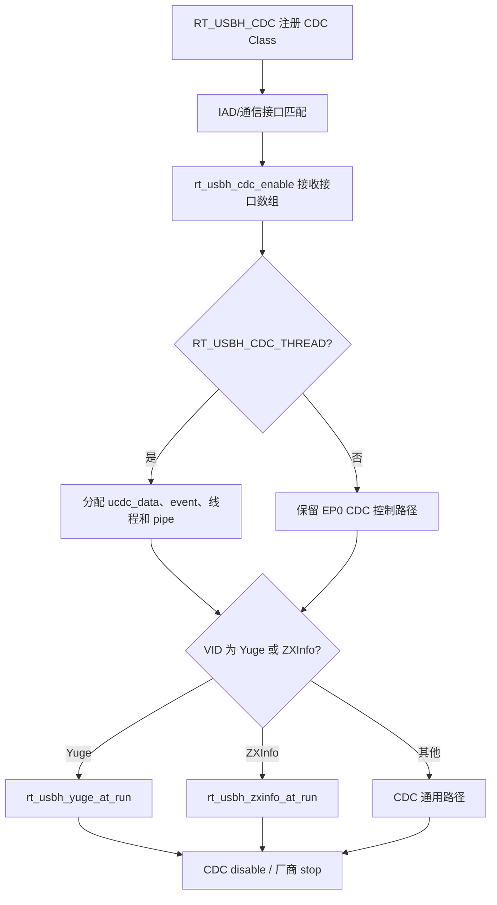

### 4.4 USB 人机接口设备（HID、鼠标与键盘）

**相关源码：** `sdk/lib/bus/rttusb/usbhost/class/hid.c`、`sdk/lib/bus/rttusb/usbhost/class/umouse.c`、`sdk/lib/bus/rttusb/usbhost/class/ukbd.c`。

#### 关键宏

| 宏 | 当前状态 | 作用与使用说明 |
|---|---:|---|
| `RT_USBH_HID` | 由工程配置决定 | 定义后注册 HID Host 驱动并启用 Interrupt IN 报告接收。 |
| `RT_USBH_HID_MOUSE` | 由工程配置决定 | 定义后注册 Mouse protocol 对象；仅启用 `RT_USBH_HID` 而未注册对应 protocol 时，鼠标接口的 enable 会失败。 |
| `RT_USBH_HID_KEYBOARD` | 由工程配置决定 | 定义后注册 Keyboard protocol 对象；仅启用 `RT_USBH_HID` 而未注册对应 protocol 时，键盘接口的 enable 会失败。 |

- 基础宏为 `RT_USBH_HID`；Mouse 和 Keyboard 协议分别受 `RT_USBH_HID_MOUSE`、`RT_USBH_HID_KEYBOARD` 控制。
- `rt_usbh_hid_enable()` 按 `bInterfaceProtocol` 查找已注册的 `uprotocal`；找不到协议对象时返回错误。
- HID enable 只扫描 Interrupt IN 端点并分配 pipe，随后调用 protocol init 启动报告处理。
- disable 释放 Interrupt IN pipe 和 `uhid` 对象。
- 源码接口中 `protocal` 为现有拼写，例如 `rt_usbh_hid_set_protocal()`。

#### EP0 控制接口

| SDK 接口 | HID 请求 | 功能 |
|---|---|---|
| `rt_usbh_hid_get_report_descriptor()` | 标准 `GET_DESCRIPTOR(Report)` | 读取 HID Report 描述符，供上层解析报告格式。 |
| `rt_usbh_hid_set_idle()` | `SET_IDLE` | 设置指定 Report ID 的空闲发送周期。 |
| `rt_usbh_hid_get_report()` | `GET_REPORT` | 通过控制传输读取 HID Report。 |
| `rt_usbh_hid_set_report()` | `SET_REPORT` | 通过控制传输写入 Report；当前实现固定使用 Output Report 类型。 |
| `rt_usbh_hid_set_protocal()` | `SET_PROTOCOL` | 选择 Boot Protocol 或 Report Protocol；接口名保留源码中的 `protocal` 拼写。 |

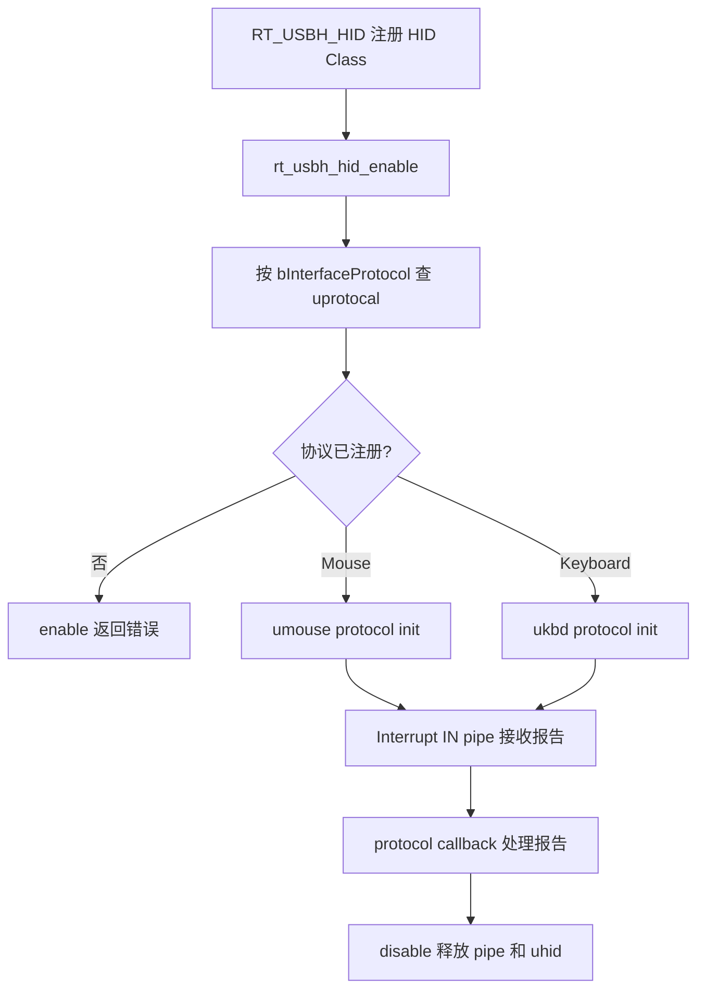

### 4.5 USB 视频设备类（UVC）

**相关源码：** `sdk/lib/bus/rttusb/usbhost/class/usbh_video.c`、`sdk/lib/bus/rttusb/usbhost/class/usbh_video.h`、`sdk/lib/video/uvc/rtt_uvc_host.c`、`sdk/include/lib/video/uvc/rtt_uvc_host.h`、`sdk/app/video_app/video_app_usb_msi.c`。`rtt_usbh_video_irq()` 的接入点在 `sdk/lib/bus/rttusb/bsp/drv_usbh_fpv.c` 和 `sdk/lib/bus/rttusb/bsp/drv_usb11h.c`。

#### 关键宏

| 宏 | 当前值或状态 | 作用与使用说明 |
|---|---:|---|
| `RT_USBH_UVC` | 由工程配置决定 | 定义后注册 UVC Host 驱动，启用 VideoControl/VideoStreaming 描述符解析和视频端点数据路径。 |
| `USBH_VIDEO_PPB` | `1` | 启用 `usbh_video` 软件双接收缓冲；修改后要同步核对 DMA 缓冲切换与回调消费速度。 |
| `USBH_VIDEO_MAX_FORMAT_NUM` | `5` | 每个 UVC 实例可保存的格式描述符数量上限；超过上限的格式不会进入内部格式表。 |
| `USBH_VIDEO_MAX_FRAME_NUM` | `15` | 每种格式可保存的帧描述符数量上限；格式选择只能使用已写入内部帧表的条目。 |
| `PSRAM_HEAP` | 已定义 | `rtt_usbh_video_user_open()` 只在定义该宏时为设备 0、1 建立 `video_app_usb_msi` 帧交付路径；未定义时仅执行 `usbh_video_open()` 和 DMA 启动，不建立 MSI 交付路径。 |
| `UVC_DEFAULT_FRAME_NUM` | `2` | `rtt_uvc_host` 默认帧槽数量；决定接收、可用和消费状态可并行占用的帧数。 |
| `UVC_DEFAULT_BLANK_NUM` | `8` | 每个 UVC 设备默认分配的分片节点数量。节点不足时当前帧会进入异常清理。 |
| `UVC_DEFAULT_BLANK_LEN` | `16 * 1024` | 单个分片节点的默认容量；与节点数共同决定组帧期间可承载的数据量。 |
| `UVC_DEVICE_CHECK_HEADER_EOH` | 已定义 | 启用 UVC payload Header 长度和 EOH 位校验。 |
| `UVC_DEVICE_BULK_CHECK_MJPEG_HEADER` | 已定义 | Bulk MJPEG 开始组帧前检查 Header 后是否为 JPEG SOI `FF D8`。 |
| `UVC_DEVICE_CHECK_PTS` | 未定义 | 当前不执行 PTS 连续性检查；源码中保留了关闭状态的定义行。 |
| `MAX_UVC_APP` | `2` | `video_app_usb_msi.c` 可管理的 UVC 应用实例上限。 |
| `UVC_YUV422_MJPEG_FORMAT` | `0` | 非 0 时，JPEG 帧在输出 MSI 前经过 `parse_jpg()` 处理；当前值为 0，直接输出组好的帧。 |
| `UVC_PSRAM_MALLOC_SIZE_INIT` | `100 * 1024` | 连续帧缓冲的初始申请大小；实际代码会根据帧长重新申请更大的缓冲。 |

- 编译宏为 `RT_USBH_UVC`，Class code 为 `USB_CLASS_VIDEO`。
- enable 遍历配置描述符，解析 VideoControl、VideoStreaming、格式、帧和 altsetting，分配接收缓冲，调用 `usbh_video_close()` 置为关闭 altsetting，再调用 `usbh_video_run()`。
- ISO pipe 不在 enable 中固定创建。弱定义 `usbh_video_run()` 调用 `rtt_usbh_video_user_open()`（定义于 `usbh_video.c`）；后者先由 `rtt_usbh_video_dev_pipe_manage()` 按 `isoin` 分配 pipe，再由 `usbh_video_open()` 选择格式、分辨率和 altsetting，并按 `video_rx_size`（取自该端点 `wMaxPacketSize`）启动 RX 端点 DMA。当前设备 0 打开 MJPEG 640×480，设备 1 打开 MJPEG 1280×720；源码中设备 1 分支附近的"H264"注释与实际配置不符。
- `rtt_usbh_video_user_close()` 先释放 ISO IN pipe，再调用 `usbh_video_close()` 切回关闭 altsetting。Class disable 调用该接口和 `usbh_video_stop()`，随后释放接收缓冲并归还 Class pool。
- `usbh_video.h` 声明了 `usbh_video_open()`、`usbh_video_close()`、`usbh_video_list_info()`、用户 open/close、pipe 管理以及弱定义 run/stop 钩子。

#### EP0 控制接口

| SDK 接口 | UVC 请求 | 功能 |
|---|---|---|
| `usbh_video_get()` | Class / Interface IN | 发送 UVC `GET_CUR`、`GET_MIN`、`GET_MAX` 等控制请求，是流协商读取操作的通用入口。 |
| `usbh_video_set()` | Class / Interface OUT | 发送 UVC `SET_CUR` 等控制请求，是流协商写入操作的通用入口。 |
| `usbh_videostreaming_get_cur_probe()` | `GET_CUR(VS_PROBE_CONTROL)` | 读取设备当前 Probe 参数。 |
| `usbh_videostreaming_set_cur_probe()` | `SET_CUR(VS_PROBE_CONTROL)` | 写入期望的视频格式、帧索引和帧间隔等 Probe 参数。 |
| `usbh_videostreaming_set_cur_commit()` | `SET_CUR(VS_COMMIT_CONTROL)` | 提交协商后的流参数。 |
| `usbh_video_open()` | Probe/Commit 组合流程 | 固定执行 8 步：GET_CUR(Probe) → SET_CUR(Probe) → GET_CUR(Probe) → GET_MAX(Probe) → GET_MIN(Probe) → SET_CUR(Probe) → GET_CUR(Probe) → SET_CUR(Commit)；ISO 传输最后通过标准 `SET_INTERFACE` 切换到流 altsetting。 |
| `usbh_video_close()` | ISO：标准 `SET_INTERFACE(0)`；Bulk：`CLEAR_FEATURE(halt)` | ISO 传输时切回零带宽 altsetting，Bulk 传输时清除端点 halt，停止当前视频流。 |

`usbh_video_open()` 中的协商顺序由当前实现固定组织。扩展格式选择时应同时检查格式描述符、帧描述符、帧间隔和 altsetting，不能只修改 `SET_CUR` 的单个字段。

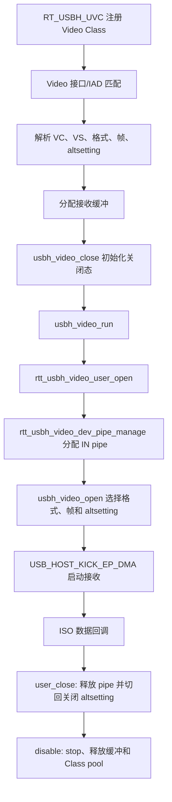

#### 视频数据解析与组帧（`usbh_video.c` + `rtt_uvc_host.c`）

视频 DMA 完成后进入 `rtt_usbh_video_irq()`（定义于 `usbh_video.c`，由 USB 2.0/1.1 Host BSP 中断处理调用）。`rtt_uvc_data_deal()` 通过 `USB_HOST_GET_RX_DMA_LEN` 读取本次接收长度，长度无效时结束本次处理，再按 `USB_HOST_ISO_IS_CRC_ERR` 生成 `drop` 标志，把跳过 `uvc_head` 后的 payload 交给 `rtt_uvc_host.c` 的 `process_uvc_payload()` 组帧。

组帧侧先过滤注册后的前 10 个 payload，再经 payload Header 校验（长度与标志位，Bulk MJPEG 还要求 Header 后为 `FF D8`）和初始 FID 同步进入正常组帧；有效数据用 `hw_memcpy()` 分段写入 `UVC_BLANK` 节点并累计 `frame_len`，Bulk MJPEG 以 `FF D9`、其他路径以 Header EOI 位判断帧结束，完整帧由 `uvc_device_end_frame()` 置为 `AVAILABLE`。出现 CRC 错误、Header ERR 或 ISO 流异常 FID 变化时，当前帧标记错误：非 USING 帧归还节点并恢复 IDLE，正在消费的帧由消费侧进入异常清理。帧槽与分片节点的数量由 `UVC_DEFAULT_FRAME_NUM`、`UVC_DEFAULT_BLANK_NUM`、`UVC_DEFAULT_BLANK_LEN` 决定。

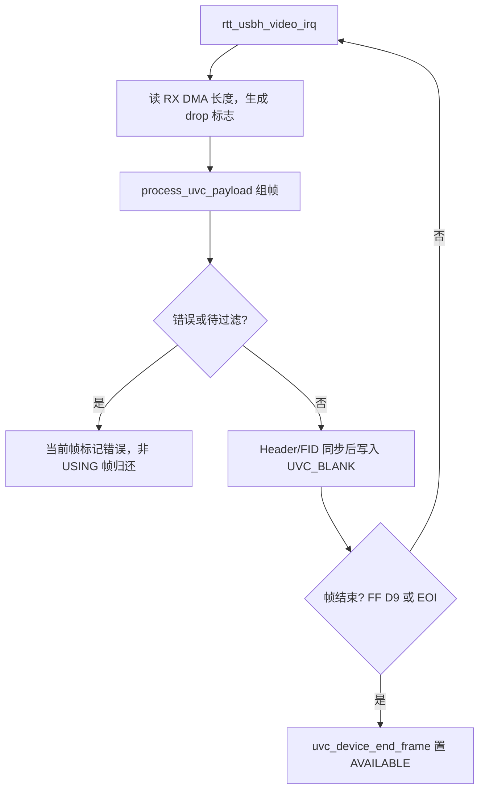

帧槽状态随生产和消费过程变化：

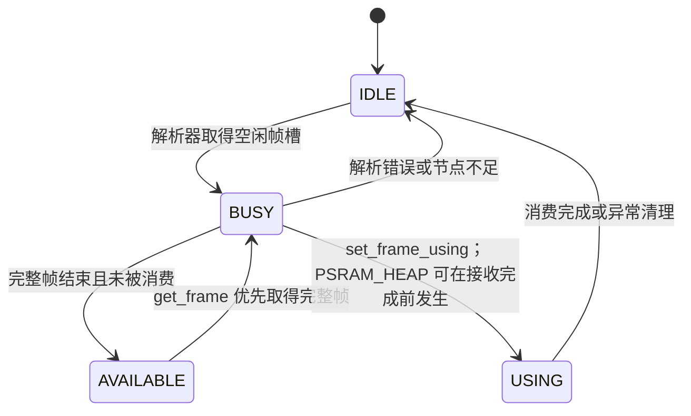

#### 向 `video_app_usb_msi` 交付视频帧

定义 `PSRAM_HEAP` 时，`rtt_usbh_video_user_open()` 才会为设备 0 和 1 调用 `usbh_video_enum_finish_init()` 建立本节路径：创建 MSI 对象和 frame-buffer pool，注册 UVC 帧管理对象，建立 `ROUTE_USB` 输出路由，并创建 `msi_get_usb_psram_thread()`。

消费任务 `get_frame()` 优先取 AVAILABLE 帧（无 AVAILABLE 时可取 BUSY 帧与接收侧并行），`set_frame_using()` 后把各 `UVC_BLANK` 节点的 `blank_len - re_space` 字节拼入连续缓冲，封装为 `framebuff`（`len`、`data`、`mtype`/`stype`、`srcID`、`time`）并经 `msi_output_fb()` 输出，最后 `set_frame_idle()` 归还帧槽。`UVC_YUV422_MJPEG_FORMAT` 非 0 时 JPEG 帧输出前先经 `parse_jpg()` 校验；分配失败、帧错误或传输停止时释放未交付的 `framebuff` 和连续缓冲。

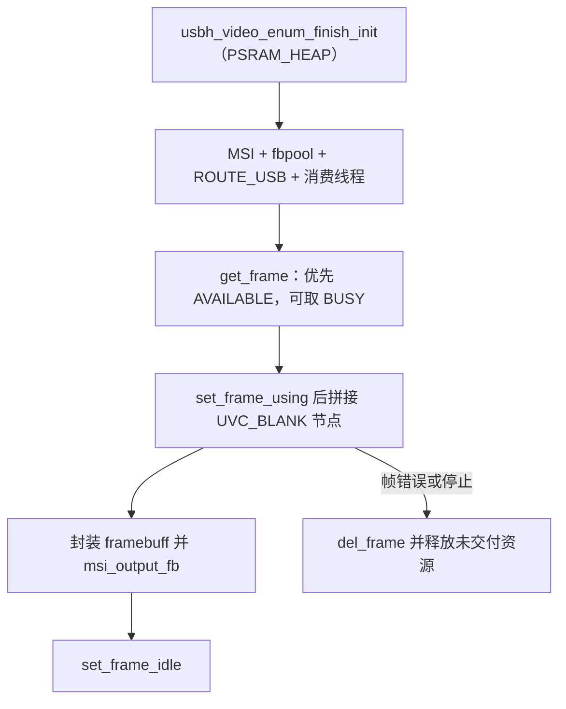

#### 应用通过 MSI 获取 Host UVC 视频帧

业务代码不应直接操作 `UVC_MANAGE`、`UVC_BLANK`、`get_frame()` 或 `set_frame_using()`；这些接口由 `video_app_usb_msi` 的组帧任务使用。应用从 `ROUTE_USB`（字符串值为 `route-usb`）订阅视频帧，使用 `msi_get_fb()` 取得 `framebuff`，处理 `data`、`len`、`mtype` 和 `stype` 后，必须调用 `msi_delete_fb(NULL, fb)` 释放该帧。未释放的帧会持续占用 MSI 队列和 UVC 帧缓冲资源。

下面的接收结构与 `sdk/app/video_demo/video_demo.c` 中 `jpg_demo_from_USB()` 的取帧路径一致，并补全了长期任务退出时的解绑和对象配对操作：

```c
#include "basic_include.h"
#include "lib/multimedia/msi.h"
#include "stream_define.h"

extern struct msi *route_msi(const char *name);

static void usb_uvc_receive(volatile int *stop)
{
    struct msi *usb_route;
    struct msi *receiver;
    struct framebuff *fb;
    uint8_t is_new = 0;

    usb_route = route_msi(ROUTE_USB);
    if (usb_route == NULL) {
        return;
    }

    receiver = msi_new("usb_uvc_user", 8, &is_new);
    if (receiver == NULL) {
        msi_destroy(usb_route);
        return;
    }

    if (msi_add_output(usb_route, NULL, receiver, NULL) != RET_OK) {
        msi_destroy(receiver);
        msi_destroy(usb_route);
        return;
    }
    receiver->enable = 1;

    while (!*stop) {
        fb = msi_get_fb(receiver, 0);
        if (fb != NULL) {
            /* 在返回前完成对 fb->data[0..fb->len-1] 的同步处理。 */
            /* fb->mtype 和 fb->stype 用于区分帧媒体类型与编码子类型。 */
            msi_delete_fb(NULL, fb);
        } else {
            os_sleep_ms(1);
        }
    }

    receiver->enable = 0;
    msi_del_output(usb_route, NULL, receiver, NULL);
    while ((fb = msi_get_fb(receiver, 0)) != NULL) {
        msi_delete_fb(NULL, fb);
    }
    msi_destroy(receiver);
    msi_destroy(usb_route);
}
```

`msi_get_fb()` 返回的 `data` 所有权仍由 `framebuff` 管理。若业务需要异步保存或跨线程长期持有内容，应先复制所需数据，再立即删除原 `framebuff`；不能在 `msi_delete_fb()` 后继续访问 `fb` 或 `fb->data`。

### 4.6 USB 音频设备类（UAC）

**相关源码：** `sdk/lib/bus/rttusb/usbhost/class/usbh_audio.c`、`sdk/lib/bus/rttusb/usbhost/class/usbh_audio.h`。

#### 关键宏

| 宏 | 当前值或状态 | 作用与使用说明 |
|---|---:|---|
| `RT_USBH_UAC` | 由工程配置决定 | 定义后注册 UAC Host 驱动，启用 AudioControl/AudioStreaming 枚举和音频数据路径。 |
| `AUDIO_MIC_EN` / `AUDIO_SPK_EN` | `1` / `1` | 分别启用 Host 麦克风 ISO IN 和扬声器 ISO OUT 应用路径。关闭某一路时，对应 pipe、open 和启动逻辑不会执行。 |
| `AUDIO_VOLUME_CONTROL_EN` | `0` | 控制枚举后的音量初始化路径；设备还必须实际提供可用 Feature Unit。 |
| `AUDIO_SET_INTF_ALTSETTING` | `1` | `usbh_audio_open()` 中执行流接口 altsetting 切换；关闭后不会通过该分支选择带宽接口。 |
| `AUDIO_MIC_SAMPLING_FREQ` / `AUDIO_SPK_SAMPLING_FREQ` | `8000` / `8000` | Host 打开 Mic/Speaker 流时请求的采样率，必须与目标设备格式描述符匹配。 |
| `AUDIO_MIC_RESOLUTION_BITS` / `AUDIO_SPK_RESOLUTION_BITS` | `16` / `16` | Host Mic/Speaker 选择格式时使用的采样位宽。 |
| `AUDIO_MIC_MODULE_CHANNEL` / `AUDIO_SPK_MODULE_CHANNEL` | `1` / `1` | Host Mic/Speaker 选择格式时使用的通道数。 |
| `CONFIG_USBHOST_MAX_AUDIO_CLASS` | `1` | `usbh_audio.h` 中的 UAC Class 实例上限。 |
| `UAC_FRAME_NUM` / `UAC_FRAME_LEN` | `4` / `1024` | `uac_host.c` 的音频帧管理对象包含 4 个、每个 1024 字节的帧缓冲。 |
| `AUDIO_LEN` | Mic/Spk 均为 `1024` | Host UAC MSI 单个应用缓冲的长度。Mic 和 Speaker 源文件分别定义该宏。 |
| `MAX_UAC_APP` | Mic `4`；Spk `8` | Host Mic/Speaker MSI 各自可管理的应用对象数量上限。 |

- 编译宏为 `RT_USBH_UAC`，Class code 为 `USB_CLASS_AUDIO`。
- enable 解析 IAD、AudioControl/AudioStreaming、Input/Output Terminal、Feature Unit、Format 和 ISO IN/OUT 描述符。
- 代码分配接收缓冲，把模块 altsetting 先切换到关闭状态，拼接设备名并打印注册信息（未调用设备框架注册接口），然后调用 `usbh_audio_run()`。
- 弱定义 `usbh_audio_run()` 调用 `rtt_usbh_audio_user_open()`。该接口按 `AUDIO_MIC_EN`、`AUDIO_SPK_EN` 分支调用 `rtt_usbh_audio_dev_pipe_mange()` 分配 ISO IN/OUT pipe，再调用 `usbh_audio_open()` 选择采样率和 altsetting，最后启动端点数据路径（Mic RX 每次 kick `AUDIO_RX_PACKET_SIZE`，Speaker TX 每包 `AUDIO_TX_PACKET_SIZE`，均为端点最大包长的 1 倍）。函数名末段的 mange 是当前源码拼写。
- `rtt_usbh_audio_user_close()` 先停止数据路径，再释放 mic/speaker pipe，并调用 `usbh_audio_close()` 切回关闭 altsetting。该接口声明在 `usbh_audio.h`，但 Class disable 没有调用它。
- Class disable 调用 `usbh_audio_stop()`、释放接收缓冲并归还 Class pool。当前 SDK 中 `usbh_audio_stop()` 的弱定义函数体为空，且未检索到其他强定义；因此该 disable 路径本身不执行 pipe 释放和 `usbh_audio_close()`。
- 音量、静音、stream open/close、用户 open/close/start/stop 及 pipe 管理接口均声明于 `usbh_audio.h`。

#### EP0 控制接口

| SDK 接口 | UAC/标准请求 | 功能 |
|---|---|---|
| `usbh_audio_open()` | 标准 `SET_INTERFACE`；`SET_CUR(SAMPLING_FREQ_CONTROL)` | 切换到目标流 altsetting，并向流端点写入 3 字节采样率。 |
| `usbh_audio_close()` | 标准 `SET_INTERFACE(0)` | 切回零带宽 altsetting，关闭音频流。 |
| `usbh_audio_get_min_volume()` | `GET_MIN(VOLUME_CONTROL)` | 读取 Feature Unit 支持的最小音量。 |
| `usbh_audio_get_max_volume()` | `GET_MAX(VOLUME_CONTROL)` | 读取最大音量。 |
| `usbh_audio_get_cur_volume()` | `GET_CUR(VOLUME_CONTROL)` | 读取当前音量。 |
| `usbh_audio_get_res_volume()` | `GET_RES(VOLUME_CONTROL)` | 读取音量调节步进。 |
| `usbh_audio_set_volume()` | `SET_CUR(VOLUME_CONTROL)` | 写入原始音量控制值。 |
| `usbh_audio_set_volume_db()` | `SET_CUR(VOLUME_CONTROL)` | 按 dB 参数转换后写入音量值。 |
| `usbh_audio_set_mute()` | `SET_CUR(MUTE_CONTROL)` | 设置或清除静音状态。 |

音量控制相关路径受 `AUDIO_VOLUME_CONTROL_EN` 影响；使用前还应确认解析结果中存在可用的 Feature Unit 和对应 Control Selector。

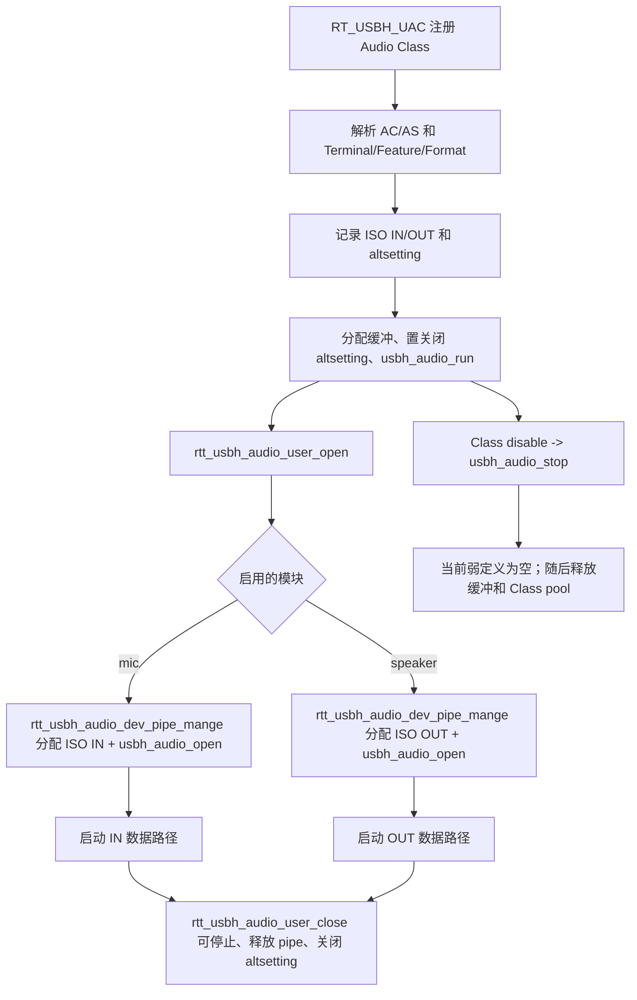

#### Host UAC MSI 数据流与应用接入

Host Mic 的 `audio_usbh_mic_msi.c` 创建名称为 `S_USB_MIC`（字符串值 `usb_microphone`）的 MSI 源。ISO IN 数据先由 `uac_host.c` 写入 `UAC_MANAGE`，Mic 任务再取出数据并封装为 `framebuff`：`mtype = MEDIA_DATA_AUDIO`、`stype = AUDIO_CODEC_PCM_S16LE`、`len` 为本次 PCM 字节数。当前初始化还把该源默认连接到 `R_USB_SPK`，形成 USB Mic 到 USB Speaker 的 PCM 回环。

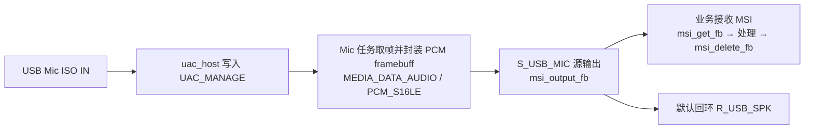

应用读取 Host Mic 的接入顺序与 UVC 接收一致：创建有队列的接收 MSI，将 `S_USB_MIC` 连接到该接收对象，使能接收对象，然后循环调用 `msi_get_fb()`。每个成功取得的 PCM `framebuff` 都必须调用 `msi_delete_fb(NULL, fb)`；采样率、位宽和通道数按本节宏表中的 Host Mic 配置解释。

Host Speaker 的 `audio_usbh_spk_msi.c` 创建名称为 `R_USB_SPK`（字符串值 `usb_speaker`）的接收 MSI。应用已有的 PCM 生产 MSI 可通过 `msi_add_output(source, NULL, NULL, R_USB_SPK)` 接入；发送的帧必须满足 `mtype = MEDIA_DATA_AUDIO` 且 `stype = AUDIO_CODEC_PCM_S16LE`。Speaker 任务用 `msi_get_fb()` 取帧，将 PCM 拷贝到 `UAC_MANAGE` 后删除输入帧，再由 `uac_host.c` 经 ISO OUT 发给 USB Speaker。

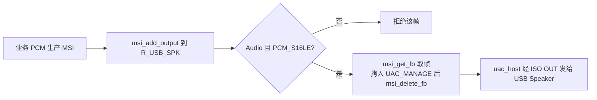

业务停止 Speaker 输入时，应先用 `msi_del_output()` 断开生产 MSI 到 `R_USB_SPK` 的连接，再停止或销毁生产对象，避免退出期间继续向 Speaker 队列投递新帧。

### 4.7 远程网络驱动接口规范（Wireless / RNDIS）

**相关源码：** `sdk/lib/bus/rttusb/usbhost/class/wireless.c`、`sdk/lib/bus/rttusb/usbhost/class/rndis.c`、`sdk/lib/bus/rttusb/usbhost/class/rndis.h`。

#### 关键宏

| 宏 | 作用与使用说明 |
|---|---|
| `RT_USBH_WIRELESS` | 定义后注册 Wireless Host 驱动，建立控制、通知和 Bulk 数据 pipe。 |
| `RT_USBH_WIRELESS_RNDIS` | 定义后编译并接入 Wireless 下的 RNDIS 控制和网络数据实现；使用 RNDIS 时需与 `RT_USBH_WIRELESS` 一起启用。 |

- Wireless Class 注册受 `RT_USBH_WIRELESS` 控制，匹配 `USB_CLASS_WIRELESS`；RNDIS 实现还受 `RT_USBH_WIRELESS_RNDIS` 控制。
- enable 接受两组 subclass/protocol 组合：`1/3` 或 `2/255`（后者用于兼容部分 Cat.1 模组 IAD/接口描述符差异）；控制接口扫描 Interrupt IN，数据接口扫描 Bulk IN/OUT。
- 代码分配 `usb_rndis` 及控制、通知和数据缓冲，随后调用 `rt_usbh_rndis_run()`。
- disable 调用 `rt_usbh_rndis_stop()`；RNDIS 控制走 EP0/Interrupt，网络数据走 Bulk pipe。
- `rndis.h` 声明 `rt_usbh_host_rndis_attach()`，而 `rndis.c` 中实现名为 `rt_usbh_rndis_attach()`，不能把二者视为一个已闭合的公共接口。

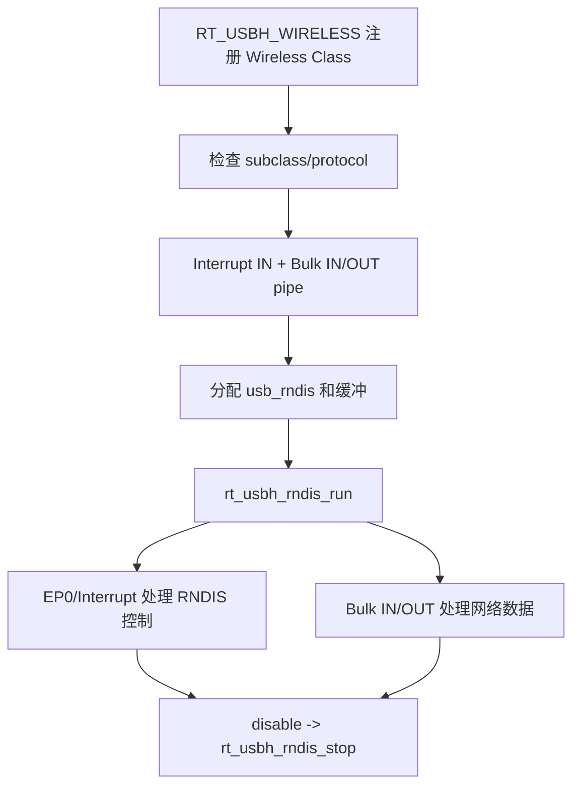

### 4.8 Quectel Cat.1 模组

**相关源码：** `sdk/lib/bus/rttusb/usbhost/class/quectel.c`。

#### 关键宏

| 宏 | 作用与使用说明 |
|---|---|
| `RT_USBH_VENDOR_QUECTEL` | 定义后注册 Quectel Vendor Host 驱动；当前实现继续按固定 VID、PID 和接口号筛选目标 AT 接口。 |

- 宏为 `RT_USBH_VENDOR_QUECTEL`；`rt_usb_host_init()` 有独立注册分支。
- 驱动匹配 Vendor Specific Class 和 VID `0x2C7C`。
- enable 继续检查 PID `0x0903` 和接口号 3；命中后分配 AT 对象和缓冲、注册 `HG_USB_AT_DEVID`、扫描 Bulk IN/OUT、读取 line coding 并启动接收线程。

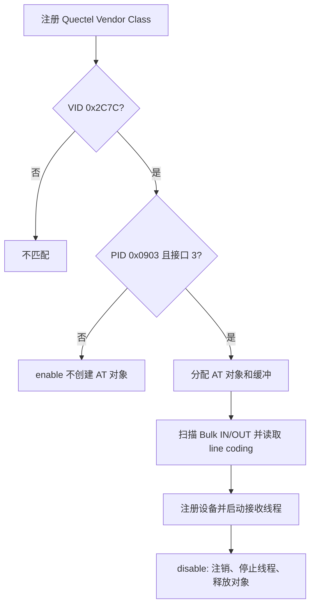

### 4.9 China Mobile Cat.1 模组

**相关源码：** `sdk/lib/bus/rttusb/usbhost/class/chinamobile.c`。

#### 关键宏

| 宏 | 作用与使用说明 |
|---|---|
| `RT_USBH_VENDOR_CHINAMOBILE` | 定义后注册 China Mobile Vendor Host 驱动；当前实现继续按固定 VID、PID 和接口号筛选目标 AT 接口。 |

- 宏为 `RT_USBH_VENDOR_CHINAMOBILE`；`rt_usb_host_init()` 有独立注册分支。
- 驱动匹配 Vendor Specific Class 和 VID `0x2ECC`。
- enable 检查 PID `0x3012` 和接口号 2，随后分配对象和缓冲、扫描 Bulk IN/OUT、读取 line coding、注册设备并启动接收线程。

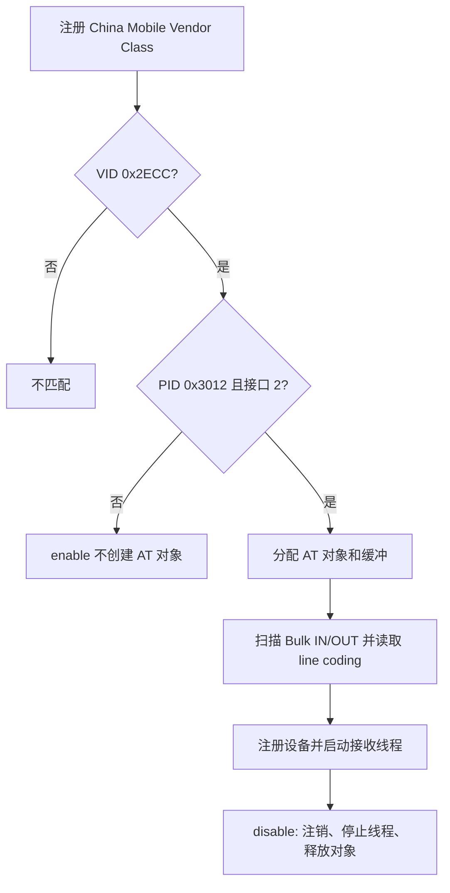

### 4.10 Yuge Cat.1 模组

**相关源码：** `sdk/lib/bus/rttusb/usbhost/class/cdc.c`、`sdk/lib/bus/rttusb/usbhost/class/yuge.c`、`sdk/lib/bus/rttusb/usbhost/class/yuge.h`。

#### 关键宏

| 宏 | 作用与使用说明 |
|---|---|
| `RT_USBH_VENDOR_YUGE` | 定义后编译 Yuge AT 接入钩子。该实现由 CDC Class 按 VID 转入，不会单独注册一个 Host Class，因此还需启用 CDC Host 路径。 |

- 宏为 `RT_USBH_VENDOR_YUGE`；`rt_usb_host_init()` 没有 Yuge 独立注册调用。
- CDC enable 按 VID `0x19D1` 进入 Yuge 钩子。
- Yuge enable 检查 CDC subclass 2、protocol 1、PID `0x1003` 和接口号 2，从关联数据接口扫描 Bulk IN/OUT，读取 line coding，注册 AT 设备并启动线程。

```mermaid
flowchart TD
    A["CDC Class 已匹配"] --> B{"VID 0x19D1?"}
    B -- 否 --> X["不进入 Yuge 钩子"]
    B -- 是 --> C["rt_usbh_yuge_at_run"]
    C --> D{"CDC 2/1、PID 0x1003、接口 2?"}
    D -- 否 --> Y["不创建 Yuge AT 对象"]
    D -- 是 --> E["关联数据接口 Bulk IN/OUT"]
    E --> F["读取 line coding、注册设备、启动线程"]
    F --> G["CDC disable -> rt_usbh_yuge_at_stop"]
```

### 4.11 ZXInfo Cat.1 模组

**相关源码：** `sdk/lib/bus/rttusb/usbhost/class/cdc.c`、`sdk/lib/bus/rttusb/usbhost/class/zxinfo.c`、`sdk/lib/bus/rttusb/usbhost/class/zxinfo.h`。

#### 关键宏

| 宏 | 作用与使用说明 |
|---|---|
| `RT_USBH_VENDOR_ZXINFO` | 定义后编译 ZXInfo AT 接入钩子。该实现由 CDC Class 按 VID 转入，不会单独注册一个 Host Class，因此还需启用 CDC Host 路径。 |

- 宏为 `RT_USBH_VENDOR_ZXINFO`；`rt_usb_host_init()` 没有 ZXInfo 独立注册调用。
- CDC enable 按 VID `0x3361` 进入 ZXInfo 钩子。
- ZXInfo enable 检查 CDC subclass 2、protocol 1、PID `0x7B6E` 和接口号 4，从数据接口扫描 Bulk IN/OUT，读取 line coding，注册 AT 设备并启动线程。

```mermaid
flowchart TD
    A["CDC Class 已匹配"] --> B{"VID 0x3361?"}
    B -- 否 --> X["不进入 ZXInfo 钩子"]
    B -- 是 --> C["rt_usbh_zxinfo_at_run"]
    C --> D{"CDC 2/1、PID 0x7B6E、接口 4?"}
    D -- 否 --> Y["不创建 ZXInfo AT 对象"]
    D -- 是 --> E["数据接口 Bulk IN/OUT"]
    E --> F["读取 line coding、注册设备、启动线程"]
    F --> G["CDC disable -> rt_usbh_zxinfo_at_stop"]
```

### 4.12 Android 开放配件协议（ADK）

**相关源码：** `sdk/lib/bus/rttusb/usbhost/class/adk.c`、`sdk/lib/bus/rttusb/usbhost/class/adk.h`、`sdk/lib/bus/rttusb/usbhost/core/usbhost.c`。

#### 关键宏

| 宏 | 作用与使用说明 |
|---|---|
| `RT_USBH_ADK` | 定义后编译 ADK accessory 协商和 Bulk 数据实现；当前 `rt_usb_host_init()` 没有注册 ADK 驱动，单独定义该宏不会使通用 Host 初始化链自动接入 ADK。 |

- `RT_USBH_ADK` 保护的代码包含 accessory protocol 查询、字符串发送、accessory mode 切换、Bulk IN/OUT 和 `adkdev` 对象。
- `rt_usbh_class_driver_adk()` 存在，但 `rt_usb_host_init()` 没有调用它，因此当前通用 Host 初始化链不会注册 ADK Class。
- ADK 未接入当前通用 Host 初始化链。集成前需处理 `adk.c` 与当前 Host 核心在对象和 pipe 调用形式上的差异。

```mermaid
flowchart TD
    A["RT_USBH_ADK 源码实现存在"] --> B["rt_usbh_class_driver_adk 存在"]
    B --> C{"rt_usb_host_init 有注册调用?"}
    C -- 否 --> D["当前通用初始化链在此中断"]
    C -- 是 --> E["accessory 协商和 Bulk 路径"]
```

## 5. USB Device 核心

### 5.1 Class 注册与对象构造

USB 2.0 和 USB 1.1 Device 的 BSP 注册代码分别位于 `sdk/lib/bus/rttusb/bsp/drv_usbd.c` 和 `sdk/lib/bus/rttusb/bsp/drv_usb11d.c`。两者都按宏调用 VIDEO、AUDIO_MIC、AUDIO_SPEAKER（注册前先执行 `audio_speaker_init()`）、MSTORAGE、RNDIS、HID、WINUSB 和 CDC 的 Class 注册函数，没有 ECM 注册分支。USB 2.0 BSP 另有 `RT_USB_DEVICE_VIDEO_MJPEG`、`RT_USB_DEVICE_VIDEO_H264` 两个分支，分别注册 `rt_usbd_uvc_mjpeg_device_class_register()` 和 `rt_usbd_uvc_h264_device_class_register()`；USB 1.1 BSP 没有这两个分支。

`sdk/lib/bus/rttusb/usbdevice/core/usbdevice.c` 的 `rt_usb_device_init()`：

1. 查找 DCD 和对应 Class 链表。
2. 创建并启动 USB Device 线程（`rt_usbd_core_init()`）。
3. 创建 `udevice` 和配置对象，并把 DCD 绑定到设备。
4. 遍历已注册 Class，调用各自 `rt_usbd_function_create`，把 function 加入配置。
5. 设置设备描述符和字符串，把配置加入设备。
6. 调用 `rt_device_init(udc)`，再调用 `rt_usbd_set_config(udevice, 1)` 设置核心当前配置和 DCD 配置值。

```mermaid
flowchart TD
    A["BSP 按 RT_USB_DEVICE_* 注册 Class"] --> B["rt_usb_device_init"]
    B --> C["创建 udevice 和 config，绑定 DCD"]
    C --> D["遍历 Class 链表"]
    D --> E["rt_usbd_function_create"]
    E --> F["function 加入 config"]
    F --> G["设置描述符并把 config 加入 device"]
    G --> H["rt_device_init udc"]
    H --> I["rt_usbd_set_config udevice, 1"]
```

### 5.2 Setup、配置和 I/O 生命周期

`sdk/lib/bus/rttusb/usbdevice/core/usbdevice_core.c` 的实际顺序如下：

- DCD 通过 `rt_usbd_ep0_setup_handler()` 把 Setup 请求封装成 `USB_MSG_SETUP_NOTIFY`，Device 线程再调用 `_setup_request()`。
- 标准请求 `USB_REQ_SET_CONFIGURATION` 进入 `_set_config()`。非零配置值会切换当前配置、逐端点先 disable 再 enable，然后调用各 function 的 `FUNC_ENABLE()`，最后把状态设为 `USB_STATE_CONFIGURED`。
- 配置值 0 只把设备状态设为 `USB_STATE_ADDRESS` 并发送状态阶段，不调用 `FUNC_DISABLE()`。
- `USB_REQ_SET_INTERFACE` 要求设备处于 Configured 状态；核心切换 altsetting，重启其端点，再调用接口 handler。
- `rt_usbd_io_request()` 对 READ 请求调用读准备，对 WRITE 请求调用端点写；端点 stall 时把请求挂入端点请求链，清除 halt 后重新提交。
- Reset 消息在设备原状态为 Address 或 Configured 时调用 `_stop_notify()`；Plug-out 消息也调用 `_stop_notify()`。该函数遍历当前配置并执行各 function 的 disable。

```mermaid
flowchart TD
    A["DCD 上报 Setup"] --> B["USB_MSG_SETUP_NOTIFY"]
    B --> C["_setup_request"]
    C --> D{"请求类型"}
    D -- USB_REQ_SET_CONFIGURATION 非零 --> E["切换配置并重启全部端点"]
    E --> F["逐 function FUNC_ENABLE"]
    F --> G["USB_STATE_CONFIGURED"]
    D -- USB_REQ_SET_CONFIGURATION 0 --> H["USB_STATE_ADDRESS，不调用 disable"]
    D -- USB_REQ_SET_INTERFACE --> I["切换 altsetting、重启端点、调用接口 handler"]
    D -- Class/接口请求 --> J["function/interface handler"]
    G --> K["rt_usbd_io_request 非 EP0 I/O"]
    K --> L{"Reset 或 Plug-out"}
    L -- 是 --> M["_stop_notify -> FUNC_DISABLE"]
```

## 6. USB Device Class 开发说明

### 6.1 USB 虚拟串口（CDC-VCOM）

**相关源码：** `sdk/lib/bus/rttusb/usbdevice/class/cdc_vcom.c`、`sdk/lib/bus/rttusb/usbdevice/class/cdc_vcom.h`。

#### 关键宏

| 宏 | 默认值或状态 | 作用与使用说明 |
|---|---:|---|
| `RT_USB_DEVICE_CDC` | 由工程配置决定 | 定义后编译 CDC-VCOM 实现，通用 Device BSP 会调用 `rt_usbd_vcom_class_register()`。 |
| `RT_USB_DEVICE_COMPOSITE` | 由工程配置决定；启用 UVC 时由头文件自动定义 | 同时启用多个 Device Class 时使用；Device 核心据此采用复合设备的接口、字符串和描述符组织方式。`rttusb_device.h` 在定义 `RT_USB_DEVICE_VIDEO` 时会自动补定义该宏。 |
| `RT_VCOM_TX_TIMEOUT` | 未定义时 `1000` | 覆盖 VCOM 发送等待超时值。 |
| `RT_CDC_RX_BUFSIZE` | 未定义时 `3 * 1024` | 覆盖 CDC OUT 接收环形缓冲大小；增大后会增加常驻内存占用。 |
| `RT_VCOM_TASK_STK_SIZE` | 未定义时 `1024` | 覆盖 VCOM 任务栈大小。 |
| `RT_VCOM_TX_USE_DMA` | 由工程配置决定 | 当前源码仅把它转定义为 `VCOM_TX_USE_DMA`，`cdc_vcom.c` 内没有其他使用点；定义该宏当前不改变 VCOM 收发行为。 |
| `RT_VCOM_SERNO` / `RT_VCOM_SER_LEN` | 默认字符串 `32021919830108` / 长度 `14` | 覆盖 USB 序列号及其长度；两者必须保持一致。 |

- 宏为 `RT_USB_DEVICE_CDC`；两个 Device BSP 都调用 `rt_usbd_vcom_class_register()`。
- `rt_usbd_function_cdc_create()` 创建通信接口和数据接口，端点为 Interrupt IN、Bulk IN 和 Bulk OUT。
- 接口 handler 处理 line coding 等 CDC 控制请求；数据端点通过 `rt_usbd_io_request()` 提交。
- `_function_enable()` 初始化 VCOM/serial 状态，分配 OUT 缓冲并首次提交 OUT request；disable 反初始化 VCOM 并释放缓冲。

```mermaid
flowchart TD
    A["RT_USB_DEVICE_CDC"] --> B["rt_usbd_vcom_class_register"]
    B --> C["rt_usbd_function_cdc_create"]
    C --> D["通信接口: Interrupt IN"]
    C --> E["数据接口: Bulk IN/OUT"]
    D --> F["EP0 CDC 控制请求"]
    E --> G["FUNC_ENABLE: 初始化 serial、提交 OUT request"]
    G --> H["完成回调/写操作再次提交 I/O"]
    H --> I["FUNC_DISABLE: 反初始化并释放 OUT 缓冲"]
```

### 6.2 USB 大容量存储类（MSC）

**相关源码：** `sdk/lib/bus/rttusb/usbdevice/class/mstorage.c`、`sdk/lib/bus/rttusb/usbdevice/class/mstorage.h`。

#### 关键宏

| 宏 | 当前值或状态 | 作用与使用说明 |
|---|---:|---|
| `RT_USB_DEVICE_MSTORAGE` | 由工程配置决定 | 定义后编译 MSC Device 实现，通用 Device BSP 会注册该 Class。 |
| `USBDISK` | 由工程配置决定 | 选择后端：值 `1` 使用 SD，值 `2` 使用 Flash，值 `3` 使用 SRAM；已定义但值不匹配时 `RT_USE_UDISK_BACKEND` 为 `RT_NULL`，未定义时使用 SRAM 后端。 |
| `PINGPANG_BUF_EN` | 定义 `USBDISK` 时为 `1`；未定义时为 `0` | 控制 MSC 数据阶段的 ping-pong 缓冲和读写优化任务。定义 `USBDISK` 时由 `usbd_mass_speed_optimize.h` 启用；未定义时走单缓冲路径。 |
| `UDISK_READONLY` | `0` | `0` 允许 Host 读写，`1` 使后端按只读方式响应写请求。 |

- 宏为 `RT_USB_DEVICE_MSTORAGE`；两个 Device BSP 都调用 `rt_usbd_msc_class_register()`。
- `rt_usbd_function_mstorage_create()` 创建单接口和 Bulk OUT/IN 端点。
- EP0 handler 处理 GET_MAX_LUN 和 RESET；Bulk OUT 接收 CBW 或写数据，Bulk IN 发送读数据或 CSW。
- `_function_enable()`取得后端设备、分配传输对象和缓冲，并提交首个 OUT request；disable 释放 CBW、缓冲和相关对象。
- ping-pong 分支受 `PINGPANG_BUF_EN` 控制，具体后端分支仍由该文件中的 `USBDISK` 条件决定。

```mermaid
flowchart TD
    A["RT_USB_DEVICE_MSTORAGE"] --> B["rt_usbd_msc_class_register"]
    B --> C["创建 Bulk OUT/IN function"]
    C --> D["FUNC_ENABLE: 取得后端、分配缓冲、提交 OUT"]
    D --> E["Bulk OUT 接收 CBW"]
    E --> F{"SCSI 数据方向"}
    F -- Host 读 --> G["后端读 -> Bulk IN -> CSW"]
    F -- Host 写 --> H["Bulk OUT 数据 -> 后端写 -> CSW"]
    G --> I["再次等待 CBW"]
    H --> I
    I --> J["FUNC_DISABLE: 释放类资源"]
```

### 6.3 USB 视频设备类（UVC）

**相关源码：** `sdk/lib/bus/rttusb/usbdevice/class/usbd_video.c`、`sdk/lib/bus/rttusb/usbdevice/class/usbd_video.h`。

#### 关键宏

| 宏 | 当前值或状态 | 作用与使用说明 |
|---|---:|---|
| `RT_USB_DEVICE_VIDEO` | 由工程配置决定 | 定义后编译 UVC Device 实现，通用 Device BSP 会注册该 Class。 |
| `CONFIG_USB_HS` | 在 `usbd_video.c` 中已定义 | 选择当前 High-Speed payload 配置；当前 `MAX_PAYLOAD_SIZE` 为 `1024`。若改变总线模式，必须同步核对端点描述符和每包发送长度。 |
| `MAX_PAYLOAD_SIZE` / `VIDEO_PACKET_SIZE` | `1024` / `1024` 字节 | 前者确定视频发送缓冲大小；后者写入 ISO IN 端点描述符，并作为每次 request 的最大长度。每个 UVC payload 还需占用 2 字节 Header，因此单片编码数据上限为 1022 字节。 |
| `VIDEO_MJPEG_bNumFrameDescriptors` | `2` | 控制 MJPEG 帧描述符数量；当前描述 640×360 与 1280×720 两档。 |
| `VIDEO_H26x__bNumFrameDescriptors` | `2` | 控制 H.26x 帧描述符数量；当前描述 1280×720 与 1920×1080 两档。 |
| `CAM_FPS` | `30` | 参与计算帧间隔、最小/最大码率和最大帧长度描述字段。 |

- 宏为 `RT_USB_DEVICE_VIDEO`；两个 Device BSP 都调用 `rt_usbd_uvc_device_class_register()`。
- `rt_usbd_function_uvc_device_create()` 创建 VideoControl 和 VideoStreaming 接口；Streaming 接口含无端点 altsetting 和带 ISO IN 端点的 altsetting。
- 接口请求代码处理 UVC Probe/Commit 控制；`USB_REQ_SET_INTERFACE` 值 1 调用 `usbd_video_open()`，值 0 调用 `usbd_video_close()`。
- `_function_enable()` 初始化视频消息队列；ISO IN 数据由 `usbd_uvc_entry` 路径通过 `rt_usbd_io_request()` 提交；disable detach 消息队列。

`usbd_video_mjpeg.c` 和 `usbd_video_h264.c` 提供仅含 MJPEG、H.264 的精简 UVC Device 实现，分别由 `RT_USB_DEVICE_VIDEO_MJPEG`、`RT_USB_DEVICE_VIDEO_H264` 控制编译。

```mermaid
flowchart TD
    A["RT_USB_DEVICE_VIDEO"] --> B["BSP 注册 UVC Class"]
    B --> C["创建 VC 与 VS 接口"]
    C --> D["VS alt 0 无端点 / alt 1 ISO IN"]
    D --> E["FUNC_ENABLE 初始化消息队列"]
    E --> F["EP0 Probe/Commit"]
    F --> G["USB_REQ_SET_INTERFACE 1 -> usbd_video_open"]
    G --> H["usbd_uvc_entry 提交 ISO IN request"]
    H --> I["USB_REQ_SET_INTERFACE 0 -> usbd_video_close"]
    I --> J["FUNC_DISABLE detach 消息队列"]
```

#### Device UVC MSI 数据流与应用接入

`usbd_uvc_entry()` 创建名称为 `R_USBD_VIDEO`（字符串值 `usbd_video_msi`）、队列深度为 2 的接收 MSI。Host 通过 Probe/Commit 和 `SET_INTERFACE` 启动流后，分辨率设置路径从 `AUTO_JPG` 或 `AUTO_H264` 取得源 MSI，并用 `msi_add_output(..., R_USBD_VIDEO)` 把编码帧送入 UVC Device。

UVC 发送任务调用 `msi_get_fb()` 取得完整编码帧，读取 `fb->data` 和 `fb->len`，按 `VIDEO_PACKET_SIZE - 2` 分片；每片调用 `usbd_video_mjpeg_payload_header_fill()` 加入 2 字节 UVC payload Header，再用 ISO IN request 发给 USB Host。完整帧发送结束或流停止后，任务调用 `msi_delete_fb(NULL, get_f)` 释放输入帧。

```mermaid
flowchart LR
    A["编码源 MSI<br/>AUTO_JPG / AUTO_H264"] --> B["R_USBD_VIDEO 接收 MSI"]
    B --> C["msi_get_fb → 按 1022 字节分片<br/>每片加 2 字节 Header → ISO IN 发送"]
    C --> D{"一帧完成或流停止?"}
    D -- 否 --> C
    D -- 是 --> E["msi_delete_fb"]
```

应用接入自定义编码源时，生产 MSI 必须输出完整帧，并连接到 `R_USBD_VIDEO`。`fb->data` 在该帧被删除前必须保持有效；业务不能在 `msi_output_fb()` 后自行释放或改写这块数据。

停止或切换视频源时，需要区分源 MSI 与 `R_USBD_VIDEO` 接收 MSI。当前 MJPEG/H.264 分辨率设置函数先把 `recv_msi->enable` 置 0，再对 `cur_msi` 调用 `msi_put()`，随后通过 `msi_get_fb(cur_msi, 0)` 取出并删除该源对象队列中的帧，最后调用 `msi_del_output(cur_msi, NULL, NULL, R_USBD_VIDEO)` 解除连接并清空 `cur_msi` 指针。这里被读取的是 `cur_msi`，不能把该步骤理解为清空 `R_USBD_VIDEO` 的接收队列。重新启用时，函数等待 `EVENT_VIDEO_COMPLITE`，重新查找 `AUTO_JPG` 或 `AUTO_H264`，使能接收 MSI 后再次连接。自定义源应在断开连接后按自身的引用计数和队列生命周期释放资源。

### 6.4 USB 音频设备类麦克风（UAC Mic）

**相关源码：** `sdk/lib/bus/rttusb/usbdevice/class/audio_mic.c`。

#### 关键宏

| 宏 | 当前值或状态 | 作用与使用说明 |
|---|---:|---|
| `RT_USB_DEVICE_AUDIO_MIC` | 由工程配置决定 | 定义后编译 UAC Mic Device 实现，通用 Device BSP 会注册该 Class。 |
| `RECORD_SAMPLERATE` / `RECORD_CHANNEL` / `RESOLUTION_BITS` | `8000` / `1` / `16` | 共同决定 Mic 描述符、音频能力参数和每毫秒发送字节数；修改时必须与 MSI 上游 PCM 格式保持一致。 |
| `RECORD_TIME` | `50 ms` | 决定 Mic 内部缓冲时长；当前缓冲大小为采样率、通道数、字节位宽和该时长的乘积。 |
| `RECORD_PER_MS_SZ` / `RECORD_BUFFER_SZ` | `16` / `800` 字节 | 前者是当前 PCM 格式每毫秒的数据量，后者是 `mic.buffer` 的申请长度。 |
| `UAC_MAX_PACKET_SIZE` / `UAC_EP_MAX_PACKET_SIZE` | `800` / `16` 字节 | 当前发送循环以 `UAC_MAX_PACKET_SIZE` 作为单次拷贝和 request 的上限；ISO IN 端点描述符的 `wMaxPacketSize` 使用 `UAC_EP_MAX_PACKET_SIZE`。修改音频参数时必须分别核对软件缓冲、request 长度和端点描述符。 |
| `RT_USBD_MIC_DEVICE_NAME` | 未定义时 `mic0` | 覆盖 Mic 底层音频设备名。 |
| `UAC_USE_FEATURE_UNIT` | `1` | 在 Mic AudioControl 描述符和请求处理路径中加入 Feature Unit。 |

- 宏为 `RT_USB_DEVICE_AUDIO_MIC`；两个 Device BSP 都调用 `rt_usbd_uac_mic_class_register()`。
- create 函数构造 AudioControl、AudioStreaming alt 0 和带 ISO IN 端点的 alt 1。
- `USB_REQ_SET_INTERFACE` 值 1 调用 `_record_start()`，值 0 调用 `_record_stop()`。
- 录音路径提交 ISO IN request，完成回调继续提交；function disable 调用 `_record_stop()`。

```mermaid
flowchart TD
    A["RT_USB_DEVICE_AUDIO_MIC"] --> B["注册并创建 AC/AS function"]
    B --> C["AS alt 0 无端点 / alt 1 ISO IN"]
    C --> D["USB_REQ_SET_INTERFACE 1"]
    D --> E["_record_start"]
    E --> F["rt_usbd_io_request ISO IN"]
    F --> G["完成回调再次提交"]
    G --> H["USB_REQ_SET_INTERFACE 0 或 FUNC_DISABLE"]
    H --> I["_record_stop"]
```

#### Device UAC Mic MSI 数据流与应用接入

Device Mic 表示“设备向 USB Host 发送音频”。`mic_entry()` 创建名称为 `R_USB_AUDIO_MIC`（字符串值 `usb-audio-mic`）、队列深度为 16 的接收 MSI 并使能它。应用的 PCM 生产 MSI 通过 `msi_add_output(source, NULL, NULL, R_USB_AUDIO_MIC)` 接入；Host 选择 AudioStreaming alt 1 后，Mic 任务用 `msi_get_fb()` 取得 PCM 帧，按当前 `UAC_MAX_PACKET_SIZE = 800` 字节分段提交 ISO IN request，处理完成后调用 `msi_delete_fb()`。ISO IN 端点描述符的 `wMaxPacketSize` 使用另一个宏 `UAC_EP_MAX_PACKET_SIZE = 16` 字节，不能用它替代发送循环中的分段条件。

```mermaid
flowchart LR
    A["应用 PCM 生产 MSI<br/>8 kHz / 单声道 / 16 bit"] --> B["R_USB_AUDIO_MIC 接收 MSI"]
    B --> C["msi_get_fb → 按 800 字节分段<br/>→ ISO IN 发送"]
    C --> D{"当前帧发送完?"}
    D -- 否 --> C
    D -- 是 --> E["msi_delete_fb"]
```

当前 Mic 消费路径直接使用 `audio_f->data` 和 `audio_f->len`，没有在入口检查 `mtype`/`stype`；这不代表可以输入任意格式。应用必须按 `RECORD_SAMPLERATE = 8000`、`RECORD_CHANNEL = 1`、`RESOLUTION_BITS = 16` 提供 PCM 数据，否则 USB 描述符声明的格式与实际负载不一致。发送方在 `msi_output_fb()` 后把帧所有权交给 MSI，不得提前释放数据。

### 6.5 USB 音频设备类扬声器（UAC Speaker）

**相关源码：** `sdk/lib/bus/rttusb/usbdevice/class/audio_speaker.c`、`sdk/lib/bus/rttusb/bsp/drv_usbd.c`、`sdk/lib/bus/rttusb/bsp/drv_usb11d.c`。

#### 关键宏

| 宏 | 当前值或状态 | 作用与使用说明 |
|---|---:|---|
| `RT_USB_DEVICE_AUDIO_SPEAKER` | 由工程配置决定 | 定义后编译 UAC Speaker Device 实现，通用 Device BSP 先初始化 Speaker，再注册该 Class。 |
| `AUDIO_SAMPLERATE` / `AUDIO_CHANNEL` / `RESOLUTION_BITS` | `8000` / `1` / `16` | 共同决定 Speaker 描述符、每毫秒接收字节数和输出 `framebuff` 的 PCM 数据格式。 |
| `AUDIO_INTERVAL_TIME` | `64 ms` | 决定循环接收缓冲总长度；当前 `AUDIO_BUFFER_SZ` 为 1024 字节。 |
| `AUDIO_PER_MS_SZ` / `AUDIO_BUFFER_SZ` | `16` / `1024` 字节 | 前者是当前 PCM 格式每毫秒的数据量，后者是 Speaker 循环接收缓冲的申请长度。 |
| `UAC_MAX_PACKET_SIZE` / `UAC_EP_MAX_PACKET_SIZE` | `1024` / `16` 字节 | `UAC_MAX_PACKET_SIZE` 等于循环缓冲长度；当前 ISO OUT request 和每个 MSI 输出帧都使用其一半，即 512 字节。ISO OUT 端点描述符的 `wMaxPacketSize` 使用 `UAC_EP_MAX_PACKET_SIZE`。 |
| `RT_USBD_SPEAKER_DEVICE_NAME` | 未定义时 `sound0` | 覆盖 Speaker 底层音频设备名。 |

- 宏为 `RT_USB_DEVICE_AUDIO_SPEAKER`；两个 Device BSP 在 Class 注册前调用 `audio_speaker_init()`，再调用 `rt_usbd_uac_speaker_class_register()`。
- create 函数构造 AudioControl、AudioStreaming alt 0 和带 ISO OUT 端点的 alt 1。
- `USB_REQ_SET_INTERFACE` 值 1 调用 `_audio_start()`，值 0 调用 `_audio_stop()`。
- 扬声器路径提交 ISO OUT request，完成回调继续提交；function disable 调用 `_audio_stop()`。

```mermaid
flowchart TD
    A["RT_USB_DEVICE_AUDIO_SPEAKER"] --> B["audio_speaker_init"]
    B --> C["注册并创建 AC/AS function"]
    C --> D["AS alt 0 无端点 / alt 1 ISO OUT"]
    D --> E["USB_REQ_SET_INTERFACE 1 -> _audio_start"]
    E --> F["rt_usbd_io_request ISO OUT"]
    F --> G["完成回调再次提交"]
    G --> H["USB_REQ_SET_INTERFACE 0 或 FUNC_DISABLE"]
    H --> I["_audio_stop"]
```

#### Device UAC Speaker MSI 数据流与应用接入

Device Speaker 表示“设备从 USB Host 接收音频”。`audio_speaker_init()` 创建名称为 `S_USB_MIC`（字符串值 `usb_microphone`）的 MSI 源和 frame-buffer pool。ISO OUT 完成回调把已接收 PCM 复制到新分配的数据区，并输出 `mtype = SOUND`、`stype = SOUND_USB_SPK`、`len = UAC_MAX_PACKET_SIZE / 2` 的 `framebuff`。按当前宏值，每次输出 512 字节。

```mermaid
flowchart LR
    A["USB Host PCM"] --> B["ISO OUT 接收 → 循环缓冲"]
    B --> C["每 512 字节封装 framebuff 输出<br/>SOUND / SOUND_USB_SPK"]
    C --> D["业务播放 MSI<br/>msi_get_fb → 处理 → msi_delete_fb"]
```

应用获取 Device Speaker 数据时，创建带队列的接收 MSI，将 `S_USB_MIC` 连接到该接收对象并使能，然后循环调用 `msi_get_fb()`。处理逻辑应按 `AUDIO_SAMPLERATE = 8000`、`AUDIO_CHANNEL = 1`、`RESOLUTION_BITS = 16` 解释数据，并在每次处理后调用 `msi_delete_fb(NULL, fb)`。这里的 `S_USB_MIC` 是当前源码沿用的 MSI 名称，实际数据方向仍是 USB Host 到 Device Speaker。

### 6.6 USB 人机接口设备（HID）

**相关源码：** `sdk/lib/bus/rttusb/usbdevice/class/usbd_hid.c`、`sdk/lib/bus/rttusb/usbdevice/class/usbd_hid.h`。

#### 关键宏

| 宏 | 作用与使用说明 |
|---|---|
| `RT_USB_DEVICE_HID` | 定义后编译 HID Device 实现，通用 Device BSP 会注册该 Class。 |
| `RT_USB_DEVICE_HID_KEYBOARD` | 加入键盘 Report 描述符和对应报告处理路径。 |
| `RT_USB_DEVICE_HID_KEYBOARD_NUMBER` | 控制键盘 Report 集合数量；源码按大于 1、2、3 依次加入额外键盘报告。 |
| `RT_USB_DEVICE_HID_MOUSE` | 加入鼠标 Report 描述符和鼠标报告路径。 |
| `RT_USB_DEVICE_HID_MEDIA` | 加入媒体控制 Report 描述符。 |
| `RT_USB_DEVICE_HID_GENERAL` | 加入通用 IN/OUT Report；报告长度还由 `RT_USB_DEVICE_HID_GENERAL_IN_REPORT_LENGTH` 和 `RT_USB_DEVICE_HID_GENERAL_OUT_REPORT_LENGTH` 决定。 |

- 基础宏为 `RT_USB_DEVICE_HID`；报告描述符分支还受 Keyboard、Mouse、Media 和 General 子宏控制。
- 两个 Device BSP 都调用 `rt_usbd_hid_class_register()`。
- `rt_usbd_function_hid_create()` 创建 Interrupt IN 和 Interrupt OUT 端点。
- EP0 handler 处理 Report/HID 描述符以及 GET/SET_REPORT、GET/SET_PROTOCOL 等请求。
- `_function_enable()` 初始化写信号量、分配 OUT 缓冲并提交 OUT request；发送路径通过 IN request；disable detach 信号量并释放 OUT 缓冲。

```mermaid
flowchart TD
    A["RT_USB_DEVICE_HID 及报告子宏"] --> B["BSP 注册 HID Class"]
    B --> C["创建 Interrupt IN/OUT function"]
    C --> D["EP0 处理描述符和 HID Class 请求"]
    C --> E["FUNC_ENABLE: 信号量、OUT 缓冲、OUT request"]
    E --> F["OUT 完成回调处理 Host report"]
    E --> G["IN request 发送 Device report"]
    F --> H["FUNC_DISABLE: detach 信号量、释放缓冲"]
    G --> H
```

### 6.7 远程网络驱动接口规范（RNDIS）

**相关源码：** `sdk/lib/bus/rttusb/usbdevice/class/usbd_rndis.c`、`sdk/lib/bus/rttusb/usbdevice/class/usbd_rndis.h`。

#### 关键宏

| 宏 | 当前值或状态 | 作用与使用说明 |
|---|---:|---|
| `RT_USB_DEVICE_RNDIS` | 由工程配置决定 | 定义后编译 RNDIS Device 实现，通用 Device BSP 会注册该 Class。 |
| `USB_ETH_MTU` | `1500 + 14` | RNDIS 以太网帧缓冲上限，包含 14 字节以太网头；修改网络 MTU 时需同步核对上层网卡缓冲。 |

- 宏为 `RT_USB_DEVICE_RNDIS`；两个 Device BSP 都调用 `rt_usbd_rndis_class_register()`。
- create 函数创建控制接口的 Interrupt IN，以及数据接口的 Bulk IN/OUT。
- EP0 处理 SEND_ENCAPSULATED_COMMAND 和 GET_ENCAPSULATED_RESPONSE；Interrupt IN 报告 response available；Bulk IN/OUT 传输网络数据。
- `_function_enable()`绑定预分配 pool 并提交首个 Bulk OUT request；disable 停止可选 timer、清理 response 链并复位状态。

```mermaid
flowchart TD
    A["RT_USB_DEVICE_RNDIS"] --> B["BSP 注册 RNDIS Class"]
    B --> C["控制接口 Interrupt IN + 数据接口 Bulk IN/OUT"]
    C --> D["FUNC_ENABLE 绑定 pool、提交 Bulk OUT"]
    D --> E["EP0 接收封装命令并生成 response"]
    E --> F["Interrupt IN 通知 response available"]
    D --> G["Bulk OUT/IN 网络帧"]
    F --> H["FUNC_DISABLE 清 response 链并复位状态"]
    G --> H
```

### 6.8 以太网控制模型（ECM）

**相关源码：** `sdk/lib/bus/rttusb/usbdevice/class/ecm.c`、`sdk/lib/bus/rttusb/bsp/drv_usbd.c`、`sdk/lib/bus/rttusb/bsp/drv_usb11d.c`。

#### 关键宏

| 宏 | 当前值或状态 | 作用与使用说明 |
|---|---:|---|
| `RT_USB_DEVICE_ECM` | 由工程配置决定 | 定义后编译 ECM Device 实现；当前通用 Device BSP 没有调用其注册函数，仍需在 BSP 注册链中显式接入。 |
| `USB_ETH_MTU` | 未由外部定义时 `1514` | ECM 以太网帧缓冲上限；外部定义可覆盖默认值。 |

- `RT_USB_DEVICE_ECM` 保护的实现和 `rt_usbd_ecm_class_register()` 已提供。
- create 函数创建 Interrupt IN 和 Bulk IN/OUT；`_function_enable()`复位接收状态并提交 Bulk OUT request，网络发送回调为 `rt_ecm_eth_tx()`；disable 下报 link down 并复位接收状态。
- 两个通用 Device BSP Class 注册函数均没有调用 `rt_usbd_ecm_class_register()`，因此通用 BSP 注册链在 Class 注册之前中断。

```mermaid
flowchart TD
    A["RT_USB_DEVICE_ECM 实现"] --> B["rt_usbd_ecm_class_register 存在"]
    B --> C{"drv_usbd / drv_usb11d 有注册调用?"}
    C -- 否 --> D["当前通用 BSP 注册链中断"]
    C -- 是 --> E["创建 Interrupt IN + Bulk IN/OUT"]
    E --> F["FUNC_ENABLE 提交 Bulk OUT"]
    F --> G["网络 RX / rt_ecm_eth_tx"]
    G --> H["FUNC_DISABLE link down 并复位状态"]
```

### 6.9 Windows USB 通用驱动接口（WINUSB）

**相关源码：** `sdk/lib/bus/rttusb/usbdevice/class/winusb.c`、`sdk/lib/bus/rttusb/usbdevice/class/winusb.h`。

#### 关键宏

| 宏 | 作用与使用说明 |
|---|---|
| `RT_USB_DEVICE_WINUSB` | 定义后编译 WINUSB Device 实现，通用 Device BSP 会注册该 Class，并建立 Microsoft OS 描述符及 Bulk IN/OUT 数据路径。 |
| `RT_USB_DEVICE_COMPOSITE` | 与其他 Device Class 组合时使用；WINUSB 据此使用复合设备的 IAD/接口编号和字符串配置路径。启用 UVC 时 `rttusb_device.h` 会自动定义该宏。 |

- 宏为 `RT_USB_DEVICE_WINUSB`；两个 Device BSP 都调用 `rt_usbd_winusb_class_register()`。
- create 函数设置 Microsoft OS compatible ID 相关描述符对象，创建 Bulk OUT/IN 端点。源码保留了 RT-Thread device 结构与操作集，但 `dev_register` 调用已被注释，当前不会向设备框架注册任何对象。
- EP0 handler 处理源码定义的命令读取和 OS descriptor 请求；非 EP0 读写通过 `rt_usbd_io_request()`。
- `_function_enable()`调用内部 `win_usb_read()` 提交首次接收；当前 `_function_disable()` 只做参数检查并返回 `RT_EOK`。

```mermaid
flowchart TD
    A["RT_USB_DEVICE_WINUSB"] --> B["BSP 注册 WINUSB Class"]
    B --> C["创建 OS descriptor 对象和 Bulk IN/OUT"]
    C --> E["FUNC_ENABLE -> win_usb_read"]
    E --> F["Bulk OUT 接收 / Bulk IN 发送"]
    C --> G["EP0 命令和 OS descriptor 请求"]
    F --> H["FUNC_DISABLE 返回 RT_EOK"]
    G --> H
```

## 7. USB 2.0 OTG 检测链

**相关源码：** `sdk/demo/app_common.c`、`sdk/lib/bus/rttusb/bsp/usb_detect.c`。

当 `app_usb_init()` 接收 `USB20_OTG_MODE` 时，它调用 `hg_usb_connect_detect_init()`。该函数先执行 `hg_usbd_class_driver_register()` 和 `hg_usbd_register(HG_USB_DEV_CONTROLLER_DEVID)`，再用 `OS_WORK_INIT()` 初始化 `hg_usb_connect_detect_work()`，并通过 `os_run_work_delay(..., 500)` 启动周期检测。

`hg_usb_connect_detect_work()` 的状态分支如下：

- `USB_STATUS_NONE` 连续进入超过两次后，静态函数 `hg_usb_detect_init()` 先调用 `hg_usbh_unregister()` 和 `hg_usbd_unregister()`。随后重复调用 `hgusb20_connected()`，直到连续两次结果相同，再把结果写入 `usb_connect_status`（采样循环初值为 `USB_CONNECTED_NONE`，首次读到的值即为 NONE 时单次采样即退出）。`USB_CONNECTED_PC` 与 `USB_STATUS_DEVICE` 的枚举值同为 1；`USB_CONNECTED_DEVICE` 与 `USB_STATUS_HOST` 的枚举值同为 2。
- `USB_STATUS_DEVICE` 先通过 `hg_usbh_unregister()` 关闭 Host，再由 `hg_usb_detect_device_open()` 恢复 Device：Device 对象不存在时调用 `hgusb20_dev_attach()`，对象已存在时改调 `hg_usbd_recover()`；完成后记录 `usb_connect_last_status` 并转为 `USB_STATUS_USING`。
- `USB_STATUS_HOST` 先通过 `hg_usbd_unregister()` 关闭 Device，再由 `hg_usb_detect_host_open()` 恢复 Host：Host 对象不存在时调用 `hgusb20_host_attach()`，对象已存在时改调 `hg_usbh_register()`；完成后记录 `usb_connect_last_status` 并转为 `USB_STATUS_USING`。
- `USB_STATUS_USING` 仅在上次角色为 Device 时调用 `hgusb20_is_host_online()`；返回 0 时回到 `USB_STATUS_NONE`。上次角色为 Host 时，该分支没有对应的离线检测调用。
- 每次 work 结束前都再次执行 `os_run_work_delay(..., 500)`。`hg_usb_connect_detect_recfg()` 可把状态改为 `USB_STATUS_NONE`，`hg_usb_connect_detect_using()` 可直接改为 `USB_STATUS_USING`，`hg_usb_connect_detect_deinit()` 只取消检测 work。

`app_usb_init()` 侧没有与 OTG 各角色对应的统一反初始化入口（模式位过滤见 2.2 节），角色切换边界由上述 `usb_detect.c` 调用链确定。

```mermaid
flowchart TD
    A["app_usb_init USB20_OTG_MODE"] --> B["hg_usb_connect_detect_init"]
    B --> B1["hg_usbd_class_driver_register"]
    B1 --> B2["hg_usbd_register Device Controller"]
    B2 --> B3["OS_WORK_INIT + 延迟 500 调度"]
    B3 --> C["hg_usb_connect_detect_work"]
    C --> D{"usb_connect_status"}
    D -- NONE 且 timeout 大于 2 --> E["hg_usbh_unregister + hg_usbd_unregister"]
    E --> F["hgusb20_connected 直到连续两次相同"]
    F -- USB_CONNECTED_PC --> G["USB_STATUS_DEVICE"]
    F -- USB_CONNECTED_DEVICE --> H["USB_STATUS_HOST"]
    F -- USB_CONNECTED_NONE --> D
    G --> G1["hg_usbh_unregister"]
    G1 --> G2["对象不存在时 hgusb20_dev_attach"]
    G2 --> G3["对象已存在时 hg_usbd_recover"]
    G3 --> I["记录 last_status 后转 USING"]
    H --> H1["hg_usbd_unregister"]
    H1 --> H2["对象不存在时 hgusb20_host_attach"]
    H2 --> H3["对象已存在时 hg_usbh_register"]
    H3 --> I
    D -- USING 且 last_status 为 DEVICE --> J["hgusb20_is_host_online"]
    J -- 返回 0 --> K["状态改为 NONE"]
    J -- 非 0 --> I
    D -- USING 且 last_status 为 HOST --> I
    I --> L["延迟 500 再次调度 work"]
    K --> L
    D -- NONE 且 timeout 不大于 2 --> L
```

## 8. 常见问题 FAQ

### 8.1 USB 传输启动后无完成中断，或者数据内容异常，首先检查什么？

首先检查直接交给端点传输接口的缓冲区地址：

1. 使用 `IS_SRAM_ADDR(buffer)` 确认地址位于 SRAM，不能使用 `IS_PSRAM_ADDR(buffer)` 为真的地址。
2. 使用 `((uintptr_t)buffer & 0x3U) == 0U` 确认地址按 4 字节对齐。
3. 检查传入的是原始分配地址还是偏移后的地址；`buffer + 1`、`buffer + 2`、`buffer + 3` 都会破坏 word 对齐。
4. RX 分配容量应为“预期接收长度 + `USB_RX_BUFF_RESERVE_SIZE`”，当前需额外预留 4 字节。
5. RX DMA 长度应配置为该端点 `wMaxPacketSize` 的整数倍；一次传输的实际接收长度以 `USB_HOST_GET_RX_DMA_LEN` 读回为准，短包结束由读回长度体现。

业务数据位于 PSRAM 时按 2.4 节的 SRAM 中转要求处理；仅执行 cache clean/invalidate 不能把 PSRAM 地址变成可用的 DMA 地址。

### 8.2 为什么使用 `rt_malloc()` 创建 USB 缓冲区，而不使用 `os_malloc_psram()`？

当前硬件 USB DMA 不支持 PSRAM 地址，直接参与 DMA 的缓冲区必须放在 SRAM。`rt_malloc` 映射为 `os_malloc`，从 `sram_heap` 分配，因此现有 Host UVC、UAC、MSC 及 Device Class 的端点缓冲区均位于 SRAM；扩展 Class 时也应使用 `rt_malloc()`/`os_malloc()` 创建 DMA 缓冲区，不得使用 `os_malloc_psram()`，并在启动传输前确认 4 字节对齐。

### 8.3 Host 已检测到设备，但没有进入目标 Class 的 enable，如何排查？

按以下顺序检查：

1. 确认 `app_usb_init()` 选择了对应 Host 模式，并且模式组合没有触发互斥校验。
2. 确认目标 `RT_USBH_*` 宏使能了 `rt_usb_host_init()` 中的注册分支。
3. 根据枚举打印确认接口描述符的 `bInterfaceClass` 和设备 `idVendor`。
4. 按 3.3 节核对匹配规则：`find()` 只比较 Class（Vendor Specific 时再比较 VID），不使用传入的 subclass。
5. 打印 `find usb device driver failed` 表示 Class 表无匹配项；已匹配时继续检查 Class enable 内的 pipe 分配、描述符解析和私有对象创建。enable 包装函数固定返回 `RT_EOK`，以 Class 自身的失败打印和对象状态为准。

### 8.4 EP0 控制传输失败或枚举停在中途，如何定位？

Host 枚举步骤见 3.2 节。可根据 `set device address failed`、`get full device descriptor failed`、`get configuration descriptor head failed`、`get full configuration descriptor failed` 等打印确定失败阶段。

Class 自定义 EP0 请求还应检查：

- `bmRequestType` 的方向、类型和接收者是否与请求一致。
- `wValue`、`wIndex`、`wLength` 是否按目标协议填写。
- 数据阶段使用的缓冲区容量是否不小于 `wLength`。
- pipe 是否属于当前设备实例，设备拔出后不能继续复用原 pipe。

### 8.5 MSC 已枚举，但文件系统没有挂载成功，如何排查？

当前 SDK 的 Host MSC 文件系统流程是“MSC attach → `udisk` 块设备和 FatFs 驱动准备完成 → `fatfs_register_drive()` 注册逻辑盘 → `vfs_mount(source, target, "fatfs", 0, NULL)` 挂载 → 通过 `vfs_*` 文件接口读写”。应依次检查：

1. MSC Class 是否完成 Bulk IN/OUT pipe 创建和 BOT 初始化。
2. `fatfs_register_drive(DEV_USB + data->udisk_id, &udisk_driver, disk)` 是否完成。
3. `vfs_mount()` 参数是否正确：`source` 为 FatFS 逻辑盘号 `"<DEV_USB + udisk_id>:"`（数字冒号格式，首个 USB 盘为 `"2:"`），`target` 为 `"/usb<udisk_id>"`（如 `/usb0`），类型为 `"fatfs"`；应用层通过 `target` 路径访问文件。
4. `vfs_mount()` 返回值是否为 0；挂载失败时不要继续使用该挂载点执行 `vfs_open()`、`vfs_read()` 或 `vfs_write()`。
5. 拔盘前先停止业务访问并关闭文件；MSC 拔出路径由 `rt_udisk_stop()` 调用 `vfs_umount(target)`，随后释放 SRAM 传输缓冲、逻辑盘 ID 和 `udisk` 对象。卸载后不再使用旧文件描述符和块设备对象。

### 8.6 Host UVC 已枚举但应用取不到视频帧，如何排查？

按数据链逐段检查：

1. `rtt_usbh_video_user_open()` 是否完成格式、分辨率和 altsetting 选择，并启动 ISO/Bulk pipe DMA。
2. `rtt_usbh_video_irq()` 是否进入，`USB_HOST_GET_RX_DMA_LEN` 返回值是否大于 0。
3. `process_uvc_payload()` 是否持续接收 payload，FID、EOF 和错误标志是否使帧进入 `UVC_DEVICE_FRAME_STATE_AVAILABLE`。
4. `video_app_usb_msi` 的任务是否通过 `get_frame()` 取得可用帧并调用 `msi_output_fb()`。
5. 业务 MSI 是否使用 `msi_get_fb()` 取帧，并在处理完成后调用 `msi_delete_fb()` 释放帧。

若业务持有帧后不释放，可用 `framebuff` 会逐步耗尽，后续表现为没有新帧。若 DMA 接收缓冲被改成 PSRAM 地址或偏移后失去 4 字节对齐，应先恢复为符合第 2.4 节要求的 SRAM 缓冲区。

### 8.7 UAC 已枚举但没有音频数据，如何排查？

先区分数据方向：Host Speaker 是应用到 USB 设备，Host Mic 是 USB 设备到应用；Device Mic 是设备向 Host 发送，Device Speaker 是设备接收 Host 数据。然后检查：

- 对应 UAC 宏是否使能，Class 是否完成接口和端点创建。
- 采样率、声道数、位宽及每包长度是否与当前 altsetting 匹配。
- Host UAC 是否已启动对应 RX/TX DMA，直接参与 DMA 的音频缓冲区是否位于 SRAM 并按 4 字节对齐。
- MSI 输入、输出路由是否与 Mic/Speaker 方向一致，生产端和消费端是否都在运行。
- 关闭或拔出时是否已经停止 DMA 和 MSI，再释放 Class 私有对象与缓冲区。

### 8.8 Device Class 已注册，但主机看不到对应功能，如何排查？

Device 侧需要同时满足“Class 注册、function 创建、描述符加入配置、收到非零 `SET_CONFIGURATION` 后执行 function enable”。可按以下顺序检查：

1. `hg_usbd_class_driver_register()` 或 USB 1.1 对应入口中是否调用了目标 Class 的注册函数。
2. 目标 `RT_USB_DEVICE_*` 宏是否使能。
3. function create 是否成功，接口和端点描述符是否已加入配置。
4. 主机是否发送非零 `SET_CONFIGURATION`；当前核心在该请求中启用端点并执行全部 function enable。
5. Reset 或 Plug-out 会由 `_stop_notify()` 遍历当前配置并执行 function disable，重新连接后应重新走配置和 enable 流程。

### 8.9 USB 设备拔出后再次接入异常，哪些对象不能继续使用？

Host 拔出路径会调用 Class disable，并由 `rt_usbh_detach_instance()` 释放接口、pipe、配置描述符和设备实例。应用不能继续保存或使用旧的 `uinstance`、interface、pipe、UVC 帧节点、MSC 文件描述符或 Class 私有对象。Device Reset/Plug-out 则会执行当前配置下各 function 的 disable；Class disable 中应停止端点 I/O、唤醒或退出等待任务，再释放缓冲区和私有状态。

---

本指南中的 Class 接入状态、函数顺序、对象和端点描述适用于本文标注的 SDK 基线。
