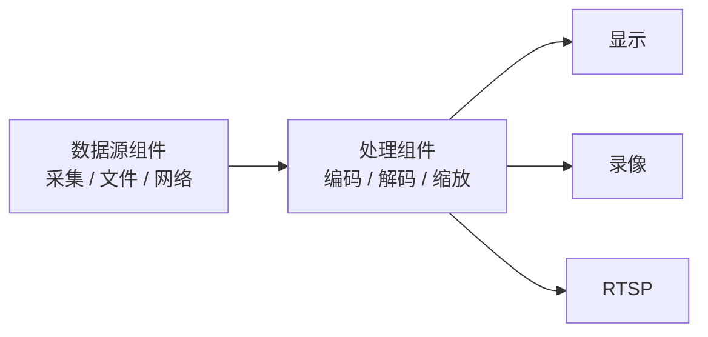
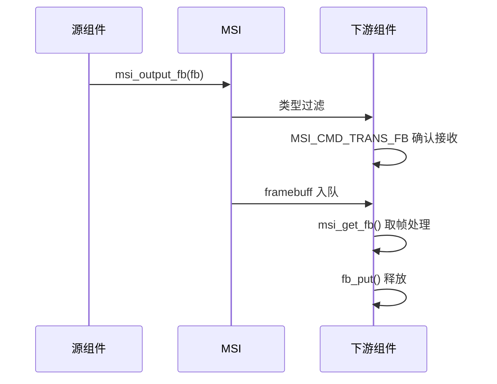
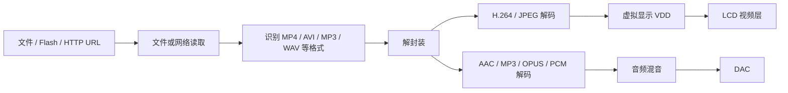
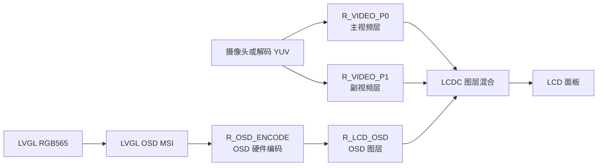
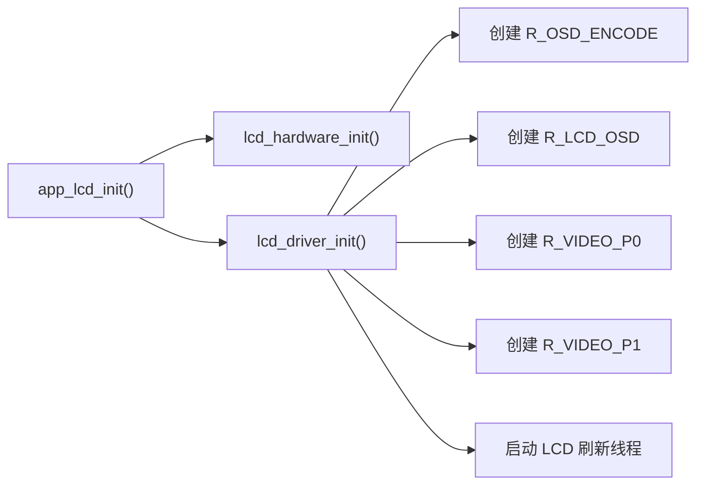
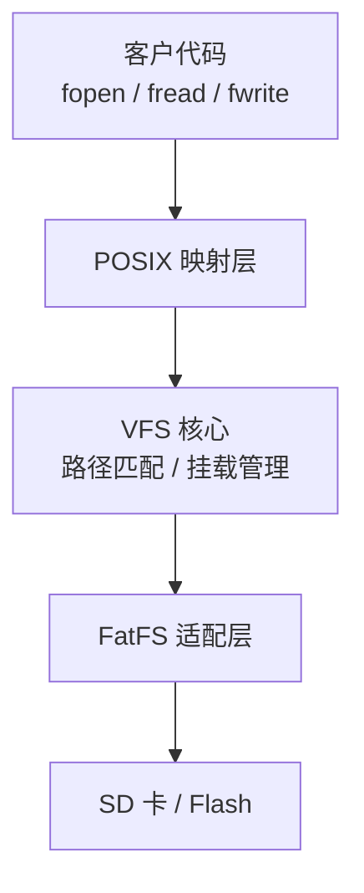
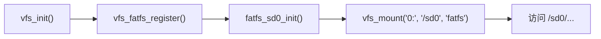
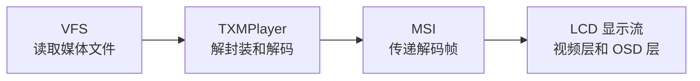

# TXW82x SDK 框架原理说明

> 适用版本：v2.7.1.7
> 本文详细说明 MSI、播放器、LCD 显示流和 VFS。每节最后给出客户最常用的调用方式。

## 1. MSI 媒体流框架

### 1.1 MSI 解决什么问题

MSI（Media Stream Interface）把采集、编码、解码、显示、网络发送和文件保存统一为“组件”。组件之间传递 `framebuff`，不需要彼此了解内部实现。



核心文件：

| 文件 | 作用 |
| --- | --- |
| `sdk/include/lib/multimedia/msi.h` | MSI 结构、命令和接口 |
| `sdk/include/lib/multimedia/framebuff.h` | 数据帧、队列和帧池 |
| `sdk/lib/multimedia/msi/msi.c` | 组件连接、命令和数据分发 |
| `sdk/app/algorithm/stream_frame/stream_define.h` | 应用组件名称 |

### 1.2 核心对象

#### MSI 组件

一个 `struct msi` 代表一个处理节点。

| 字段 | 作用 |
| --- | --- |
| `name` | 组件唯一名称 |
| `action` | 命令处理回调 |
| `output_list[]` | 下游组件列表 |
| `fbQ` | 输入帧队列 |
| `type` | 帧类型过滤 |
| `enable` | 是否接收数据 |
| `priv` | 组件私有数据 |
| `fb_limits` | 在途帧数量限制 |

#### Framebuff

`framebuff` 是组件之间传递的数据帧。

| 字段 | 作用 |
| --- | --- |
| `data` / `len` | 数据地址和长度 |
| `time` | 时间戳 |
| `mtype` / `stype` | 主类型和子类型 |
| `srcID` | 数据来源 |
| `next` | 分片链表 |
| `users` | 引用计数 |

### 1.3 一帧数据如何流动



流程说明：

1. 源组件分配并填写 `framebuff`。
2. `msi_output_fb()` 遍历下游组件。
3. 下游按 `mtype`、`stype` 和自身逻辑决定是否接收。
4. 帧进入下游输入队列。
5. 下游线程取帧处理，引用计数归零后自动释放。

### 1.4 数据连接和控制命令

数据连接：

```c
msi_add_output(source_msi, NULL, target_msi, NULL);
```

按名称连接：

```c
msi_add_output(NULL, AUTO_H264, target_msi, NULL);
```

控制当前组件：

```c
msi_do_cmd(target_msi, MSI_CMD_START, param1, param2);
```

向整条下游链广播：

```c
msi_cmd2(source_msi, MSI_CMD_STOP, 0, 0);
```

### 1.5 帧所有权

- `msi_output_fb(..., care=0)` 返回后，调用方不再持有该帧。
- `msi_output_fb(..., care=1)` 在没有下游接收时保留调用方引用。
- 跨线程保存帧前调用 `fb_get()`。
- 使用结束调用 `fb_put()`。
- 帧链 API 必须传入首节点。

### 1.6 客户如何使用 MSI

客户通常不需要修改 MSI 框架，只需：

1. 找到数据源名称，例如 `AUTO_H264` 或 `AUTO_JPG`。
2. 创建自己的 MSI 组件。
3. 使用 `msi_add_output()` 连接。
4. 在工作线程中使用 `msi_get_fb()` 取帧。
5. 退出时断开并销毁组件。

常用接口：

| 功能 | 接口 |
| --- | --- |
| 创建组件 | `msi_new()` |
| 查找组件 | `msi_find()` / `msi_find2()` |
| 连接组件 | `msi_add_output()` |
| 断开组件 | `msi_del_output()` |
| 发送帧 | `msi_output_fb()` |
| 获取帧 | `msi_get_fb()` |
| 控制组件 | `msi_do_cmd()` |
| 销毁组件 | `msi_destroy()` |
| 查看状态 | `msi_dump()` |

---

## 2. TXMPlayer 播放器框架

### 2.1 播放器架构

TXMPlayer 支持音频、视频、图片和网络 URL。播放器负责读取数据、识别容器、解封装、选择解码器并输出到音频或显示设备。



播放器内部每次播放会申请一个独立流通道，并创建对应 MSI 组件。默认最多支持多路流，实际数量受内存和解码器资源限制。

### 2.2 初始化

当方案定义 `SUPPORT_TXMPLAYER` 时，系统 `Codec_init()` 自动调用：

```c
txmplayer_init(0, 0, NULL);
```

同时根据配置初始化 H.264、JPEG、AAC、MP3、OPUS 等解码器。客户正常使用参考方案时不需要重复初始化播放器。

需要的常用宏：

| 功能 | 配置宏 |
| --- | --- |
| 播放器 | `SUPPORT_TXMPLAYER` |
| H.264 视频 | `SUPPORT_DECODER_H264` |
| JPEG 图片 | `SUPPORT_DECODER_JPEG` |
| LCD 输出 | `SUPPORT_LCD` |
| AAC / MP3 / OPUS | 对应 `*_DEC_CTRL` |

### 2.3 主动读取模式

客户传入文件路径或 URL，播放器自行完成后续流程：

```c
int32_t stream_id = txmplayer_open("0:/movie.mp4", 0, NULL);
if (stream_id < 0) {
    /* 打开失败 */
}
```

网络播放：

```c
int32_t stream_id = txmplayer_open("https://example.com/audio.mp3", 0, NULL);
```

常用控制：

```c
txmplayer_pause(stream_id, 1);       /* 暂停 */
txmplayer_pause(stream_id, 0);       /* 继续 */
txmplayer_seek(stream_id, 30 * 1000);/* 跳到 30 秒 */
txmplayer_set_volume(stream_id, 80); /* 音量 80 */
txmplayer_set_speed(stream_id, 2);   /* 2 倍速 */
txmplayer_close(stream_id);          /* 关闭 */
```

状态查询：

```c
int32_t state = txmplayer_state(stream_id);
uint32_t total_time;
int32_t play_time = txmplayer_playtime(stream_id, &total_time);
```

### 2.4 MSI 被动输入模式

高级应用可以取得播放器 MSI 通道，再主动推送 `framebuff`。该模式适合客户已有解封装或私有网络协议的场景。


普通文件和 URL 播放优先使用 `txmplayer_open()`，无需使用被动输入模式。

### 2.5 音视频同步

播放器支持三种同步基准：

| 模式 | 说明 |
| --- | --- |
| `TXMPLAYER_AVSYNC_AUDIO` | 以音频时钟为基准，常用于正常音视频播放 |
| `TXMPLAYER_AVSYNC_VIDEO` | 以视频帧率为基准 |
| `TXMPLAYER_AVSYNC_CLOCK` | 以系统时钟为基准 |

视频解码完成后通过 VDD 输出；音频解码后进入混音和 DAC。播放器根据时间戳控制视频显示节奏。

### 2.6 自定义输出

`struct txmplayer_param` 可设置：

- `volume`：初始音量。
- `fbQ_size`：播放队列深度，网络播放可适当增大。
- `netbuf_size`：网络缓冲大小。
- `vdd`：自定义虚拟显示设备。
- `decoder[]`：把视频、音频、图片或字幕输出到客户组件。

大多数客户使用默认参数即可：

```c
txmplayer_open(path, 0, NULL);
```

---

## 3. LCD 显示流

### 3.1 LCD 显示分层

LCD 显示包含视频层和 OSD 层：



- P0：主视频画面。
- P1：画中画或第二视频层。
- OSD：LVGL 菜单、文字和图标。
- LCDC：完成图层位置、旋转、缩放和混合。

### 3.2 初始化过程

客户调用：

```c
app_lcd_init(NULL);
```

内部执行：



参考方案已经在 `app_hardware_init()` 中调用 `app_lcd_init()`，客户通常不需要重复调用。

### 3.3 显示视频

将产生 YUV 帧的 MSI 组件连接到 P0：

```c
msi_add_output(video_source, NULL, NULL, R_VIDEO_P0);
msi_cmd(R_VIDEO_P0, MSI_CMD_LCD_VIDEO, MSI_VIDEO_ENABLE, 1);
```

关闭显示：

```c
msi_cmd(R_VIDEO_P0, MSI_CMD_LCD_VIDEO, MSI_VIDEO_ENABLE, 0);
msi_del_output(video_source, NULL, NULL, R_VIDEO_P0);
```

使用 P1 时把目标名称改为 `R_VIDEO_P1`。前提是方案确实提供了第二路 YUV 数据源。

### 3.4 显示 LVGL UI

LCD 初始化后调用：

```c
app_lvgl_init(main_ui, LVGL_INPUTDEV_SUPPORT);
```

LVGL 刷新时，显示缓冲被封装成 MSI 帧，送到 `R_OSD_ENCODE`，再由 `R_LCD_OSD` 交给 LCDC OSD 图层。

客户只需要在 `main_ui()` 中创建 LVGL 对象，不需要直接操作 OSD 编码组件。

### 3.5 虚拟显示 VDD

定义 `SUPPORT_LCD` 后，系统 `Codec_init()` 会注册 VDD 设备并创建 LCD 虚拟显示 MSI。播放器默认通过 VDD 把解码视频送到 LCD。


因此，播放器上屏通常只需要：

```c
txmplayer_open("0:/movie.mp4", 0, NULL);
```

### 3.6 换屏注意事项

换屏时需要同时调整：

- 方案 `*_config.h` 中的屏幕宏。
- 屏驱动中的 `lcdstruct` 时序和分辨率。
- 复位、背光、电源和数据引脚。
- 颜色格式、旋转方向和 LVGL 分辨率。

---

## 4. VFS 文件系统

### 4.1 VFS 解决什么问题

VFS 为 SD 卡和 Flash 文件系统提供统一路径和标准文件接口。



核心文件：

| 文件 | 作用 |
| --- | --- |
| `sdk/lib/fs/vfs/vfs.c` | VFS 核心 |
| `sdk/lib/fs/vfs/vfs_fatfs.c` | FatFS 适配 |
| `sdk/lib/posix/stdio.c` | 标准文件接口映射 |

### 4.2 初始化和挂载

`FS_EN=1` 时，系统启动调用 `vfs_init()`。SD 方案随后调用 `app_sd_init()`，完成 FatFS 注册和挂载。



### 4.3 路径说明

| 路径 | 用途 |
| --- | --- |
| `/sd0/...` | 客户使用 VFS 和标准文件接口时推荐 |
| `0:/...` | 部分现有录像、拍照和播放器内部模块使用的 FatFS 路径 |
| `V:/sd0/...` | LVGL 文件系统路径 |

客户自己的普通文件代码统一使用 `/sd0/...`。

### 4.4 文件读写

写文件：

```c
FILE *fp = fopen("/sd0/customer/data.bin", "wb");
if (fp) {
    int written = fwrite(data, 1, data_len, fp);
    if (written == data_len) {
        fsync(fileno(fp));
    }
    fclose(fp);
}
```

读文件：

```c
FILE *fp = fopen("/sd0/customer/data.bin", "rb");
if (fp) {
    int read_len = fread(buf, 1, sizeof(buf), fp);
    fclose(fp);
}
```

### 4.5 VFS 原理

VFS 根据路径做最长前缀匹配。例如：

```text
/sd0/photo/a.jpg
```

匹配过程：

```text
挂载点：/sd0
设备：0:
文件系统内路径：/photo/a.jpg
```

这样客户代码不需要直接了解底层设备盘符。

### 4.6 使用注意事项

- `fread()` 和 `fwrite()` 当前返回实际字节数。
- `fflush()` 当前不执行实际刷盘，需要同步时使用 `fsync(fileno(fp))`。
- SD 卡拔出前停止录像并关闭文件。
- `rename()` 不能跨挂载点移动文件。
- `FS_EN=0` 时不要调用文件接口。
- 新代码不要继续使用 `osal_fopen`、`osal_fwrite` 等兼容接口。

---

## 5. 框架关系



- VFS 负责文件访问。
- 播放器负责读取、解封装和解码。
- MSI 负责组件之间传递帧和命令。
- LCD 显示流负责把视频和 UI 输出到屏幕。

录像、拍照和图传的最简调用方法见[TXW82x SDK 视频应用功能使用说明](https://taixin-semi.com/zh/docs/txw82x/latest/TXW82x%20SDK%20%E8%A7%86%E9%A2%91%E5%BA%94%E7%94%A8%E5%8A%9F%E8%83%BD%E4%BD%BF%E7%94%A8%E8%AF%B4%E6%98%8E)。
