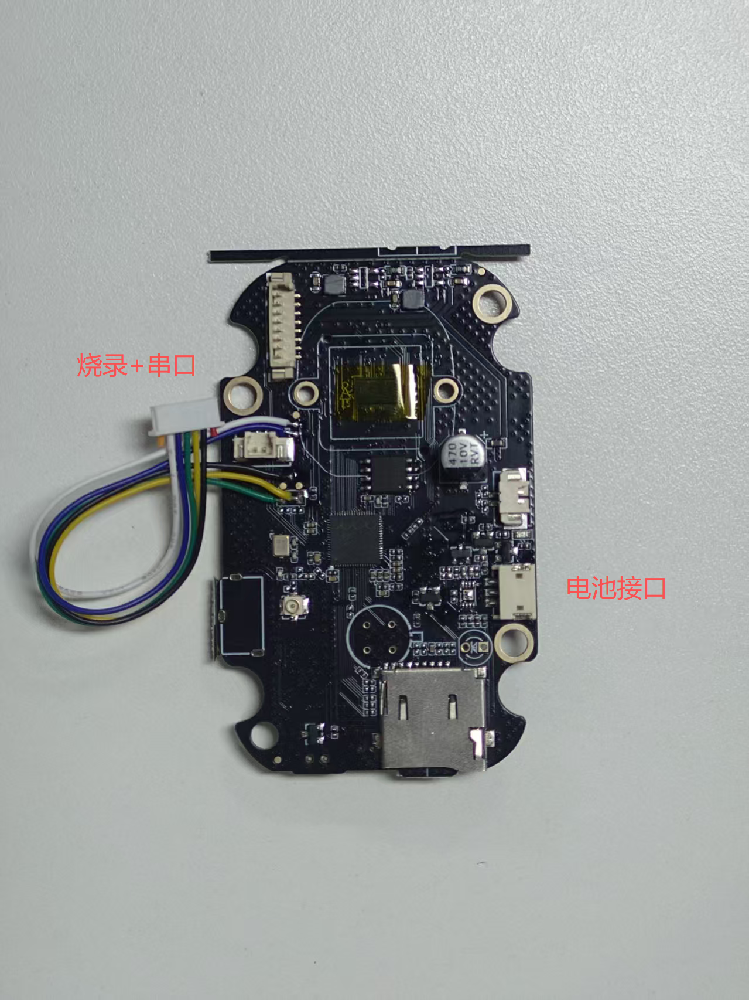
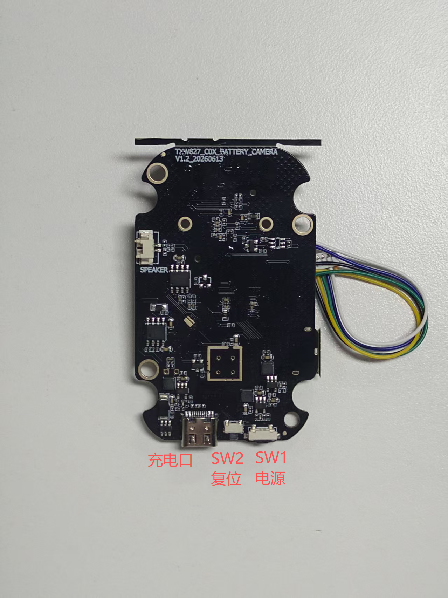
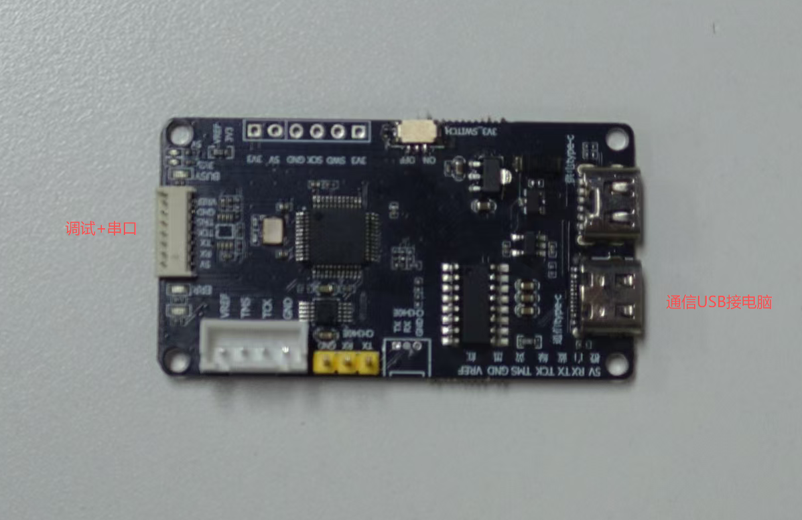
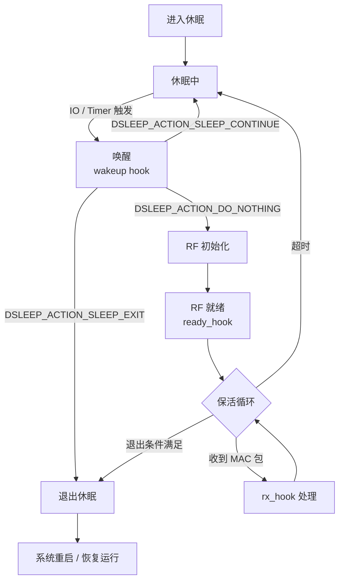
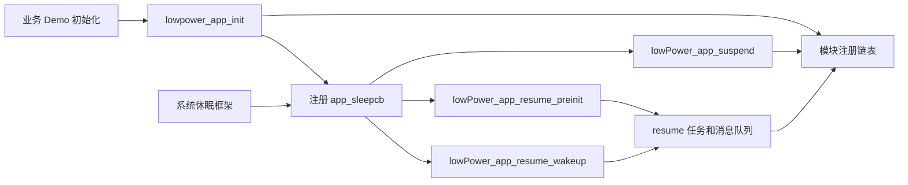
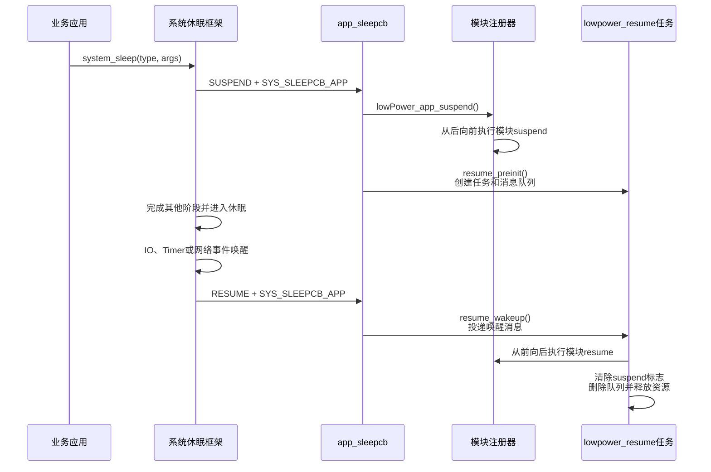

# TXW82x 低功耗开发指南

> 适用版本：v2.7.1.7 
> 本文档以电池摄像机开发板为例介绍芯片低功耗开发的相关内容，包括休眠模式选择、API 接口说明、数据保持机制、唤醒检测与 Hook、lowPower_app 低功耗应用、功耗测试方法、实测数据及唤醒 IO 配置，供方案选型和开发参考。


**修订记录**

| 日期         | 版本   | 描述   |
| ---------- | ---- | ---- |
| 2026-08-18 | V1.0 | 初始版本 |

## 0. 开箱检查




### 0.1 硬件说明

电池摄像机开发板开发测试主要接口说明：
- USB充电口供电池充电，有USB插入检测引脚可用作唤醒IO
- SW1 电源开关，硬件设计按住按键让芯片接通电路，需要靠程序启动后控制电源开关引脚维持供电状态（低功耗期间需要维持IO输出控制状态以免误切断供电）
- SW2 复位开关，硬件上连接DCDC_EN，通过按键拉低电平关闭DCDC输出使整体断电，重新上电需要按SW1开机
- 烧录+串口测试点，可与TX-CLINK-UART板连接到电脑，进行程序调试和烧录或串口调试（因IO紧张，串口是复用了IR的IO，调试开发阶段可暂时忽略IR功能）
- 电池接口，通过电池供电或电源供电，功耗测试时的接入点

> 详细硬件信息可查阅硬件原理图及开发指南

### 0.2 测试步骤

电池摄像机开发板默认烧录 Demo 程序，如果 Flash 被擦除，可编译 SDK 中 ID=9 的程序测试

1. **接线**：准备低功耗分析仪或测量电流仪表，通过电池接口使用 **4.2 V** ，将 TX-CLINK-UART 与电池摄像机开发板的调试烧录/串口连接，USB通信口与电脑连接。检查电脑中能够正常识别到串口端口，使用波特率 **921600** 打开串口工具

2. **开机**：长按电池摄像机开发板底部 SW1 按键数秒开机，通过串口输出确认设备已启动

3. **RTC 模式测试**（模式 5）：串口工具输入AT测试命令，检查休眠期间功耗应在 35 ~ 45μA 范围，按下 SW1 按键 IO 唤醒或等待 80 s 后定时唤醒

   ```
   AT+SLEEP=5,80000,23,1
   ```

   参数含义：模式 5 RTC 休眠，定时 80 秒，唤醒 IO 为 PB7（下降沿，对应 SW1 按键）

---
## 1. 工程示例说明

SDK包中打开工程 `txw82xApp.cdkproj`，在 `project_config.h` 中选择：

```c
#define CUSTOMER_ID 9
```

`project_config.h` 根据ID包含 `battery_camera_1080p_config.h`，并定义 `BATTERY_CAMERA_1080P_DEMO`。

程序主要应用入口调用链为：

```text
main
  -> sys_app_init
    -> app_battery_camera_1080p_demo_init
      -> app_power_init()
      -> app_io_init()
      -> app_hardware_init()
      -> app_function_init()
      -> app_user_init()
      -> app_1080p_lowpower_register
        -> lowpower_app_init
          -> 注册模块数组
          -> sys_register_sleepcb(app_sleepcb, NULL)
```

程序启动后，在常规系统功能与 WiFi 初始化之外，进入应用功能部分，初始化应用用到的系统电源控制及音视频功能。低功耗部分通过 `app_1080p_lowpower_register()` 注册 `app_1080p_lowpower_modules`。

用户主要开发内容包括外设控制、应用功能和低功耗休眠流程处理等。本指南重点介绍低功耗相关处理部分，其余功能请根据需求自行开发。

## 2. 休眠模式与接口

### 2.1 休眠模式说明

系统支持以下三种休眠模式，功耗以电池摄像机开发板 4.2V 屏蔽环境下测试参考，请根据方案需求选择合适的模式：

| 休眠模式          | 场景说明                                                     | 唤醒方式                   | 功耗参考  |
| ----------------- | ------------------------------------------------------------ | -------------------------- | --------- |
| 1 - WiFi 保活休眠 | 休眠期间保持 WiFi 连接，唤醒后系统从休眠点恢复运行，无需重新初始化 | 远程唤醒 / IO / Timer 唤醒 | 约 338 μA |
| 3 - SRAM 保持休眠 | 休眠期间不维持 WiFi 连接，唤醒后系统从休眠点恢复运行，无需重新初始化 | IO / Timer 唤醒            | 约 91 μA  |
| 5 - RTC 休眠      | 休眠期间不维持 WiFi 连接，不保存数据，唤醒后系统重启并重新初始化 | IO / Timer 唤醒            | 约 43 μA  |
> **RTC 时钟源**：默认使用内部 RC 振荡器计时。如需更高计时精度，可在 `bgn_dsleep_init` 初始化时通过 `flags` 参数的 `BIT(0)` 使能外部晶振

### 2.2 休眠接口

#### 2.2.1 进入休眠

```c
int32 system_sleep(uint16 type, struct system_sleep_param *args);
```

程序中主要使用该API进入休眠，休眠模式参考上一小节说明选择，另外提供参数可配置休眠时长及唤醒IO

```c
struct system_sleep_param {
    uint32 sleep_ms;           // 休眠时长，单位 ms；填 0 表示无 Timer 唤醒
    uint8  wkup_io_sel[6];     // 唤醒 IO 选择，对应 IO0 ~ IO5
    uint8  wkup_io_en;         // IO 唤醒使能掩码，0: 关闭，1: 开启
    uint8  wkup_io_edge;       // IO 唤醒边沿掩码，0: 上升沿，1: 下降沿
};
```

**字段详解：**

- **`sleep_ms`**：休眠定时时长（毫秒）。设置为 `0` 时不会产生 Timer 唤醒，仅依赖 IO 唤醒。
- **`wkup_io_sel`**：选择唤醒 IO 的引脚编号，最多同时支持 6 路 IO 唤醒（索引 0 ~ 5）。
- **`wkup_io_en`**：IO 唤醒使能掩码。`bit0` 对应 `wkup_io_sel[0]`，`bit1` 对应 `wkup_io_sel[1]`，以此类推。置 `1` 使能，置 `0` 关闭。
- **`wkup_io_edge`**：IO 唤醒边沿选择掩码。`bit0` 对应 `wkup_io_sel[0]` 的边沿设置，以此类推。
  - `0`：上升沿唤醒（芯片内部自动开启下拉电阻）
  - `1`：下降沿唤醒（芯片内部自动开启上拉电阻）

#### 2.2.2 IO 保持配置

```c
void dsleep_set_user_gioa(uint32 user_gioa);
void dsleep_set_user_giob(uint32 user_giob);
void dsleep_set_user_gioc(uint32 user_gioc);
void dsleep_set_user_giod(uint32 user_giod);
void dsleep_set_user_gioe(uint32 user_gioe);
void dsleep_set_user_giof(uint32 user_giof);
```

按 GPIO 端口（A ~ F）分别设置低功耗期间需要保持的 IO 掩码。置位的 IO 在休眠期间保持原有配置不变；未置位的 IO 会在进入休眠时被芯片复位，以防止浮空漏电。

> 例如：休眠期间需保持 PA0、PA3 输出高电平，则调用 `dsleep_set_user_gioa(BIT(0) | BIT(3))`。

#### 2.2.3 外部 DCDC 控制

```c
void dsleep_set_ext_dcdc(uint8 en);
```

当方案板使用外部 DCDC（如 1.5 V 供电）时，可在休眠期间关闭芯片内部 LDO，改用外部 DCDC 供电，进一步降低功耗。

| 参数 | 说明 |
|------|------|
| `en` | `0`：休眠期间开启内部 LDO；`1`：休眠期间使用外部 DCDC |
#### 2.2.4 低功耗数据保持

休眠期间仅常电 SRAM 区域的数据不会丢失，如果用户需要数据在多次休眠唤醒期间能够保持，系统提供两种方式在该区域保存数据：

| 方式                      | 适用场景         | 说明                                       |
| ----------------------- | ------------ | ---------------------------------------- |
| `__dsleep_data` 声明      | 编译期确定大小的静态变量 | 在变量声明前加 `__dsleep_data` 修饰，链接阶段自动放置到常电区域 |
| `sys_sleepdata_request` | 运行时动态申请      | 在初始化阶段按需申请指定大小的内存块                       |

```c
void *sys_sleepdata_request(uint8 id, uint32 size);
void *sys_sleepdata_get(uint8 id);
```

根据数据区域ID申请睡眠保留内存块，通常在系统初始化阶段或进入睡眠前的准备阶段调用。 每个 ID 只能申请一次，重复申请返回相同的地址。

```c
enum system_sleepdata_id {
    SYSTEM_SLEEPDATA_ID_LMAC      = 0, // LMAC 数据区（WiFi 驱动底层上下文）
    SYSTEM_SLEEPDATA_ID_UMAC      = 1, // UMAC 数据区（WiFi 协议栈上下文）
    SYSTEM_SLEEPDATA_ID_PSALIVE   = 2, // 应用保活状态数据
    SYSTEM_SLEEPDATA_ID_PSCONNECT = 3, // 节能连接状态数据
    SYSTEM_SLEEPDATA_ID_WKDATA    = 4, // 应用唤醒数据
    SYSTEM_SLEEPDATA_ID_USER      = 5, // 用户自定义数据区
    SYSTEM_SLEEPDATA_ID_SLEEPLOG  = 6, // 睡眠日志区（记录睡眠/唤醒的时间戳和事件）
    SYSTEM_SLEEPDATA_ID_MAX       = 7, // ID 最大值（用于边界检查或数组大小定义）
};
```

> **注意**：用户应用仅应使用 `SYSTEM_SLEEPDATA_ID_USER` 申请自定义空间。其他 ID 对应的区域由 SDK 内部使用，随意修改可能导致异常。

#### 2.2.5 低功耗计时

休眠期间系统关闭高频时钟以降低功耗，计时单元由常电域 RC Timer 提供。因此需使用专用 API 替代常规系统时钟函数。

```c
uint64 pmu_tmrao_get(void);   // 返回 64 位 RC 计数值
uint32 pmu_tmraol_get(void);  // 返回低 32 位
uint32 pmu_tmraoh_get(void);  // 返回高 32 位
```

RC 振荡器的实际频率存在偏差，需通过 `SYSTEM_SLEEPDATA_ID_LMAC` 区域中校准后的频率值进行换算：

```c
struct dsleep_priv *dsleep = sys_sleepdata_get(SYSTEM_SLEEPDATA_ID_LMAC);
uint64 now  = pmu_tmrao_get();
uint64 diff = now - tmr_last;               // RC 计数值差值
uint64 ms   = diff / dsleep->rc_hz * 1000;  // 换算为毫秒
```

> 休眠期间 systick 不会计时（现象为打印中时间戳不会变化），唤醒后会对 systime 进行补偿，应用可以通过读取 systime 或 ntptime 等判断休眠时长

---

#### 2.2.6 休眠 Hook 回调

低功耗框架提供三个 Hook 回调点，允许应用在休眠流程的关键节点插入自定义逻辑：

```c
void dsleep_set_wakeup_hook(DSLEEP_ACTION (*func)(uint8 wk_reason));
void dsleep_set_rx_hook(void (*func)(uint8 *data, uint32 len));
void dsleep_set_ready_hook(void (*func)(void));
```

```c
typedef enum {
    DSLEEP_ACTION_DO_NOTHING,     // 无操作（交由低功耗程序执行默认行为）
    DSLEEP_ACTION_SLEEP_CONTINUE, // 继续休眠（放弃本次唤醒，重新进入休眠）
    DSLEEP_ACTION_SLEEP_EXIT,     // 退出休眠（正常唤醒，继续后续流程）
} DSLEEP_ACTION;
```

**Hook 函数原型**

```c
DSLEEP_ACTION (*dsleep_wakeup_hook)(uint8 wk_reason);  // 返回值决定唤醒后的行为
void          (*dsleep_rx_hook)(uint8 *data, uint32 len); // data: MAC 层数据包, len: 数据长度
void          (*dsleep_ready_hook)(void);                   // RF 就绪，可主动发包
```

| Hook | 调用时机 | 用途 |
|------|----------|------|
| `wakeup_hook` | IO / Timer 唤醒后立即调用 | 根据 `wk_reason`（唤醒原因）判断是否需要真正唤醒。返回 `DSLEEP_ACTION_SLEEP_CONTINUE` 则放弃本次唤醒、重新进入休眠，实现**唤醒过滤**（如过滤干扰脉冲触发的误唤醒） |
| `rx_hook` | 唤醒窗口内收到 MAC 层数据包时调用 | 解析收到的数据包，执行自定义处理逻辑（如判断是否为有效唤醒报文）。**注意：该 Hook 在中断上下文执行，应尽快返回，避免长时间占用。** |
| `ready_hook` | Wakeup hook 未拦截唤醒，且 RF 初始化就绪后调用 | 可在此主动发包（如向服务器发送 Keep-Alive 保活包），配合 `rx_hook` 处理回包，利用 RC 定时可实现在休眠期间**周期性向服务器上报状态** |
##### 2.2.6.1 示例 1：IO 唤醒过滤（wakeup_hook）

场景：SRAM 保持休眠下，PIR 传感器接入 IO1 唤醒组。通过多次 IO 触发计数过滤干扰脉冲——未达到阈值的触发返回 `DSLEEP_ACTION_SLEEP_CONTINUE` 继续休眠，达标后返回 `DSLEEP_ACTION_SLEEP_EXIT` 退出休眠。

可通过修改 `SYSTEM_SLEEPDATA_ID_LMAC` 区域中 `dsleep->dcfg.wk_reason` 自定义唤醒原因（如标记为 PIR 触发），供上层查询。其他不需特殊处理的唤醒原因应返回 `DSLEEP_ACTION_DO_NOTHING`，交由低功耗框架执行默认操作。

```c
__dsleep_data uint8 user_cnt = 0;

DSLEEP_ACTION user_dsleep_wakeup_hook(uint8 wk_reason)
{
    user_cnt++;
    os_printf("user check wk_reason: %d, cnt:%d\r\n", wk_reason, user_cnt);

    if (wk_reason == DSLEEP_WK_REASON_IO1) {
        if (user_cnt >= 5) {
            user_cnt = 0;
            // dsleep_set_change_wkreason(reason);
            return DSLEEP_ACTION_SLEEP_EXIT;
        } else {
            return DSLEEP_ACTION_SLEEP_CONTINUE;
        }
    } else {
        return DSLEEP_ACTION_DO_NOTHING;
    }
}
```

##### 2.2.6.2 示例 2：周期性保活发包（ready_hook + rx_hook）

场景：唤醒后利用 RC Timer 判断距上次保活操作是否已超过阈值，若超时则主动发包，并配合 `rx_hook` 处理回包。

```c
__dsleep_data uint64 tmr_last = 0;
__dsleep_data uint8  wait_rx_flag = 0;

void user_dsleep_ready_hook(void)
{
    if (!dsleep) return;

    uint64 tmr_now = pmu_tmrao_get();
    if (((tmr_now - tmr_last) / dsleep_get_rc_hz()) > action_tmo) {
        // 发包保活操作...
        wait_rx_flag = 1;
        tmr_last = tmr_now;
    }
}
```

```c
void user_dsleep_rx_hook(uint8 *data, uint32 len)
{
    // 尽早过滤，避免在中断中无效处理
    if (wait_rx_flag != 1) return;

    struct ieee80211_hdr *hdr = (struct ieee80211_hdr *)data;
    if (ieee80211_is_data(hdr->frame_control)) {
        // 处理收到的数据包...
    }
}
```

#### 2.2.7 以太网包发送接口

```c
void dsleep_tx_ether(uint8 *data, uint32 len);
```

配合 `ready hook` 函数在合适的时机发送自定义的以太网包数据

#### 2.2.8 休眠流程图

正常模式下，外设与应用代码会在cpu0执行，WiFi协议栈与部分算法功能会在cpu1执行。而休眠模式下cpu0会执行独立的低功耗程序，cpu1会停止执行。低功耗程序中仅维持基本的外设功能及RF收发功能，同时提供部分位置hook用于用户二次开发



---

## 3. lowPower_app 接入低功耗应用示例

实际产品进入低功耗前，还需要按依赖关系暂停文件系统、Sensor、MIPI、ISP、VPP、音频等应用模块；唤醒后再按相反的依赖关系恢复这些模块。SDK 通过 `sdk/app/lowPower_app` 提供统一的应用层 suspend/resume 管理框架。

### 3.1 目录与文件说明

`sdk/app/lowPower_app` 当前包含以下 6 个文件。

| 文件 | 主要职责 |
|------|----------|
| `lowPower_app.h` | 对外头文件，声明初始化、应用 suspend、resume 任务预创建和唤醒等接口，并包含模块注册头文件 |
| `lowPower_app.c` | lowPower_app 总入口；注册系统 sleep callback；在系统 APP 阶段衔接应用 suspend/resume；包含休眠测试函数和 TCP 包唤醒检测回调 |
| `lowPower_module_registry.h` | 定义 `lowPower_module_ops`、统一回调原型及模块注册管理接口 |
| `lowPower_module_registry.c` | 保存模块双向链表和状态机；执行逆序 suspend、正序 resume，并在 suspend 失败时回滚 |
| `lowPower_suspend.c` | 应用 suspend 入口；通过 `app_suspend_flag` 防止同一轮休眠重复执行 suspend |
| `lowPower_resume.c` | 在 suspend 阶段预创建 resume 任务和消息队列；系统唤醒后发送消息，由独立任务恢复应用模块并释放临时资源 |

各文件之间的关系如下：



### 3.2 模块回调结构

每个需要参与应用低功耗流程的模块使用一个 `lowPower_module_ops` 描述：

```c
typedef int (*lowPower_module_cb)(void *param1,
                                  void *param2,
                                  void *param3,
                                  void *param4);

struct lowPower_module_ops {
    const char *name;
    lowPower_module_cb suspend;
    lowPower_module_cb resume;
    void *priv[4];
};
```

| 字段 | 说明 |
|------|------|
| `name` | 模块名称，用于注册检查和 suspend/resume 调试打印；不能为 `NULL` |
| `suspend` | 进入低功耗前的模块暂停或反初始化回调；不需要时可为 `NULL` |
| `resume` | 唤醒后的模块恢复或重新初始化回调；不需要时可为 `NULL` |
| `priv[4]` | 传给回调的 4 个用户参数，可传设备句柄、配置对象或上下文指针 |

模块的 `suspend` 和 `resume` 不能同时为 `NULL`。回调成功应返回 `RET_OK`，失败返回 `RET_ERR` 或其他非零值。建议模块数组和模块名称使用静态存储期，避免注册后名称指针失效。

### 3.3 注册顺序与执行规则

`lowpower_app_init()` 会先清除原模块列表，再按照数组从前到后的顺序注册模块，最后通过 `sys_register_sleepcb()` 注册 `app_sleepcb()`：

```c
int lowpower_app_init(const struct lowPower_module_ops *ops,
                      int module_count);
```

模块数组应按照正常上电初始化的依赖顺序排列：基础电源或前置资源在前，上层业务或后置操作在后。框架的执行规则是：

- **suspend：从数组末尾向数组开头执行**，即后注册的模块先暂停。
- **resume：从数组开头向数组末尾执行**，即先注册的模块先恢复。
- 某项 `suspend` 为 `NULL` 时不调用函数，但该节点仍会被标记为已 suspend，唤醒时可执行它的 `resume`。
- 某项 `resume` 为 `NULL` 时，框架只清除该节点的 suspend 标记。
- suspend 回调失败时，框架会对本轮已经成功 suspend 的模块执行 resume 回滚，使注册器回到 ACTIVE 状态。
- resume 回调失败时，框架会继续恢复后续模块，但注册器保持 SUSPENDED 状态，用于表明本轮恢复并未全部成功。

假设模块数组为 `[power, sensor, isp, service]`，正常执行顺序为：

```text
suspend：service -> isp -> sensor -> power
resume ：power -> sensor -> isp -> service
```

> **注意**：执行顺序只由数组位置决定，与模块名中的 `prev`、`post` 无关。设计模块表时，应同时检查反向 suspend 和正向 resume 两条路径是否满足硬件及软件依赖。

### 3.4 系统 sleep callback 流程

`lowPower_app.c` 中的 `app_sleepcb()` 是应用框架与系统休眠框架的连接点。它只处理 `SYS_SLEEPCB_APP` 阶段：

```c
static int32 app_sleepcb(uint16_t type,
                         struct sys_sleepcb_param *args,
                         void *priv)
{
    switch (args->action) {
    case SYS_SLEEPCB_ACTION_SUSPEND:
        if (args->step == SYS_SLEEPCB_APP) {
            lowPower_app_suspend();
            lowPower_app_resume_preinit();
        }
        break;

    case SYS_SLEEPCB_ACTION_RESUME:
        if (args->step == SYS_SLEEPCB_APP) {
            lowPower_app_resume_wakeup();
        }
        break;
    }
    return RET_OK;
}
```

一次完整休眠和唤醒的时序如下：



resume 不直接在系统 sleep callback 中执行，而是由 `lowPower_app_resume_task()` 完成。这样可以把文件系统挂载、Sensor 初始化等耗时或可能阻塞的操作移到任务上下文中。

各阶段的具体职责为：

1. `lowPower_app_suspend()` 检查 `app_suspend_flag`，避免重复 suspend；首次执行时置位标志并调用 `lowPower_app_suspend_modules()`。
2. `lowPower_app_resume_preinit()` 申请消息队列对象，创建长度为 1 的消息队列，并创建 `lowpower_resume` 任务。该任务此时阻塞等待消息。
3. 系统唤醒进入 APP resume 阶段后，`lowPower_app_resume_wakeup()` 向消息队列投递消息。
4. resume 任务收到消息后调用 `lowPower_app_resume_modules()`，最后清除 `app_suspend_flag`，删除消息队列并释放内存。

> **当前实现注意事项**：`app_sleepcb()` 没有使用 `type` 和唤醒原因，代码中的 `args->resume.wkreason` 判断也处于注释状态，因此所有进入 APP resume 阶段的唤醒都会触发应用恢复。如果产品只允许特定原因退出低功耗，需要恢复并完善唤醒原因判断。

### 3.5 TCP 包唤醒检测回调

`lowpower_app_init()` 还会执行：

```c
dsleep_set_usr_wkdet_cb(NULL, user_check_data);
```

当前 `user_check_data()` 用于判断收到的 IP 报文是否为 TCP 包。`data[9]` 对应 IPv4 头部的 `protocol` 字段，协议值 `0x06` 表示 TCP。报文长度不小于 10 字节且该字段为 `0x06` 时返回 `1`：

```c
static int32 user_check_data(void *usr_wkdet_priv, uint8 *data, uint32 len)
{
    if (len >= 10 && data[9] == 0x06) {
        return 1;
    }
    return 0;
}
```

该回调返回值直接决定是否唤醒：

- 返回 `1`：检测到 TCP 包，退出当前低功耗状态并唤醒系统。
- 返回 `0`：不是 TCP 包，不唤醒系统，继续保持低功耗状态。

当前实现只判断 IP 协议类型，因此任意 TCP 包都会触发唤醒，没有进一步校验源/目的 IP、TCP 端口或负载内容。如果产品只允许特定 TCP 连接或特定命令唤醒，应在保证报文长度合法的前提下继续解析 TCP 头部和业务数据，并仅在完全匹配时返回 `1`。

### 3.6 新项目接入步骤

#### 3.6.1 确认系统休眠能力已开启

工程需要启用 `CONFIG_SLEEP`，并完成底层深睡初始化。现有工程在 `project/txw82xApp/wifi.c` 中调用 `bgn_dsleep_init()`。休眠模式、唤醒 IO 和 Timer 参数仍通过前文介绍的 `system_sleep()` 配置。

#### 3.6.2 为模块实现 suspend/resume

以下模板演示如何传递设备上下文：

```c
static int user_sensor_suspend(void *param1, void *param2,
                               void *param3, void *param4)
{
    struct user_sensor *sensor = (struct user_sensor *)param1;

    return user_sensor_deinit(sensor);
}

static int user_sensor_resume(void *param1, void *param2,
                              void *param3, void *param4)
{
    struct user_sensor *sensor = (struct user_sensor *)param1;
    const struct user_sensor_cfg *cfg =
        (const struct user_sensor_cfg *)param2;

    return user_sensor_init(sensor, cfg);
}
```

suspend 回调返回前应确认相关任务、DMA、硬件传输和中断已经停止，不能在资源仍被访问时直接关闭时钟或电源。resume 回调应按照初始化依赖恢复资源，并避免重复创建未销毁的任务或对象。

#### 3.6.3 按依赖顺序定义模块数组

```c
static const struct lowPower_module_ops user_lowpower_modules[] = {
    {
        "power",
        user_power_suspend,
        user_power_resume,
        {NULL, NULL, NULL, NULL},
    },
    {
        "sensor",
        user_sensor_suspend,
        user_sensor_resume,
        {&g_sensor, &g_sensor_cfg, NULL, NULL},
    },
    {
        "service",
        user_service_suspend,
        user_service_resume,
        {NULL, NULL, NULL, NULL},
    },
};
```

该数组的 resume 顺序为 `power -> sensor -> service`，suspend 顺序为 `service -> sensor -> power`。

#### 3.6.4 在业务模块初始化完成后注册

```c
int user_lowpower_register(void)
{
    int ret = lowpower_app_init(user_lowpower_modules,
                                ARRAY_SIZE(user_lowpower_modules));
    if (ret != RET_OK) {
        os_printf("register user lowpower modules failed\n");
        return RET_ERR;
    }

    return RET_OK;
}
```

应在正常运行所需的硬件和业务模块初始化完成后调用注册函数，并确保第一次休眠前注册成功。一个应用只应统一调用一次 `lowpower_app_init()`；再次调用会先清空原有模块表，再注册新的模块表和系统 sleep callback。

#### 3.6.5 触发休眠

注册完成后，可以由业务逻辑或 AT 命令调用 `system_sleep()`。例如进入模式 3 并在 5 秒后由 Timer 唤醒：

```c
struct system_sleep_param args;

os_memset(&args, 0, sizeof(args));
args.sleep_ms = 5000;

system_sleep(SYSTEM_SLEEP_TYPE_SRAM_ONLY, &args);
```

系统执行到 APP sleep callback 时，lowPower_app 会自动完成已注册模块的 suspend；唤醒后自动调度 resume 任务，不需要业务代码再次手工遍历模块。

### 3.7 电池摄像机模块表与回调

> **说明**：本节是 ID 9 电池摄像机方案实际使用的模块表（7 个模块），可作为上文 3.6.3 节通用模板的具体对照。表中`数组顺序`即注册顺序，suspend 按逆序、resume 按正序执行。

| 数组顺序 | 模块 | suspend 操作 | resume 操作 |
|----------|------|--------------|-------------|
| 1 | `prev` | 无 | 恢复 VDD、TF 卡电源和音频 PA 的 IO 方向/电平，打开 VCAM/VCAM2 LDO，并初始化公共时钟 |
| 2 | `sd` | 卸载 SD 并关闭 SD Host | 重新初始化并挂载 SD |
| 3 | `mipi` | 销毁 Sensor 信息并关闭 MIPI CSI | 初始化 Sensor 信息并按 1080P 方案重新配置 MIPI CSI |
| 4 | `isp` | 关闭 ISP | 重新配置 ISP |
| 5 | `vpp` | 释放 VPP | 重新配置 VPP |
| 6 | `audio` | 关闭 ADC，并暂停 DAC 消息任务 | 初始化 ADC，并恢复 DAC 消息任务 |
| 7 | `post` | 设置 TF、VDD、音频 PA 的低功耗电平，并配置休眠期间需要保持的 GPIO | 恢复 JTAG 映射 |

实际执行顺序仍为：

```text
suspend：post -> audio -> vpp -> isp -> mipi -> sd -> prev
resume ：prev -> sd -> mipi -> isp -> vpp -> audio -> post
```

`app_1080p_post_suspend()` 除了切换外围电源控制脚，还通过 `app_1080p_set_dsleep_pins()` 汇总以下引脚：

```c
PIN_SYS_PWR_EN
PIN_TF_PWR_EN
PIN_VDD_CTRL
PIN_AUDIO_PA_EN
```

函数按 GPIO 端口生成掩码，并调用 `dsleep_set_user_gioa()` 到 `dsleep_set_user_giof()`，保证休眠期间这些电源控制 IO 的配置和电平不被默认复位。唤醒时，`prev` 作为第一个 resume 节点先恢复电源和公共时钟，然后才依次恢复 SD、MIPI、ISP、VPP 和音频。

> **顺序提示**：ID 9 中 `post` 位于数组末尾，所以它的 suspend 实际最先执行。开发新硬件方案时不要只根据 `prev/post` 名称推断调用先后，应根据外围器件要求重新检查数组位置。例如，若某路电源必须在所有使用者停止后才能关闭，应把电源关闭动作放在反向遍历中更靠后执行的位置。

## 4. 唤醒 IO 说明

### 4.1 支持的唤醒 IO 列表

| 唤醒源 | PA | PB | PC | PD |
|--------|-----|-----|-----|-----|
| IO0 | PA0 ~ PA14 | PB6 ~ PB15 | PC0 ~ PC5 | — |
| IO1 | PA0 ~ PA15 | — | PC0 ~ PC1 | PD0 ~ PD13 |
| IO2 | PA0 ~ PA15 | PB6 ~ PB15 | PC0 ~ PC5 | — |
| IO3 | PA0 ~ PA14 | — | PC4 ~ PC5 | PD0 ~ PD13 |
| IO4 | PA0 ~ PA15 | PB6 ~ PB15 | PC0 ~ PC5 | — |
| IO5 | PA0 ~ PA15 | PB14 | PC2 | PD0 ~ PD13 |

### 4.2 配置建议

1. **优先使用 PA0 ~ PA14 作为唤醒引脚**：该引脚范围被 IO0 ~ IO5 全部 6 路唤醒源覆盖，兼容性最好。
2. **未使用 IO 的保持配置**：休眠期间若需要保持部分 IO 的输出电平，应通过 `dsleep_set_user_giox` 按位域设置对应 IO，否则芯片会复位 IO 配置以防止浮空漏电。
